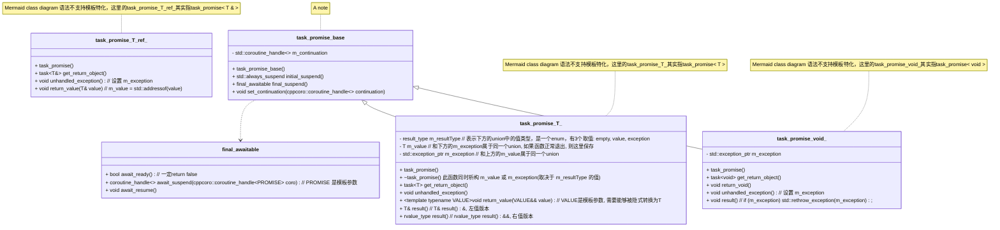

# Task

```mermaid
classDiagram
  task_promise_base ..> final_awaitable
  task_promise_base<|--task_promise_T_
  task_promise_base<|--task_promise_void_


  class final_awaitable {
    + bool await_ready() // 一定return false
    + coroutine_handle~~ await_suspend(cppcoro::coroutine_handle~PROMISE~ coro) // PROMISE 是模板参数
    + void await_resume()
  }

  class task_promise_base {
    + task_promise_base()
    + std::always_suspend initial_suspend()
    + final_awaitable final_suspend()
    + void set_continuation(cppcoro::coroutine_handle<> continuation)
    - std::coroutine_handle~~ m_continuation
  }

  note for task_promise_base "A note"


  class task_promise_T_ {
    + task_promise()
    + ~task_promise() 此函数同时析构 m_value 或 m_exception (取决于 m_resultType 的值)
    + task~T~ get_return_object()
    + void unhandled_exception()
    + ~template typename VALUE~void return_value(VALUE&& value) // VALUE是模板参数, 需要能够被隐式转换为T
    + T& result() // T& result() &, 左值版本
    + rvalue_type result() // rvalue_type result() &&, 右值版本
    - result_type m_resultType // 表示下方的union中的值类型，是一个enum，有3个取值: empty, value, exception
    - T m_value // 和下方的m_exception属于同一个union, 如果函数正常退出, 则这里保存
    - std::exception_ptr m_exception // 和上方的m_value属于同一个union
  }

  note for task_promise_T_ "Mermaid class diagram 语法不支持模板特化，这里的task_promise_T_其实指task_promise< T >"

  class task_promise_void_ {
    + task_promise()
    + task~void~ get_return_object()
    + void return_void()
    + void unhandled_exception() // 设置 m_exception
    + void result() // if (m_exception) std::rethrow_exception(m_exception);
    - std::exception_ptr m_exception
  }

  note for task_promise_void_ "Mermaid class diagram 语法不支持模板特化，这里的task_promise_void_其实指task_promise< void >"

  class task_promise_T_ref_ {
    + task_promise()
    + task~T&~ get_return_object()
    + void unhandled_exception() // 设置 m_exception
    + void return_value(T& value) // m_value = std::addressof(value)
  }

  note for task_promise_T_ref_ "Mermaid class diagram 语法不支持模板特化，这里的task_promise_T_ref_其实指task_promise< T & >"


```