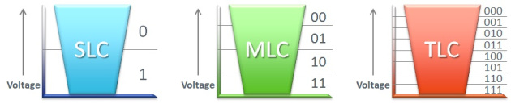
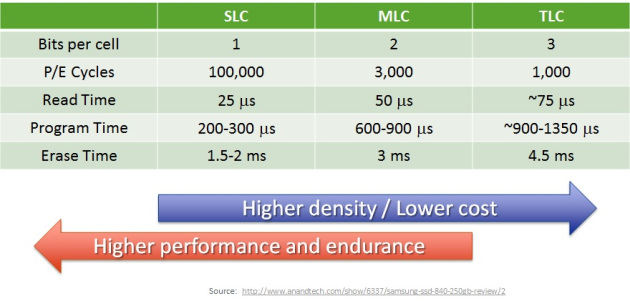

# SLC, MLC and TLC

referenced: [Understanding Flash: SLC, MLC and TLC | flashdba](https://flashdba.com/2014/07/03/understanding-flash-slc-mlc-and-tlc/)   

将闪存颗粒（cell）看作一个可以积蓄电子的池子，programing的过程即向其中充入电子（使其电位下降）的过程，erasing即从其中剥夺电子的过程（使其电位上升）。为此cell设置一个阈值，其电位小于此阈值时将其视作0，大于此阈值时将其视作1，我们就得到了一个可以存储信息的闪存颗粒。由于这个可以只能表示一个比特，我们称其为SLC（Single Level Cell）。   
如果我们设置三个阈值a, b, c，设电位为v；当v < a时视作00，a < v < b时视作01，b < v < c时视作10；c < v时视作11；如此，一个cell即可表示2个比特。我们称其为MLC(Multi Level Cell)。
若一个cell可以表示3个比特，我们就称其为TLC（Three Level Cell）。   
      

Since MLC and TLC requires more accuracy in the measurements of voltage, use of them delivers higher error rates and lower endurance(the number of program / erase cycles that can be sustained), and lower speed.   
   

