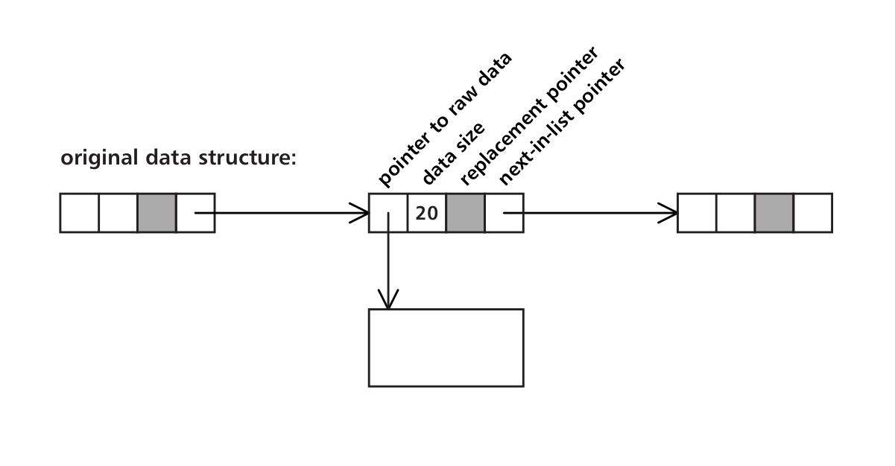
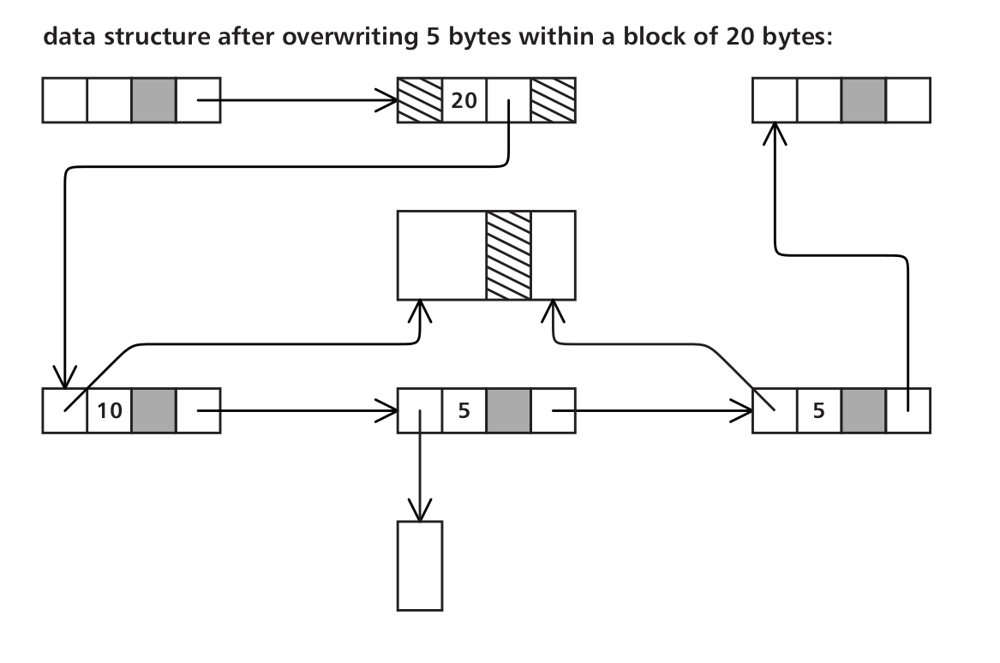

# Flash specific file systems
It benefits a lot that we expose the header data and leave the control of read/program/erase to the file system. For example, if the fs can mark the sectors of a deleted file obsolete, they won't be copied back and forth during GCs.   

## The Journaling Flash Filing System 2
The Journaling Flash Filing System 2 (JFFS2) is a POSIX compiant file system. Files are represented by an inode number. And inode numbers are never reused. Each version of an inode carries a version number, which is never reused either.   

In JFFS2, the log consists of a linked list of variable-length nodes. Most nodes contain parts of files. Such nodes contain a copy of the inode (the file's metadata), along with a range of data from the file, possibly empty. There are also special directory-entry nodes, which contain a file name and associated inode number.   

At mount time, the system scans all logs to create two data structures: the direct map (in a form of a hash table) and a collection of structures that represent each valid node on the flash.    

The structure represent the valid nodes participates in two linked lists, one chaining all the nodes according to physical address, to assist in garbage collection, and the other containing all the nodes of a file, in order.   

The list of nodes belonging to a file form a direct map of file positions to flash addresses. Because both the inode to flash-address and the file position to flash address maps are only kept in RAM, the data structure on the flash can be very simple. In particular, when a file is extended or modified, only the new data and the inode are written to the flash, but no other mapping information. The obvious consequence of this design choice is high RAM usage.   

JFFS2's wear-levelling is simple. It dosn't make hard choices at most time, it just clean some block which contains at least some obsolete data. But on every 100th cleaning operation, the cleaner selects a unit with only valid data, in an attempt to move static data around the device.   

## Yet Aother Flash Filing System
The author of this file system, Yet Another Flash Filing System (YAFFS) claims it suits NAND devicess better than JFFS and JFFS2 do.   

In YAFFS, files are stored in fixed sized chunks, which can be 512 bytes, 1 KB or 2KB in size.   

The fs associates a __header__ with each chunk. The header is 16 bytes for 512 bytes chunks, 30 bytes for 1 KB, and 42 bytes or 2 KB. Each file (including directories) is also attached with a __header chunk__, stores the file's name and permissions, and zero or more data chunks.     
YAFFS uses a tree structure to store the direct map. Each node inside the tree is of 32-byte long. Internal nodes contain 8 pointers to other nodes, and leaf nodes contain 16 2-byte pointers to physical addresses.   

A 16-bit words may not be sufficient in a large flash device. So YAFFS introduces a scheme named _approximate pointers_. Each pointer value represents a contiguous range of chunks. For example, if a flash contains 2^18 chunks, each 16-bit value represents 4 chunks. When the system finds the chunk group we needs, it searches the headers of these chunks to look for the exact chunk we needs. So, with this manner, the system plays a twp-step addressing.   

To avoid file-header modification on every append operation, each chunk's header contains the amount of data it carries; upon append, a new tail chunk is written containing the new size of the tail, with the number of full blocks give the size of the file.   

The first version of YAFFS uses 512-byte chunks and invalidates chunks by clearing a byte in the header. Since it is common in the flash that a bit-flipping happens, the bit may not be a bit, but a byte, and the system uses a majority vote in the byte.   

In YAFFS2, a slightly more complex arrangement to invalidate chunks of 1 or 2 KB is used. This modification is made to ensure a strictly sequential writing order within erase units, so that eraed pages are written on after the other and never rewritten.   

The modification in YAFFS2 metioned above is mainly comprised of two mechanisms. First the chunk's header contains not only the file ID and the position within the file, but also a sequence number. The sequence number determines which, among all the chunks representing a single block of a file, is the valid chunk. The rest can be reclaimed. Second, files and directories are deleted by moving them to a trash directory, which implicitly marks all their chunks for garbage collection. When the last chunk of a deleted file is erased, the file itself can be deleted from the trash directory.   

Wear-levelling is mainly achieved by infrequent rndom selection of an erase unit to reclaim.   

## The Trimble File System
It is very similar to TAFFS. Files are broken into 252-byte chunks, with a 4-byte header.      

Each file is attached with a header sector, contains the file number, a valid/invalid word, a file name, and up to 14 file records, only one of which, the last one, is valid.   

Each record contains the size of the file, a checksum, and the lsat modification time. Whenever a file is modified a new record is used, and when they are all used up, a new header sector is allocated and written.   

Erase units are chosen for reclamation based solely on the number of valid sectors that they still contain, and only if they contain no free sectors.      

To avoid losing the erase counts during a crash that occurs after a unit is erased but before its header is written, the erase count is written prior to erasure into a special sector containing block erasure information.   

Sectors are allocated sequentially within erase units, and the next erase unit to be used is selected from among the available ones based on erase counts, again providig some wear-leveling capability.   

## The Microsoft Flash File System
Lit FAT, nearly everything is represented with a likned list, including the directories and the files. An internal structure of a file is shown below:    
   

When some where in the file is updated, a __patch__ is generated, and the updated node's corresponding data is modified:   
   

