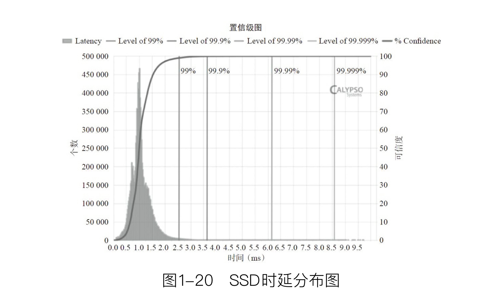
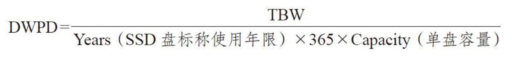

# The Parameters of SSD

## 性能指标  

SSD的性能指标包括IOPS, 吞吐量(throughput) 和 响应时间/时延 (Latency)。   

+ IOPS: 即 IO每秒，即设备每秒完成的IO请求数。一般是小块数据读写命令的响应次数。    
+ 吞吐量：单位 MB/s，亦即带宽(bandwith)。     
+ 响应时间：即每个命令从发出到收到状态回复所需要的时间。时延指标有平均时延和最大时延两项。     

-----------------------

## 访问模式

性能测试时需要考虑访问模式：
+ Ramdom/Sequencial: 随机和顺序数据命令请求。这里指LBA的连续或随机。     
+ Block Size: 块大小，指单条命令传输的数据大小，一半在4KB - 512 KB不等。随机测试一般用小块，顺序测试一般用大块。    
+ Read/Write Ratio: 一组测试中的读写命令数量之比。   

SSD的性能测试都是上述三项中各个模式的组合。   

------------------------

## 服务质量指标 (Quality of Service, QoS)

指时延的“置信级” (Condifence Level)，即大量测试中时延的统计，包括时延的分布情况，可以保证99%的操作时延不大于某值，99.9%的操作时延不大于某值等等。如下图示例。   

   

---------------------------

## 寿命   

衡量SSD寿命的主要指标有2个：DWPD (Drive Writes Per Day)，即在保质期内，用户可以每天把SSD写满多少次；以及TBW (Terabytes Written)，即在SSD的生命周期内用户可以写入的总字节数。   

如果一个200 GB的SSD保质期为5年，其最多可写入3600TB数据，则其每天可写入3600TB / (5*365) = 1972 GB，即每天可写满9.86次，则称其为10DWPD。   

TBW的计算公式如下:
   

其中：
+   NAND PE Cycles: SSD使用的闪存标称写擦除次数，如3K、5K。
+   Capacity: SSD单盘用户可使用容量。
+   WA: 写入放大系数，与SSD FW的设计和用户写入的数据类型(顺序写还是随机写)强相关。

TBW与DWPD的互换:   
   

----------

## 数据可靠性

SSD的可靠性主要指标:
+   __UBER__: Uncorrectable Bit Error Rate, 不可修复的错误比特率   
+   __RBER__: Raw Bit Error Rate, 原始错误比特率   
+   __MTBF__: Mean Time Between Failure, 平均故障间隔时间   

闪存由于其物理特性，期内的数据可能会随机发生比特翻转，即由1变为0或由0变为1，主要由一下几种原因导致：
+   擦写磨损 (P/E Cycle)
+   读取干扰 (Read Disturb)
+   编程干扰 (Program Disturb)
+   数据保持 (Data Retention)发生错误

虽然SSD内可能会使用ECC (Error Correction Code, 纠错码)来验证和恢复数据，仍然可能会有数据无法被纠正。   

UBER即指示，即使应用了纠错机制，仍然会发生的错误的数据所占总读取数据的比例。   

影响UBER的核心因素是RBER，由名可知RBER即为发生物理翻转的比特所占的概率。RBER对UBER的贡献可能是指数级的。    
RBER反应了闪存的质量。所有闪存出厂时都有一个RBER指标，企业级闪存和消费级闪存的RBER指标也是显然不同的，价格也当然不同。    

同一块闪存，经历的P/E Cycles越多，RBER越高。

同样，RBER也和闪存的内部结构有关系。   

----------------------

## 功耗

### SSD 产品功耗

SSD主要有几种功耗类型：
+   空闲 (idle) 功耗：当主机无任何命令发送给SSD，SSD处于空闲状态但也没有进入省电模式时，设备所消耗的功耗。   
+   Max active功耗 (最大功耗): SSD处于最大工作负载下的功耗，一般使用连续写来测试。   
+   Standby/Sleep 功耗: 指SSD处于Standby和Sleep状态下的功耗。SSD的工作状态一般分为如下几种: Active, Idle, Standby, Sleep，功耗逐级递减。一般在Standby和Sleep状态下，设备应尽可能把不工作的硬件模块关闭。
+   DevSleep功耗：这是SATA和PCIe新定义的一种功耗标准，目的是在Standby和Sleep的基础上再降一级功耗。   

一般功耗模式切换由主机端发起，SSD被动地切换工作状态。功耗状态的切换也需要一定的时延，并且会造成一定的性能损失。   

### 最大工作功耗与发热控制

当SSD一直处于高功耗下工作，其发热问题将不能被忽略，否则可能讲损坏其内器件。   

SSD内发热的主要部件为ASIC主控和闪存模块。   

当传感器检测到温度异常时，固件必须启动降温算法模块。   

------------------

## 兼容性

1. BIOS和操作系统的兼容性   
    测试SSD可以正常工作的主机信息。包括OS种类，主板上CPU南北桥芯片组型号和各个版本，BIOS版本，特殊应用程序的各个版本 (BenchMark工具种类和版本，DBMA种类和版本等)。
2. 电信号兼容性和硬件兼容性
    指当主机提供的电信号处于非稳定状态，存在抖动、信号完整性差等情况，但仍处于规范误差范围内时，SSD通过自身的硬件设计和结构信号完整性设计能够正常完成指令的能力。同样，在高低温、电磁干扰环境下，SSD也应可以稳定工作。
3. 容错处理
    在主机端发生错误时，SSD应保证不被损坏。