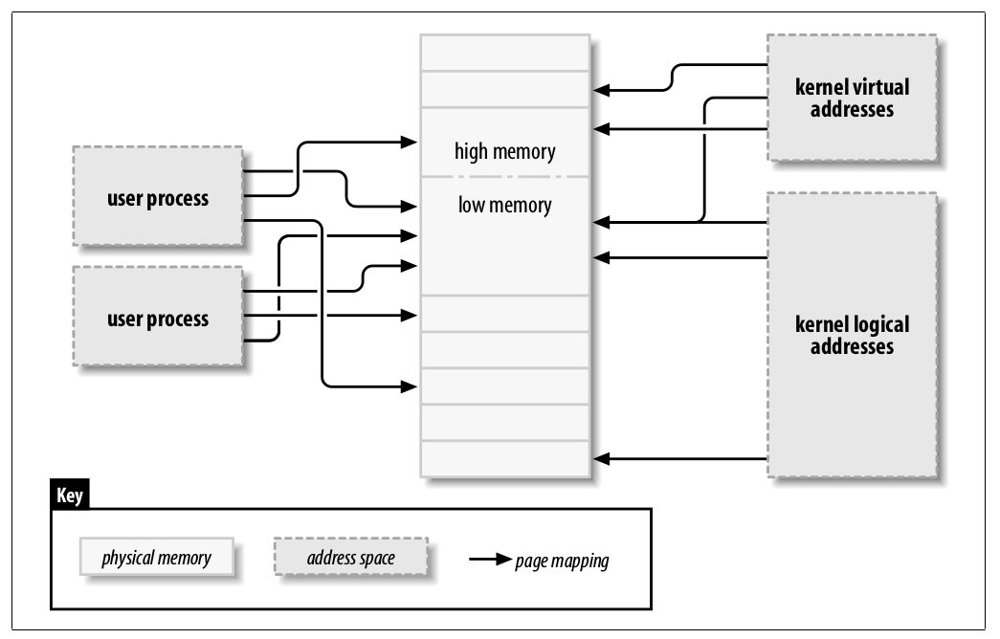

# Chapter 15 Memory Mapping and DMA

## Address Types
+   __User virtual addresses__: Regular addresses seen by user-space programs.
+   __Physical addresses__: The addresses used between the processor and the system's memory.   
+   __Bus addresses__: The addresses used between peripheral buses and memory. Some architectures can provide an I/O memory management unit (IOMMU) that remaps addresses between a bus and main memory. Bus addresses are highly architecture dependent, of course.
+   __Kernel logical addresses__: These make up the normal address space of the kernel. These addresses map some portion (perhaps all) of main memory and are often treated as if they were physical addresses. On most architectures, logical addresses and their associated physical addresses differ only by a constant offset. Logical addresses use the hardware's native pointer size and, therefore, may be unable to address all of physical memory on heavily equipped 32-bit systems. Logical addresses are usually stored in variables of type `unsigned long` or `void *`. Memory returned from `kmalloc` has a kernel logical address.
+   __Kernal virtual addresses__: Similar to logical addresses in that they are a mapping from a kernel-space address to a physical address. Kernel virtual addresses do not necessarily have the linear, one-to-one mapping to physical addresses that characterize the logical address space. All logical addresses are kernel virtual addresses, but many kernel virtual addresses are not logical addresses. Virtual addresses are susually stored in pointer variables.

   

## Physical Addresses and Pages
A memory address -- virtual or logical -- can be devided into a page number and an offset within the page.   

The macro `PAGE_SHIFT` tells how many bits must be shifted to make this conversion.   

## High and Low Memory
On some 32-bit architecture, Linux devides the 4-GB addressing space into two parts: the lower 3 GB for user space and the higher 1 GB for kernel space. Since 1 GB is sometimes not enough, it is possible to map some page to some where in the higher addresses and then access it via the mapping address. 

+   __Low Memory__: Memory for which logical addresses exits in kernel space. On almost every system you likely encounter, all memory is low memory.
+   __High Memory__: Memory for which logical addresses do not exist. Because it is beyond the address range set aside for kernel virtual addresses.

On x68-64, there is no high memory since the address space is large enough.   

