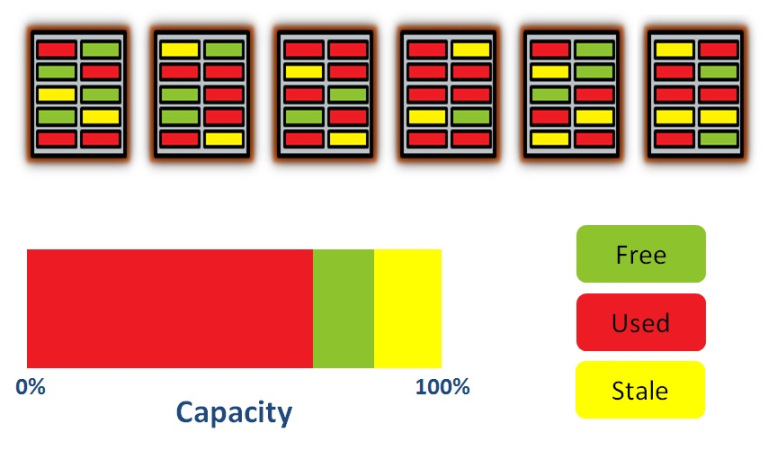
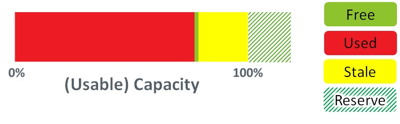
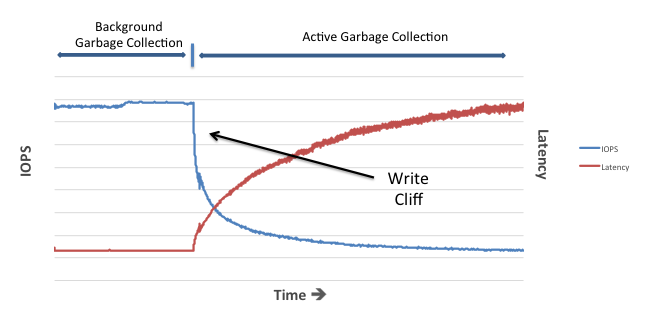

# Garbage Collection

## Garbage Collection
referenced: [Understanding Flash: Garbage Collection Matters | flashdba](https://flashdba.com/2014/10/15/understanding-flash-garbage-collection-matters/)   

With Wear levelling, the FTL may spread used pages evenly into the blocks.   
   

In the pic above, _free_ means the page is clean, free to program (write); _used_ indicates this page contains data; and _stale_ indicates this block contains data as well, but it is out-dated. The _stale_ pages are the objects to be collected for erasing.   

NAND can only be erased at the block level. If we want to erase the stale pages, we have to erase the whole block, which cause us lose all data stored in the used pages in the same block. So before the erasing, we have to copy all used pages in that block to somewhere else.   

To ensure there is always enough room to store the used pages, most of the NAND vendors give their products more space, and mark the extra space "reserve"d. This behaviour is named `overprovision`.   
   

For example, A 400GB _HGST Ultrastar SSD800MM_ owns actually 576GB of raw flash, nearly 44% percent of its capacity is marked as reserved. 

Be noted that the reserved blocks are not dedicated. Blocks are dynamically marked as free, used, stale or reserved. Just when no more capacity than the reserved left, no more data can be appended to this storage either.   

## Write Cliff
referenced: [Understanding Flash: The Write Cliff](https://flashdba.com/2014/11/24/understanding-flash-the-write-cliff/)   

Since we have to store the accompanied pages somewhere else when erasing one, it is possible that we have to queue a bunch of readings before we actually perform the erasing.   

A flash die (sometimes a plane) can only perform one operation at a time. So when we are performing one operation, the followings must be queued.   

Compared to the read and write operation, erases are very slow. For MLC a read takes ~50 microseconds while an erase takes about 3 milliseconds.   

So if it is necessary to perform a garbage collection, the device will be unable to respond the requests immediately, including the queued ones. A sharp performance decrease may occur. This phenomenon is named `write cliff`.     

So, the GC must be scheduled. If one GC does not affect the performance exposed to the users, it is named as `background garbage collection (BGC)`. But if the writes happen too often that BGC cannot keep up with, `active gargabe collections (AGC, or described as foreground garbage collection)` come out.   

Here comes the relationships: the more unused space (dies or planes) the flash device has, the less possible that AGCs present. With some extra dies been overprovisioned, when a write is issued into somewhere is under a GC, it may be temporarily redirected to a page reserved. So a NAND flash device with more extra space, runs faster.   
   
