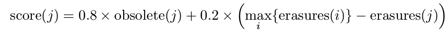
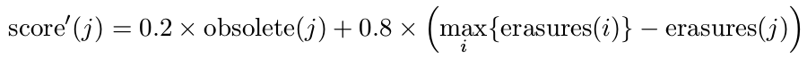
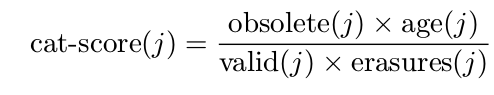
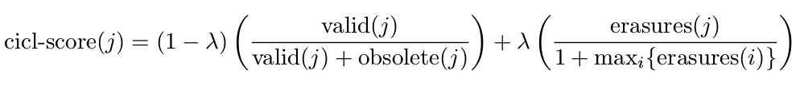
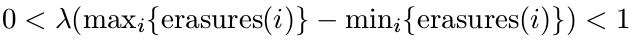

# GC & Wear Levelling Policies
The goal of wear levelling and efficient reclaimation are often contradictory.   

Typically, the system uses an efficiency-centric reclaimation policy most of the time, but switches to a wear-centric technique that ignores efficiency once in a while. Sometimes uneven wear triggers the switch, and sometimes if happens periodically whether or not wear is even.    

A simple strategy to switch between the efficieny-centric one and the wear-even-centric one is: It is triggered by the reclaimation of one block; The system keeps collecting the erase counters of every block; when the difference between the current recollected one  and the minumum one is larger than a threshold, a wear-levelling relocation is triggered.   

## Strategy #1
We name a block whose data will not changes soon (or ever) a static block.   

We name the most worn data-carrying block A, and the least worn data-carrying block B. Since least worn block tends to be a static block, a simple wear-levelling relocation strategy is to copy A's data to a spare block, erase A, move B's data into A, and then erase B. With this we can slow down A's wearing speed, and bring B closer to the average wearing level.   

## Strategy #2
Keep the stale blocks (candidates for erasure) inside a priority-queue in RAM. The queue's head is the least worn block. Every time it is time to erase a block, we retrive the queue's head, and erase it.    

We may store a value somewhere, it's always one more than the head's erase count. It can be used to estimate the storage's wear level.    

For some flash, the waer level is proportional to the erase latency. So the erase latency can be used to evaluate the wear level. With this strategy, we do not need to  store erase counters, though this may lose the accuracy and can only get one block's wear after it's erased.   

## Strategy #3
Periodically (say once per 100 reclaimations) perform wear-leveling-reclaimation, which moves static data from the least worn block to the most worn one. This strategy doesn't performs well sometimes, and some blocks may never be reclaimed.   

## Strategy #4
Totally random. Periodically or once per random times select a block randomly, move its data to somewhere spare, and then erase it.   

The aim of this technique is to have every unit undergo a fairly large number of random swaps, say 100, during the lifetime of the flash device, which is diminish the likelihood that an erase unit stores static data for much of the device's lifetime. In addition, the total overhead of wear leveling in this technique is predictable and evenly spread in time.   

## Strategy #5
Determines which block to reclaim based on a weighted benefit/cost ratio. The benefit of a unit reclaimation is the amount of invalid space in the unit. The cost is incurred by the need to read the valid data and write it back elsewhere. This is weighted by the age of the block, the time since last invalidation. A large weight is assumed to indicate that the remaining valid data in the unit is relative static. This implies that the valid occupancy of the unit is unlikely to decrease soon, so there is no point in waiting until the benefit increases. In other words, the method tries to avoid reclaiming units whose benefit/cost ratio is likely to increase soon.     

## Strategy #6
Seperate blocks into "hot" bocks and "cold" blocks. Write static data to "cold" ones and write dynamic data to "hot" ones.   

Since dynamic data temps to be almost empty upon reclamation, this increases the efficiency of GC, but leads to uneven wear of the blocks.     

## Strategy #7
We partiion the erase units into several partitions. Lower-numbered partitions are supposed to be "hot", while the higher-numbered partitions are "cold".    

Each partition has one active wease unit that is used to store updated blocks. When a virtual block is updated, the new data is written to a sector in the active unit in the same partition the block currently resides in.   

When the active unit in a partition fills up, the system finds the unit with the least valid sectors in the same partition and copied to the beggining of an empty unit.    

Thus, blocks that are not updated frequently tend to slide toward the beginning of erase units. Blocks that were updated after the unit they are on became active, and are hence hot, tend to reside toward the end of the unit. We may use this phenomenon to classify blocks as hot or cold.      

The system tries to maintain a constant reclamation frequency in all the partitions. Since the data of hot partitions tends to be invalidated more quickly, its spare units ran out quicklier. When one partition is full, we redirect the updates to its blocks to the blocks of one nearby partition.     

## Strategy #8
Use the formula to give every reclamation canidate block a score, the higher one is preferred to be reclaimed:   
   
_erasures(j)_ indicates the erase count of unit j; and _obsolete(j)_ indicates the obsolete pages count inside unit j.   

When some condition is met, say the differences between the most and the least worn out units' erase counts is 500 or higher, we use another formula:
   

## Strategy #9   
This policy is named CAT policy.   

Like #8, but we use a differenct formula:   
   
_age(j)_ means the time since last time unit j was erased; _valid(j)_ indicates the valid page count of unit j.   

With this formula, the strategy tends to choose a block with more obsolete data, longer not-been-updated time, less valid data and less erase count.    

## Strategy #10
This strategy is called `CICL`, and it uses another formula:   
   

In this formular, λ is not a constant, it's a monotonic function that depends on the discrepancy between the most and the least worn out units:   
   

