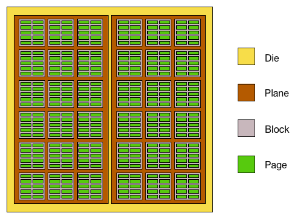

# Blocks, Pages and Program / Erase

referenced: [Understanding Flash: Blocks, Pages and Program / Erases](https://flashdba.com/2014/06/06/understanding-flash-what-is-nand-flash/)   

   

__Package__: The memory chip. Each package contains one or more (one or two or four) dies.   

__Die__: The die is the smallest unit that can independently execute commands or report status. Each die contains one or more (usually one or two) planes.   

__Plane__: Concurrent operations can take place on each plane as well, although with some restrictions. Each plane contains a number of blocks.   

__Block__: The smallest unit that can be erased. After a block gets erased, it is available to be "written" again. Each block contains a number of pages.   

__Page__: This is the smallest unit to be programed (written).   

The most important thing implied above is: We can read or program (write) in a unit of page, but we have to erase in a unit of block, which contains losts of pages.   

And, a flash chip can only survive a limited number of times of `program erase cycles (also named as PE cycle, means a pair of programing and erasing)`.     

An `erase` operation takes longer time than `read` and `program` does.   

文章最后给出了一个note: 一个空的page内部，所有数据都是1. 写入的过程即是将部分数据由1变为0的过程，例如将11111111变为11110000. 对于数据11110000，如果需要将其改变为00110000，由于需要被改变的部分都是1，因此无需对其进行erase，直接program即可。    