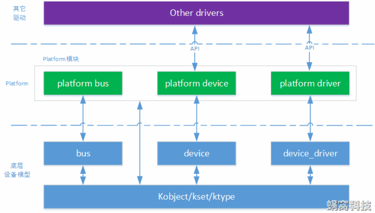

#   Platform Device Drivers
### 参考
[Linux Platform devices 平台设备驱动](https://blog.csdn.net/lizuobin2/article/details/51607813)   
***   
## 概览
   
platform平台设备驱动是基于设备总线驱动模型的，它只不过是将 `device` 进一步封装成为 `platform_device`，将 `device_driver` 进一步封装成为 `platform_device_driver`,前面已经分析过设备总线驱动模型，关于 `device` 与 `device_driver` 的注册过程以及它们在`sysfs`文件系统中的层次关系就不在分析，本文重点分析platform平台设备驱动与设备总线驱动模型相比较新增添的那些东西。   
Platform设备包括：基于端口的设备（已不推荐使用，保留下来只为兼容旧设备，legacy）；连接物理总线的桥设备；集成在SOC平台上面的控制器；连接在其它bus上的设备（很少见）。等等。   
    这些设备有一个基本的特征：可以通过CPU bus直接寻址（例如在嵌入式系统常见的“寄存器”）。因此，由于这个共性，内核在设备模型的基础上（`device`和`device_driver`），对这些设备进行了更进一步的封装，抽象出`paltform bus`、`platform device`和`platform driver`，以便驱动开发人员可以方便的开发这类设备的驱动。   
    可以说，paltform设备对Linux驱动工程师是非常重要的，因为我们编写的大多数设备驱动，都是为了驱动plaftom设备。   
***   
## `platform_bus_type`
我们知道，在设备总线驱动模型的中，BUS像一个月老一样，通过它的match函数，将注册到bus中的device与driver进行配对，那么每一个不同的bus 都有自己的`match`函数，我们来看看platform_bus_type.   
``` c
// drivers/base/platform.c
struct bus_type platform_bus_type = {
	.name		= "platform",
	.dev_attrs	= platform_dev_attrs,
	.match		= platform_match,
	.uevent		= platform_uevent,
	.pm		= &platform_dev_pm_ops,
};
static int platform_match(struct device *dev, struct device_driver *drv)
{
	struct platform_device *pdev = to_platform_device(dev);
	struct platform_driver *pdrv = to_platform_driver(drv);

	/* match against the id table first */
	if (pdrv->id_table)
		return platform_match_id(pdrv->id_table, pdev) != NULL;

	/* fall-back to driver name match */
	return (strcmp(pdev->name, drv->name) == 0);
}
```   
如果`platform_device_driver`中定义了`id_table`，则调用 `platform_match_id` 进行匹配:   
举个例子：   
``` c
// drivers/i2c/busses/i2c-s3c2410.c (with some modification)
static struct platform_device_id s3c24xx_driver_ids[] = {
	{
		.name		= "s3c2410-i2c",
		.driver_data	= TYPE_S3C2410,
	}, {
		.name		= "s3c2440-i2c",
		.driver_data	= TYPE_S3C2440,
	}, { },
};

// arch/arm/plat-samsung/devs.c (with some modification)
struct platform_device s3c_device_i2c0 = {
	.name		  = "s3c2410-i2c",
#ifdef CONFIG_S3C_DEV_I2C1
	.id		  = 0,
#else
	.id		  = -1,
#endif
	.num_resources	  = ARRAY_SIZE(s3c_i2c_resource),
	.resource	  = s3c_i2c_resource,
};

// drivers/base/platform.c
static const struct platform_device_id *platform_match_id(struct platform_device_id *id, struct platform_device *pdev)
{
	while (id->name[0]) {
		if (strcmp(pdev->name, id->name) == 0) {
			pdev->id_entry = id;
			return id;
		}
		id++;
	}
	return NULL;
}
```   
显然，`platform_match_id` 的作用就是遍历整个 `Id_table` 数组，寻找是否有与 `platform_device->name` 同名的，如果有，则返回这个 `Platform_device_id` ,使用`Id_table` 打破了原本设备总线驱动模型，一个 `device` 只能用与一个 `device_driver` 配对的局限性。现在一个`platform_device_driver` 可以与多个`platform_device`配对。   
如果没有，则只是根据 `platform_device_driver->name` 与 `platform_device->name` 进行比较，这也就是老师为啥在写平台设备驱动程序的时候经常说，“将驱动注册到内核中去，如果有同名设备，则调用driver->probe函数....”。   
***
### `platform_device_id`
``` c
// include/linux/mod_devicetable.h
struct platform_device_id {
	char name[PLATFORM_NAME_SIZE];
	kernel_ulong_t driver_data;
};
```
***
### `platform_device`
``` c
// include/linux/platform_device.h
struct platform_device {
	const char	*name;
	int		id;
	bool		id_auto;
	struct device	dev;
	u32		num_resources;
	struct resource	*resource;

	const struct platform_device_id	*id_entry;
	char *driver_override; /* Driver name to force a match */

	/* MFD cell pointer */
	struct mfd_cell *mfd_cell;

	/* arch specific additions */
	struct pdev_archdata	archdata;
};
```     

| field  | 作用                                                             |
|:-------|----------------------------------------------------------------:| 
| `name`   | 设备的名称，该名称在设备注册时，会拷贝到`dev.init_name`中                |
|  `dev`   |  真正的设备，通过 `container_of` ,就能找到整个`platform_device` ，访问其它成员，如后面要提到的 `resource` |
|  `num_resources`、`resource`  |  该设备的资源描述，由`struct resource`（`include/linux/ioport.h`）结构抽象  |   

在Linux中，系统资源包括I/O、Memory、Register、IRQ、DMA、Bus等多种类型。这些资源大多具有独占性，不允许多个设备同时使用，因此Linux内核提供了一些API，用于分配、管理这些资源。           
当某个设备需要使用某些资源时，只需利用`struct resource`组织这些资源（如名称、类型、起始、结束地址等），并保存在该设备的`resource`指针中即可。然后在设备`probe`时，设备需求会调用资源管理接口，分配、使用这些资源。而内核的资源管理逻辑，可以判断这些资源是否已被使用、是否可被使用等等。    
``` c
// include/linux/ioport.h
struct resource {
	resource_size_t start;
	resource_size_t end;
	const char *name;
	unsigned long flags;
	struct resource *parent, *sibling, *child;
};
```   
示例代码:
``` c
static struct resource led_resource[] = {	//jz2440的参数，驱动未测试 
	[0] = {
		.start = 0x56000010,
		.end   = 0x56000010 + 8 - 1,
		.flags = IORESOURCE_MEM,
	},
	[1] = {
		.start = 5,
		.end   = 5,
		.flags = IORESOURCE_IRQ,
	},
};
static struct platform_device led_dev = {
	.name = "myled",	//设备名字 与 驱动相匹配
	.id	  = -1,
	.num_resources = ARRAY_SIZE(led_resource),
	.resource = led_resource,
	
	.dev = {
		.release = led_release,
		//.devt = MKDEV(252, 1),
	},
};
```


***
### `platform_device` 中的 `id` 的作用   
``` c
    if (pdev->id != -1)      /* 如果不是-1 对name编号 */  
        dev_set_name(&pdev->dev, "%s.%d", pdev->name,  pdev->id);  
    else                             /* -1时直接是名字 */
        dev_set_name(&pdev->dev, pdev->name); 
```   
***    
### 从 `device_driver` 封装而来的`platform_dirver`   
``` c
// include/linux/platform_device.h
struct platform_driver {
	int (*probe)(struct platform_device *);
	int (*remove)(struct platform_device *);
	void (*shutdown)(struct platform_device *);
	int (*suspend)(struct platform_device *, pm_message_t state);
	int (*resume)(struct platform_device *);
	struct device_driver driver;
	struct platform_device_id *id_table;
};
```

``` c
// include/linux/platform_device.h
/*
 * use a macro to avoid include chaining to get THIS_MODULE
 */
#define platform_driver_register(drv) \
	__platform_driver_register(drv, THIS_MODULE)


// drivers/base/platform.c
/**
 * __platform_driver_register - register a driver for platform-level devices
 * @drv: platform driver structure
 * @owner: owning module/driver
 */
int __platform_driver_register(struct platform_driver *drv,
				struct module *owner)
{
	drv->driver.owner = owner;
	drv->driver.bus = &platform_bus_type;
	drv->driver.probe = platform_drv_probe;
	drv->driver.remove = platform_drv_remove;
	drv->driver.shutdown = platform_drv_shutdown;

	return driver_register(&drv->driver);
}
EXPORT_SYMBOL_GPL(__platform_driver_register);
```   
`struct platform_driver`结构和`struct device_driver`非常类似,上边的`platform_drv_probe`、`platform_drv_remove`、`platform_drv_shutdown`，只不过稍作转换调用`platform_driver`中的`probe`、`remove`、`shutdown`函数:
``` c
// drivers/base/platform.c
static int platform_drv_probe(struct device *_dev)
{
	struct platform_driver *drv = to_platform_driver(_dev->driver);
	struct platform_device *dev = to_platform_device(_dev);
	int ret;

	ret = of_clk_set_defaults(_dev->of_node, false);
	if (ret < 0)
		return ret;

	ret = dev_pm_domain_attach(_dev, true);
	if (ret)
		goto out;

	if (drv->probe) {
		ret = drv->probe(dev);
		if (ret)
			dev_pm_domain_detach(_dev, true);
	}

out:
	if (drv->prevent_deferred_probe && ret == -EPROBE_DEFER) {
		dev_warn(_dev, "probe deferral not supported\n");
		ret = -ENXIO;
	}

	return ret;
}

static int platform_drv_remove(struct device *_dev)
{
	struct platform_driver *drv = to_platform_driver(_dev->driver);
	struct platform_device *dev = to_platform_device(_dev);
	int ret = 0;

	if (drv->remove)
		ret = drv->remove(dev);
	dev_pm_domain_detach(_dev, true);

	return ret;
}

static void platform_drv_shutdown(struct device *_dev)
{
	struct platform_driver *drv = to_platform_driver(_dev->driver);
	struct platform_device *dev = to_platform_device(_dev);

	if (drv->shutdown)
		drv->shutdown(dev);
}
```   
***
### `Platform Device`提供的API
``` c
// include/linux/platform_device.h
extern int platform_device_register(struct platform_device *);
extern void platform_device_unregister(struct platform_device *);
 
extern void arch_setup_pdev_archdata(struct platform_device *);
extern struct resource *platform_get_resource(struct platform_device *, unsigned int, unsigned int);
extern int platform_get_irq(struct platform_device *, unsigned int);
extern struct resource *platform_get_resource_byname(struct platform_device *, unsigned int, const char *);
extern int platform_get_irq_byname(struct platform_device *, const char *);
extern int platform_add_devices(struct platform_device **, int);
 
extern struct platform_device *platform_device_register_full(const struct platform_device_info *pdevinfo);
 
static inline struct platform_device *platform_device_register_resndata(
                struct device *parent, const char *name, int id,
                const struct resource *res, unsigned int num,
                const void *data, size_t size)
 
static inline struct platform_device *platform_device_register_simple(
                const char *name, int id,
                const struct resource *res, unsigned int num)
 
static inline struct platform_device *platform_device_register_data(
                struct device *parent, const char *name, int id,
                const void *data, size_t size)
 
extern struct platform_device *platform_device_alloc(const char *name, int id);
extern int platform_device_add_resources(struct platform_device *pdev,
                                         const struct resource *res,
                                         unsigned int num);
extern int platform_device_add_data(struct platform_device *pdev,
                                    const void *data, size_t size);
extern int platform_device_add(struct platform_device *pdev);
extern void platform_device_del(struct platform_device *pdev);
extern void platform_device_put(struct platform_device *pdev);
```
+	`platform_device_register`、`platform_device_unregister`，Platform设备的注册/注销接口，和底层的`device_register`等接口类似。   
+	`arch_setup_pdev_archdata`，设置 `platform_device` 变量中的 `archdata` 指针。   
+	`platform_get_resource`、`platform_get_irq` 、`platform_get_resource_byname` 、`platform_get_irq_byname`，通过这些接口，可以获取 `platform_device` 变量中的`resource` 信息，以及直接获取IRQ的number等等。   
+	`platform_device_register_full` 、`platform_device_register_resndata` 、`platform_device_register_simple` 、`platform_device_register_data`，其它形式的设备注册。调用者只需要提供一些必要的信息，如name、ID、resource等，Platform模块就会自动分配一个`struct platform_device` 变量，填充内容后，注册到内核中。   
+	`platform_device_alloc`，以name和id为参数，动态分配一个 `struct platform_device` 变量。
+	`platform_device_add_resources`，向 `platform device` 中增加资源描述。   
+	`platform_device_add_data`，向`platform device`中添加自定义的数据（保存在`pdev->dev.platform_data`指针中）。   
+	`platform_device_add`、`platform_device_del`、`platform_device_put`，其它操作接口。   
***   
### `Platform Driver` 提供的API
`platform_driver_register`、`platform_driver_unregister`，platform driver的注册、注销接口。   
`platform_driver_probe`，主动执行probe动作。   
`platform_set_drvdata`、`platform_get_drvdata`，设置或者获取driver保存在device变量中的私有数据。   
***
### 懒人API
``` c
#define platform_create_bundle(driver, probe, res, n_res, data, size) \
	__platform_create_bundle(driver, probe, res, n_res, data, size, THIS_MODULE)
extern struct platform_device *__platform_create_bundle(
	struct platform_driver *driver, int (*probe)(struct platform_device *),
	struct resource *res, unsigned int n_res,
	const void *data, size_t size, struct module *module);
```
只要提供一个 `platform_driver`（要把driver的probe接口显式的传入），并告知该设备占用的资源信息，platform模块就会帮忙分配资源，并执行probe操作。对于那些不需要热拔插的设备来说，这种方式是最省事的了。  
***   
### 简单一例
开发板：Mini2440   
内核版本：2.6.32.2   
``` c
#include <linux/module.h>
#include <linux/kernel.h>
#include <linux/fs.h>
#include <linux/init.h>
#include <linux/device.h>
#include <linux/interrupt.h>
#include <linux/sched.h> 
#include <linux/irq.h>
#include <asm/uaccess.h>
#include <linux/input.h>
#include <linux/platform_device.h>
// 设备资源
static struct resource led_resource[] = {	//jz2440的参数，驱动未测试 
	[0] = {
		.start = 0x56000010,
		.end   = 0x56000010 + 8 - 1,
		.flags = IORESOURCE_MEM,
	},
	[1] = {
		.start = 5,
		.end   = 5,
		.flags = IORESOURCE_IRQ,
	},
};

static void led_release(struct device *dev){

}

// 创建一个设备
static struct platform_device led_dev = {
	.name = "myled",	//设备名字 与 驱动相匹配
	.id	  = -1,
	.num_resources = ARRAY_SIZE(led_resource),
	.resource = led_resource,
	
	.dev = {
		.release = led_release,
		//.devt = MKDEV(252, 1),
	},
};

static int led_dev_init(void){

	//向bus注册led_dev match drv链表进行配对
	platform_device_register(&led_dev);
	return 0;
}

static void led_dev_exit(void){
	platform_device_unregister(&led_dev);
}

module_init(led_dev_init);
module_exit(led_dev_exit);
MODULE_LICENSE("GPL");
	

#include <linux/module.h>
#include <linux/kernel.h>
#include <linux/fs.h>
#include <linux/init.h>
#include <linux/device.h>
#include <linux/interrupt.h>
#include <linux/sched.h> 
#include <linux/irq.h>
#include <asm/uaccess.h>

#include <linux/platform_device.h>
#include <linux/io.h>

static int major;

static struct class *cls;
static struct device *dev;

static volatile unsigned long *gpio_con;
static volatile unsigned long *gpio_dat;
static int pin;

static int led_open(struct inode *inode, struct file *file){

	*gpio_con &= ~(0x03 << (pin*2));
	*gpio_con |=  (0x01 << (pin*2));
	return 0;
}

static ssize_t led_write(struct file *file, const char __user *buf,
	size_t count, loff_t *ppos){

	int val;
	copy_from_user(&val, buf, count);

	if(val == 1){
		
		*gpio_dat &= ~(1<<pin);
	}else{
	
		*gpio_dat &=  (1<<pin);
	}

	return 0;
}

static struct file_operations led_fops = {

	.owner = THIS_MODULE,
	.open  = led_open,
	.write = led_write,
};

static int led_probe(struct platform_device *pdev){

	struct resource *res;
	// 最后一个参数 0 表示第1个该类型的资源
	res = platform_get_resource(pdev, IORESOURCE_MEM, 0);
	gpio_con = ioremap(res->start, res->end - res->start + 1);
	gpio_dat = gpio_con + 1;

	res = platform_get_resource(pdev, IORESOURCE_IRQ, 0);
	pin = res->start;

	printk("led_probe, found led\n");

	// 注册设备驱动 创建设备节点
	major = register_chrdev(0, "myled", &led_fops);
	// 创建类
	cls = class_create(THIS_MODULE, "myled");
	// 创建设备节点
	dev = device_create(cls, NULL, MKDEV(major, 0), NULL, "led");

	return 0;
}

static int led_remove(struct platform_device *pdev){

	printk("led_remove, remove led\n");	
	// 删除设备节点
	device_unregister(dev);
	// 销毁类
	class_destroy(cls);
	// 取消注册设备驱动
	unregister_chrdev(major, "myled");
	// 取消内存映射
	iounmap(gpio_con);

	return 0;
}

struct platform_driver led_drv = {

	.probe 	= led_probe,	//匹配到dev之后调用probe
	.remove = led_remove,
	.driver = {
		.name = "myled",
	},
};

static int led_drv_init(void){

	platform_driver_register(&led_drv);
	return 0;
}

static void led_drv_exit(void){
	
	platform_driver_unregister(&led_drv);
}

module_init(led_drv_init);
module_exit(led_drv_exit);
MODULE_LICENSE("GPL");
```    
