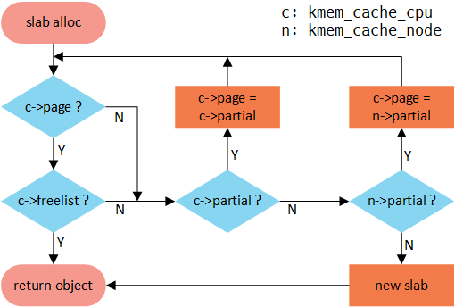

# 图解slub

[图解slub (wowotech.net)](http://www.wowotech.net/memory_management/426.html)

作者：[smcdef](http://www.wowotech.net/author/531) 发布于：2018-2-22 21:02 分类：[内存管理](http://www.wowotech.net/sort/memory_management)

## 1.前言

在Linux中，伙伴系统（buddy system）是以页为单位管理和分配内存。但是现实的需求却以字节为单位，假如我们需要申请20Bytes，总不能分配一页吧！那岂不是严重浪费内存。那么该如何分配呢？slab分配器就应运而生了，专为小内存分配而生。slab分配器分配内存以Byte为单位。但是slab分配器并没有脱离伙伴系统，而是基于伙伴系统分配的大内存进一步细分成小内存分配。

前段时间学习了下slab分配器工作原理。因为自己本身是做手机的，发现现在好像都在使用slub分配器，想想还是再研究一下slub的工作原理。之前看了代码，感觉挺多数据结构和成员的。成员的意思是什么？数据结构之间的关系是什么？不知道你是否感觉云里雾里。既然代码阅读起来晦涩难懂，如果有精美的配图，不知是否有助于阁下理解slub的来龙去脉呢？我想表达的意思就是文章图多，图多，图多。我们只说原理，尽量不看代码。因为所有代码中包含的内容我都会用图来说明。你感兴趣绝对有助于你看代码。

说明：slub是slab中的一种，slab也是slab中的一种。有时候用slab来统称slab, slub和slob。slab, slub和slob仅仅是分配内存策略不同。本篇文章中说的是slub分配器工作的原理。但是针对分配器管理的内存，下文统称为slab缓存池。所以文章中slub和slab会混用，表示同一个意思。

注：文章代码分析基于linux-4.15.0-rc3。 图片有点走形，请单独点开图片查看。

## 2. slub数据结构

slub的数据结构相对于slab来说要简单很多。并且对外接口和slab兼容。所以说，从slab的系统更换到slub，可以说是易如反掌。

### 2.1. kmem_cache

现在假如从伙伴系统分配一页内存供slub分配器管理。对于slub分配器来说，就是将这段连续内存平均分成若干大小相等的object（对象）进行管理。可是我们总得知道每一个object的size吧！管理的内存页数也是需要知道的吧！不然怎么知道如何分配呢！因此需要一个数据结构管理。那就是struct kmem_cache。kmem_cache数据结构描述如下：

```c
struct kmem_cache {
    struct kmem_cache_cpu __percpu *cpu_slab;
    /* Used for retriving partial slabs etc */
    slab_flags_t flags;
    unsigned long min_partial;
    int size;             /* The size of an object including meta data */
    int object_size;     /* The size of an object without meta data */
    int offset;           /* Free pointer offset. */
#ifdef CONFIG_SLUB_CPU_PARTIAL
    int cpu_partial;      /* Number of per cpu partial objects to keep around */
#endif
    struct kmem_cache_order_objects oo;
    /* Allocation and freeing of slabs */
    struct kmem_cache_order_objects max;
    struct kmem_cache_order_objects min;
    gfp_t allocflags;    /* gfp flags to use on each alloc */
    int refcount;         /* Refcount for slab cache destroy */
    void (*ctor)(void *);
    int inuse;            /* Offset to metadata */
    int align;            /* Alignment */
    int reserved;         /* Reserved bytes at the end of slabs */
    const char *name;    /* Name (only for display!) */
    struct list_head list;  /* List of slab caches */
    struct kmem_cache_node *node[MAX_NUMNODES];
};
```

1) cpu_slab：一个per cpu变量，对于每个cpu来说，相当于一个本地内存缓存池。当分配内存的时候优先从本地cpu分配内存以保证cache的命中率。
2) flags：object分配掩码，例如经常使用的SLAB_HWCACHE_ALIGN标志位，代表创建的kmem_cache管理的object按照硬件cache 对齐，一切都是为了速度。
3) min_partial：限制struct kmem_cache_node中的partial链表slab的数量。虽说是mini_partial，但是代码的本意告诉我这个变量是kmem_cache_node中partial链表最大slab数量，如果大于这个mini_partial的值，那么多余的slab就会被释放。
4) size：分配的object size
5) object_size：实际的object size，就是创建kmem_cache时候传递进来的参数。和size的关系就是，size是各种地址对齐之后的大小。因此，size要大于等于object_size。
6) offset：slub分配在管理object的时候采用的方法是：既然每个object在没有分配之前不在乎每个object中存储的内容，那么完全可以在每个object中存储下一个object内存首地址，就形成了一个单链表。很巧妙的设计。那么这个地址数据存储在object什么位置呢？offset就是存储下个object地址数据相对于这个object首地址的偏移。
7) cpu_partial：per cpu partial中所有slab的free object的数量的最大值，超过这个值就会将所有的slab转移到kmem_cache_node的partial链表。
8) oo：低16位代表一个slab中所有object的数量（oo & ((1 << 16) - 1)），高16位代表一个slab管理的page数量（(2^(oo  16)) pages）。
9) max：看了代码好像就是等于oo。
10) min：当按照oo大小分配内存的时候出现内存不足就会考虑min大小方式分配。min只需要可以容纳一个object即可。
11) allocflags：从伙伴系统分配内存掩码。
12) inuse：object_size按照word对齐之后的大小。
13) align：字节对齐大小。
14) name：sysfs文件系统显示使用。
15) list：系统有一个slab_caches链表，所有的slab都会挂入此链表。
16) node：slab节点。在NUMA系统中，每个node都有一个struct kmem_cache_node数据结构。

### 2.2. kmem_cache_cpu

struct kmem_cache_cpu是对本地内存缓存池的描述，每一个cpu对应一个结构体。其数据结构如下：

```c
struct kmem_cache_cpu { 
    void **freelist;    /* Pointer to next available object */
    unsigned long tid;  /* Globally unique transaction id */
    struct page *page;  /* The slab from which we are allocating */
#ifdef CONFIG_SLUB_CPU_PARTIAL
    struct page *partial;   /* Partially allocated frozen slabs */
#endif
}; 
```

1) freelist：指向下一个可用的object。
2) tid：一个神奇的数字，主要用来同步作用的。
3) page：slab内存的page指针。
4) partial：本地slab partial链表。主要是一些部分使用object的slab。

### 2.3. kmem_cache_node

slab节点使用struct kmem_cache_node结构体描述。对于slub分配器来说，成员很少，远比slab分配器简洁。

```c
struct kmem_cache_node {
    spinlock_t list_lock;
    unsigned long nr_partial;
    struct list_head partial;
};
```

1) list_lock：自旋锁，保护数据。
2) nr_partial：slab节点中slab的数量。
3) partial：slab节点的slab partial链表，和struct kmem_cache_cpu的partial链表功能类似。

### 2.4. slub接口

了解了基本的数据结构，再来看看slub提供的API。如果你了解slub，我想这几个接口你是再熟悉不过了。

```c
struct kmem_cache *kmem_cache_create(const char *name,
        size_t size,
        size_t align,
        unsigned long flags,
        void (*ctor)(void *));
void kmem_cache_destroy(struct kmem_cache *);
void *kmem_cache_alloc(struct kmem_cache *cachep, int flags);
void kmem_cache_free(struct kmem_cache *cachep, void *objp);
```

1) kmem_cache_create是创建kmem_cache数据结构，参数描述如下：

   name：kmem_cache的名称

   size ：slab管理对象的大小

   align：slab分配器分配内存的对齐字节数(以align字节对齐)

   flags：分配内存掩码

   ctor ：分配对象的构造回调函数
2) kmem_cache_destroy作用和kmem_cache_create相反，就是销毁创建的kmem_cache。
3) kmem_cache_alloc是从cachep参数指定的kmem_cache管理的内存缓存池中分配一个对象，其中flags是分配掩码，GFP_KERNEL是不是很熟悉的掩码？
4) kmem_cache_free是kmem_cache_alloc的反操作

slab分配器提供的接口该如何使用呢？其实很简单，总结分成以下几个步骤：

1) kmem_cache_create创建一个kmem_cache数据结构。
2) 使用kmem_cache_alloc接口分配内存，kmem_cache_free接口释放内存。
3) release第一步创建的kmem_cache数据结构。

再来一段demo示例代码就更好了。

```c
/*
 *　This is a demo for how to use kmem_cache_create
 */
void slab_demo(void)
{
    struct kmem_cache *kmem_cache_16 = kmem_cache_create("kmem_cache_16", 16,
            8, ARCH_KMALLOC_FLAGS,
            NULL);
 
    /* now you can alloc memory, the buf points to 16 bytes of memory*/
    char *buf = kmeme_cache_alloc(kmem_cache_16, GFP_KERNEL);
 
    /*
     * do something what you what, don't forget to release the memory after use
*/
    kmem_cache_free(kmem_cache_16, buf);
 
    kmem_cache_destroy(kmem_cache_16);
}
```

1) 首先使用kmem_cache_create创建名称为kmem_cache_16的kmem_cache，该kmem_cache主要是描述如何管理一堆对象，其实就是slab的布局。每个对象都是16字节，并且分配的对象地址按照8字节对齐，也就是说从kmem_cache_16中分配的对象大小全是16字节。不管你要申请多少，反正就是16Bytes。当然，kmem_cache_create仅仅是创建了一个描述slab缓存池布局的数据结构，并没有从伙伴系统申请内存，具体的申请内存操作是在kmeme_cache_alloc中完成的。
2) kmeme_cache_alloc从kmem_cache_16分配一个对象。
3) 内存使用结束记得kmem_cache_free释放。
4) 如果不需要这个kmem_cache的话，就可以调用kmem_cache_destroy进行销毁吧。在释放kmem_cache之前要保证从该kmem_cache中分配的对象全部释放了，否则无法释放kmem_cache。

## 3. slub数据结构之间关系

什么是slab缓存池呢？我的解释是使用struct kmem_cache结构描述的一段内存就称作一个slab缓存池。一个slab缓存池就像是一箱牛奶，一箱牛奶中有很多瓶牛奶，每瓶牛奶就是一个object。分配内存的时候，就相当于从牛奶箱中拿一瓶。总有拿完的一天。当箱子空的时候，你就需要去超市再买一箱回来。超市就相当于partial链表，超市存储着很多箱牛奶。如果超市也卖完了，自然就要从厂家进货，然后出售给你。厂家就相当于伙伴系统。

说了这么多终于要抛出辛辛苦苦画的美图了。


好了，后面说的大部分内容请看这张图。足以表明数据结构之间的关系了。看懂了这张图，就可以理清数据结构之间的关系了。

### 3.1. slub管理object方法

在图片的左上角就是一个slub缓存池中object的分布以及数据结构和kmem_cache之间的关系。首先一个slab缓存池包含的页数是由oo决定的。oo拆分为两部分，低16位代表一个slab缓存池中object的数量，高16位代表包含的页数。使用kmem_cache_create()接口创建kmem_cache的时候需要指出obj的size和对齐align。也就是传入的参数。kmem_cache_create()主要是就是填充kmem_cache结构体成员。既然从伙伴系统得到(2^(oo >> 16)) pages大小内存，按照size大小进行平分。一般来说都不会整除，因此剩下的就是图中灰色所示。由于每一个object的大小至少8字节，当然可以用来存储下一个object的首地址。就像图中所示的，形成单链表。图中所示下个obj地址存放的位置位于每个obj首地址处，在内核中称作指针内置式。同时，下个obj地址存放的位置和obj首地址之间的偏移存储在kmem_cache的offset成员。两外一种方式是指针外置式，即下个obj的首地址存储的位置位于obj尾部，也就是在obj尾部再分配sizeof(void *)字节大小的内存。对于外置式则offset就等于kmem_cache的inuse成员。

### 3.2. per cpu freelist

针对每一个cpu都会分配一个struct kmem_cacche_cpu的结构体。可以称作是本地缓存池。当内存申请的时候，优先从本地cpu缓存池申请。在分配初期，本地缓存池为空，自然要从伙伴系统分配一定页数的内存。内核会为每一个物理页帧创建一个struct page的结构体。kmem_cacche_cpu中page就会指向正在使用的slab的页帧。freelist成员指向第一个可用内存obj首地址。处于正在使用的slab的struct page结构体中的freelist会置成NULL，因为没有其他地方使用。struct page结构体中inuse代表已经使用的obj数量。这地方有个很有意思的地方，在刚从伙伴系统分配的slab的 inuse在分配初期就置成obj的总数，在分配obj的时候并不会改变。你是不是觉得很奇怪，既然表示已经使用obj的数量，为什么一直是obj的总数呢？你想想，slab中的对象总有分配完的时候，那个时候就直接脱离kmem_cache_cpu了。此时的inuse不就名副其实了嘛！对于full slab就像图的右下角，就像无人看管的孩子，没有任何链表来管理。

### 3.3. per cpu partial

当图中右下角full slab释放obj的时候，首先就会将slab挂入per cpu partial链表管理。通过struct page中next成员形成单链表。per cpu partial链表指向的第一个page中会存放一些特殊的数据。例如：pobjects存储着per cpu partial链表中所有slab可供分配obj的总数，如图所示。当然还有一个图中没有体现的pages成员存储per cpu partial链表中所有slab缓存池的个数。pobjects到底有什么用呢？我们从full slab中释放一个obj就添加到per cpu partial链表，总不能无限制的添加吧！因此，每次添加的时候都会判断当前的pobjects是否大于kmem_cache的cpu_partial成员，如果大于，那么就会将此时per cpu partial链表中所有的slab移送到kmem_cache_node的partial链表，然后再将刚刚释放obj的slab插入到per cpu partial链表。如果不大于，则更新pobjects和pages成员，并将slab插入到per cpu partial链表。

### 3.4. per node partial

per node partia链表类似per cpu partial，区别是node中的slab是所有cpu共享的，而per cpu是每个cpu独占的。假如现在的slab布局如上图所示。假如现在如红色箭头指向的obj将会释放，那么就是一个empty slab，此时判断kmem_cache_node的nr_partial是否大于kmem_cache的min_partial，如果大于则会释放该slab的内存。

## 4. slub分配内存原理

当调用kmem_cache_alloc()分配内存的时候，我们可以从正在使用slab分配，也可以从per cpu partial分配，同样还可以从per node partial分配，那么分配的顺序是什么呢？我们可以用下图表示。

[](http://www.wowotech.net/content/uploadfile/201802/fb5c1519305301.png)



首先从cpu 本地缓存池分配，如果freelist不存在，就会转向per cpu partial分配，如果per cpu partial也没有可用对象，继续查看per node partial，如果很不幸也不没有可用对象的话，就只能从伙伴系统分配一个slab了，并挂入per cpu freelist。我们详细看一下这几种情况。

1) kmem_cache刚刚建立，还没有任何对象可供分配，此时只能从伙伴系统分配一个slab，如下图所示。


2) 如果正在使用的slab有free obj，那么就直接分配即可，这种是最简单快捷的。如下图所示。


3) 随着正在使用的slab中obj的一个个分配出去，最终会无obj可分配，此时per cpu partial链表中有可用slab用于分配，那么就会从per cpu partial链表中取下一个slab用于分配obj。如下图所示。


4) 随着正在使用的slab中obj的一个个分配出去，最终会无obj可分配，此时per cpu partial链表也为空，此时发现per node partial链表中有可用slab用于分配，那么就会从per node partial链表中取下一个slab用于分配obj。如下图所示。


## 5. slub释放内存原理

我们可以通过kmem_cache_free()接口释放申请的obj对象。释放对象的流程如下图所示。


如果释放的obj就是属于正在使用cpu上的slab，那么直接释放即可，非常简单；如果不是的话，首先判断所属slub是不是full状态，因为full slab是没妈的孩子，释放之后就变成partial empty，急需要找个链表领养啊！这个妈就是per cpu partial链表。如果per cpu partial链表管理的所有slab的free object数量超过kmem_cache的cpu_partial成员的话，就需要将per cpu partial链表管理的所有slab移动到per node partial链表管理；如果不是full slab的话，继续判断释放当前obj后的slab是否是empty slab，如果是empty slab，那么在满足kmem_cache_node的nr_partial大于kmem_cache的min_partial的情况下，则会释放该slab的内存。其他情况就直接释放即可。

1) 假设下图左边的情况下释放obj，如果满足kmem_cache_node的nr_partial大于kmem_cache的min_partial的话，释放情况如下图所示。


2) 假设下图左边的情况下释放obj，如果不满足kmem_cache_node的nr_partial大于kmem_cache的min_partial的话，释放情况如下图所示。


3) 假设下图从full slab释放obj的话，如果满足per cpu partial管理的所有slab的free object数量大于kmem_cache的cpu_partial成员的话的话，将per cpu partial链表管理的所有slab移动到per node partial链表管理，释放情况如下图所示。


4) 假设下图从full slab释放obj的话，如果不满足per cpu partial管理的所有slab的free object数量大于kmem_cache的cpu_partial成员的话的话，释放情况如下图所示。


## 6. kmalloc

好了，说了这么多，估计你会感觉slab好像跟我们没什么关系。如果作为一个驱动开发者，是不是感觉自己写的driver从来没有使用过这些接口呢？其实我们经常使用，只不过隐藏在kmalloc的面具之下。

kmalloc的内存分配就是基于slab分配器，在系统启动初期调用create_kmalloc_caches ()创建多个管理不同大小对象的kmem_cache，例如：8B、16B、32B、64B、…、64MB等大小。当然默认配置情况下，系统系统启动之后创建的最大size的kmem_cache是kmalloc-8192。因此，通过slab接口分配的最大内存是8192 bytes。那么通过kmalloc接口申请的内存大于8192 bytes该怎么办呢？其实kmalloc会判断申请的内存是否大于8192 bytes，如果大于的话就会通过alloc_pages接口申请内存。kmem_cache的名称以及大小使用struct kmalloc_info_struct管理。所有管理不同大小对象的kmem_cache的名称如下：

```c
const struct kmalloc_info_struct kmalloc_info[] __initconst = { 
    {NULL,                        0},     {"kmalloc-96",             96},
    {"kmalloc-192",           192},     {"kmalloc-8",               8},
    {"kmalloc-16",             16},     {"kmalloc-32",             32},
    {"kmalloc-64",             64},     {"kmalloc-128",           128},
    {"kmalloc-256",           256},     {"kmalloc-512",           512},
    {"kmalloc-1024",         1024},     {"kmalloc-2048",         2048},
    {"kmalloc-4096",         4096},     {"kmalloc-8192",         8192},
    {"kmalloc-16384",       16384},     {"kmalloc-32768",       32768},
    {"kmalloc-65536",       65536},     {"kmalloc-131072",     131072},
    {"kmalloc-262144",     262144},     {"kmalloc-524288",     524288},
    {"kmalloc-1048576",   1048576},     {"kmalloc-2097152",   2097152},
    {"kmalloc-4194304",   4194304},     {"kmalloc-8388608",   8388608},
    {"kmalloc-16777216", 16777216},     {"kmalloc-33554432", 33554432},
    {"kmalloc-67108864", 67108864}
};
```

经过create_kmalloc_caches ()函数之后，系统通过create_kmalloc_cache()创建以上不同size的kmem_cache，并将这些kmem_cache存储在kmalloc_caches全局变量中以备后续kmalloc分配内存。现在假如通过kmalloc(17, GFP_KERNEL)申请内存，系统会从名称“kmalloc-32”管理的slab缓存池中分配一个对象。即使浪费了15Byte。

我们来看看kmalloc的实现方式。

```c
static __always_inline void *kmalloc(size_t size, gfp_t flags)
{
    if (__builtin_constant_p(size)) {
        if (size > KMALLOC_MAX_CACHE_SIZE)
            return kmalloc_large(size, flags);
        if (!(flags & GFP_DMA)) {
            int index = kmalloc_index(size);
            if (!index)
                return ZERO_SIZE_PTR;
            return kmem_cache_alloc_trace(kmalloc_caches[index], flags, size);
        }
    }
    return __kmalloc(size, flags);
}
```

1) __builtin_constant_p是gcc工具用来判断参数是否是一个常数，毕竟有些操作对于常数来说是可以优化的。
2) 通过kmalloc_index函数查找符合满足分配大小的最小kmem_cache。
3) 将index作为下表从kmalloc_caches数组中找到符合的kmem_cache，并从slab缓存池中分配对象。

我们再看一下kmalloc_index的实现。

```c
static __always_inline int kmalloc_index(size_t size)
{
    if (!size)
        return 0;
    if (size <= KMALLOC_MIN_SIZE)
        return KMALLOC_SHIFT_LOW;
    if (KMALLOC_MIN_SIZE <= 32 && size > 64 && size <= 96)
        return 1;
    if (KMALLOC_MIN_SIZE <= 64 && size > 128 && size <= 192)
        return 2;
    if (size <=          8) return 3;
    if (size <=         16) return 4;
    if (size <=         32) return 5;
    if (size <=         64) return 6;
    if (size <=        128) return 7;
    if (size <=        256) return 8;
    if (size <=        512) return 9;
    if (size <=       1024) return 10;
    if (size <=   2 * 1024) return 11;
    if (size <=   4 * 1024) return 12;
    if (size <=   8 * 1024) return 13;
    if (size <=  16 * 1024) return 14;
    if (size <=  32 * 1024) return 15;
    if (size <=  64 * 1024) return 16;
    if (size <= 128 * 1024) return 17;
    if (size <= 256 * 1024) return 18;
    if (size <= 512 * 1024) return 19;
    if (size <= 1024 * 1024) return 20;
    if (size <=  2 * 1024 * 1024) return 21;
    if (size <=  4 * 1024 * 1024) return 22;
    if (size <=  8 * 1024 * 1024) return 23;
    if (size <=  16 * 1024 * 1024) return 24;
    if (size <=  32 * 1024 * 1024) return 25;
    if (size <=  64 * 1024 * 1024) return 26;
    /* Will never be reached. Needed because the compiler may complain */
    return -1;
}
```
