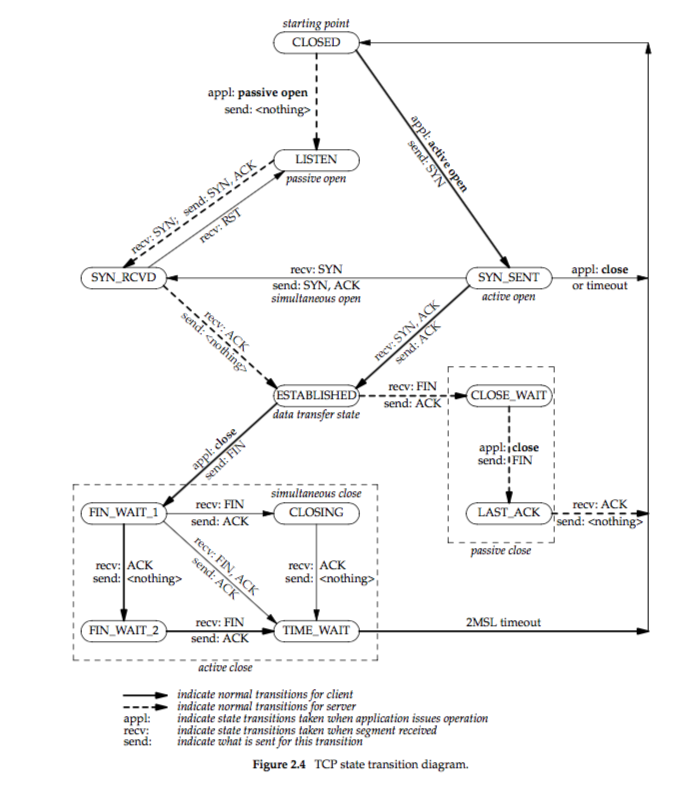

# Chapter 2 The Transport Layer: TCP, UDP, and SCTP
When a process terminates, a FIN will be sent on all of its TCP connections, in order to shut them all down.   

TCP:   
   
上图中，TIME_WAIT设置为2 MSL（maximum segment lifetime）的原因是：    
   1. To implement TCP's full-duplex connection termination reliably. 若server的最终的ACK丢失，则可以在此阶段接受对方的重传。   
   2. To allow old duplicate segments to expire in the network.  等待2MSL可以保证所有已发出的segments均已被传输或丢弃。若未等待2MSL，且在本次连接关闭后马上和server重新建立连接，则可能收到上次连接中遗留的segments.   

RFC1122建议MSL为2分钟，BSD的实现为30 seconds。   

IP datagram最大hop数为255（(1 << 8) - 1）。   

For TCP, connection socker uses the same local port as the listening socket. It uses the same local IP required by the client if the binded IP is wildcard.   

A TCP connection socket is identified by 4 elements: local IP, local port, remote IP, remote port.   

In general, the payload length of IPv4 and IPv6 datagrams are both **16-bit long**, while the the IPv4 one contains the header size and the IPv6 one doesn't. So the maximum size of an **IPv4 datagram is 65535 bytes** and the one of an **IPv6 datagram is 65575 bytes**. **IPv6 拥有 jumbo payload option**，允许使用32-bit payload length. 在使用IPv6 jumbo payload option时，IPv6首部的payload length置零，其又option headers中的相应数据代理，最大允许(40 bytes + 4GB - 1 byte)的大小。    

当报文大于MTU时，IPv4允许中间传输设备对报文做fragmenting（分片），分片后的报文在接收端重组。在IPv6中，若发送方未对报文分片，则传输过程中也不允许分片。当报文大于MTU时，传输设备将丢弃该包，并向发送方传输相应ICMPv6信息，通知其报文过大，并指示MTU大小。由发送方自行做分片，并在接受端组装(reassemble).    

IPv4报文也可以set "DF" (don't fragment) bit to prevent the segment being fragmented by any device during transmission, the recerver included. If the "DF" bit is set, and the IPv4 datagram exceeds the MTU, this datagram will be droped, and a corrsponding ICMPv4 error message will be sent back.   

IPv4与IPv6都定义了最小缓冲区大小(minimum reassembly buffer size)，即任何IPv4/IPv6实现都必须支持的最小报文(datagram)大小。IPv4为576 bytes，IPv6为1500 bytes.   

TCP定义了MSS(maximum segment size)，指示每个TCP segment最多可携带的data size。使用此值可以尽可能避免fragmentation(分片)的出现。在大多数Ethernet(MTU = 1500 bytes)上，MSS for IPv4 is less than 1460 bytes, for IPv6 it's less than 1440 bytes. Because IPv4 header is 20 bytes long, IPv6 header is 40 bytes long, and TCP header is 20 bytes long. 由于IPv6最大允许(2^32-1) bytes的数据，而TCP头内MSS段仅有16-bit，因此当TCP头内MSS段不为65535时，此报文指示的MSS即位此时的MSS大小；当MSS段值为65535(0xFFFF)时，真正的MSS值将与MTU有关，应该为IPv6 Payload Length - 20 bytes(IPv6 payload length与MTU有关，且TCP首部为20 bytes long)。     
   
   
   

   
