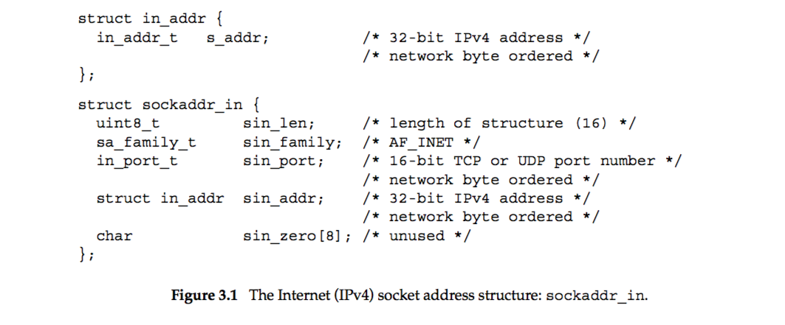
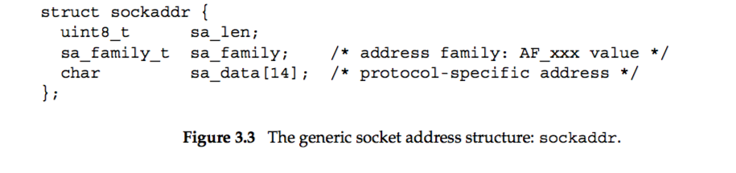
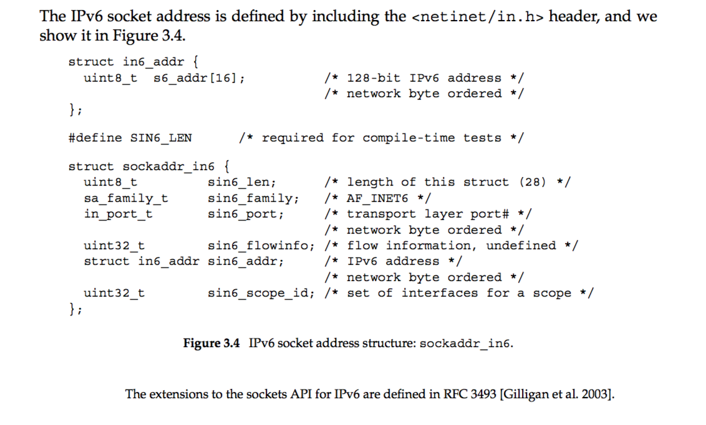
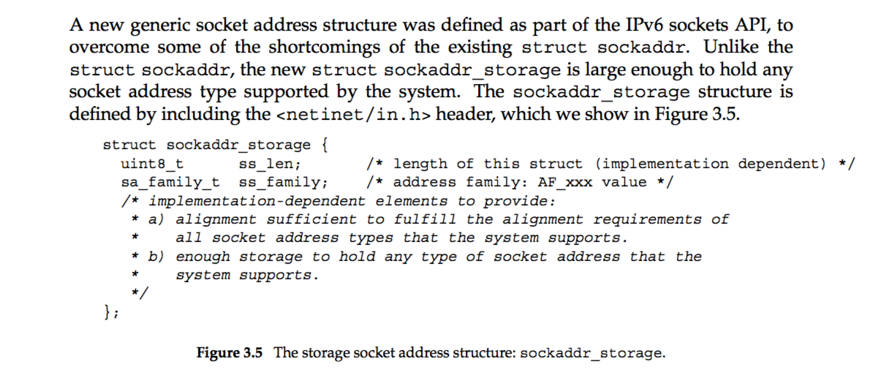
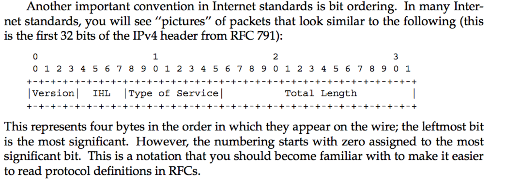

# Chapter 3 Socket Introduction   
### IPv4 Socket Address Structure:
BSD version:   
   
Before 4.3BSD-Reno, there is no member `sin_len`.   
Even if `sin_len` present, we do not need to read or write it unless we are dealing with routing sockets.   

Linux version:   
``` c
// From include/uapi/linux/in.h

#if __UAPI_DEF_IN_ADDR
/* Internet address. */
struct in_addr {
	__be32	s_addr;
};
#endif

/* Structure describing an Internet (IP) socket address. */
#if  __UAPI_DEF_SOCKADDR_IN
#define __SOCK_SIZE__	16		/* sizeof(struct sockaddr)	*/
struct sockaddr_in {
  __kernel_sa_family_t	sin_family;	/* Address family		*/
  __be16		sin_port;	/* Port number			*/
  struct in_addr	sin_addr;	/* Internet address		*/

  /* Pad to size of `struct sockaddr'. */
  unsigned char		__pad[__SOCK_SIZE__ - sizeof(short int) -
			sizeof(unsigned short int) - sizeof(struct in_addr)];
};
#define sin_zero	__pad		/* for BSD UNIX comp. -FvK	*/
#endif
```   

POSIX requires only three menbers in `sockaddr_in`: `s_addr` of type `in_addr_t` (unsigned integer type of at least 32 bits), `sin_family` of type `sa_family_t` (unsigned integer type, normally 8-bit if there is a length field, 16 bit), `sin_port` of type `in_port_t` (unsigned integer type of at least 16-bits otherwise). All implementations can add their own members in `sockaddr_in`. Almost all implementations add the `sin_zero` member so that all socket addreee structures are at least 16 bytes in size.     

`sockaddr_in`内的addr和port number均应为网络字节序(Network Byte Order, NBO), 即大端序.   

The reason for defining `in_addr` a struct is historical, we must be clear that both `sin_addr` and `sin_addr.s_addr` of a `sockaddr_in` object do reference the IPv4 address correctly.   

`sin_zero` member is unused, but always set to 0. It is common to set all bytes within a `sockaddr_in` to 0 before using it, not only `sin_zero`.    

### Generic Socket Addreee Structure
A socket can be of different definations, but they all are of 16-bytes long (at the age of IPv4). So we use structure `sockaddr` to indicate them. All variant socket pointers can be casted into `sockaddr` pointers for a general defination.

A socket address structure is **always passed by reference** when passed as an argument to any socket functions. Any socket function that takes one of these pointers as an argument must deal with socket address from any of the supported protocal families.   

BSD generic socket address structure `sockaddr`:   
   

Linux generic socket addreee structure `sockaddr`:
``` c
// From include/linux/socket.h

/*
 *	1003.1g requires sa_family_t and that sa_data is char.
 */
 
struct sockaddr {
	sa_family_t	sa_family;	/* address family, AF_xxx	*/
	char		sa_data[14];	/* 14 bytes of protocol address	*/
};
```

From an application layer porgrammer's point of view, the only use of generic socket structures is to cast pointers to protocal-specific structures.   


### IPv6 Socket Address Structure

BSD version:
   

Linux version:
``` c
// From include/uapi/linux/in6.h

/*
 *	IPv6 address structure
 */

#if __UAPI_DEF_IN6_ADDR
struct in6_addr {
	union {
		__u8		u6_addr8[16];
#if __UAPI_DEF_IN6_ADDR_ALT
		__be16		u6_addr16[8];
		__be32		u6_addr32[4];
#endif
	} in6_u;

#if __UAPI_DEF_SOCKADDR_IN6
struct sockaddr_in6 {
	unsigned short int	sin6_family;    /* AF_INET6 */
	__be16			sin6_port;      /* Transport layer port # */
	__be32			sin6_flowinfo;  /* IPv6 flow information */
	struct in6_addr		sin6_addr;      /* IPv6 address */
	__u32			sin6_scope_id;  /* scope id (new in RFC2553) */
};
#endif /* __UAPI_DEF_SOCKADDR_IN6 */
```   

The `SIN6_LEN` constant must be defined if the system supports the length member for socket address structures.   

The IPv6 family is AF_INET6, whereas the IPv4 family is AF_INET.   

The members in this structure are ordered so that if the sockaddr_in6 structure is 64-bit aligned, so is the 128-bit sin6_addr member. On some 64-bit processors, data accesses of 64-bit values are optimized if stored on a 64-bit boundary.   

The sin6_flowinfo member is divided into two fields:    
    The low-order 20 bits are the flow label   
    The high-order 12 bits are reserved     
The flow label field is described with Figure A.2. The use of the flow label field is still a research topic.   
The sin6_scope_id identifies the scope zone in which a scoped address is meaningful, most commonly an interface index for a link-local address (Section A.5).   

### New Generic Socket Address Structure
BSD version:   
   

Linux version:
``` c
// From include/linux/socket.h
#define sockaddr_storage __kernel_sockaddr_storage

// From include/uapi/linux/socket.h
/* SPDX-License-Identifier: GPL-2.0 WITH Linux-syscall-note */
#ifndef _UAPI_LINUX_SOCKET_H
#define _UAPI_LINUX_SOCKET_H

/*
 * Desired design of maximum size and alignment (see RFC2553)
 */
#define _K_SS_MAXSIZE	128	/* Implementation specific max size */
#define _K_SS_ALIGNSIZE	(__alignof__ (struct sockaddr *))
				/* Implementation specific desired alignment */

typedef unsigned short __kernel_sa_family_t;

struct __kernel_sockaddr_storage {
	__kernel_sa_family_t	ss_family;		/* address family */
	/* Following field(s) are implementation specific */
	char		__data[_K_SS_MAXSIZE - sizeof(unsigned short)];
				/* space to achieve desired size, */
				/* _SS_MAXSIZE value minus size of ss_family */
} __attribute__ ((aligned(_K_SS_ALIGNSIZE)));	/* force desired alignment */

#endif /* _UAPI_LINUX_SOCKET_H */
```   

If any socket address structures that the system supports have alignment requirements, the `sockaddr_storage` provides the strictest alignment requirement.   

The `sockaddr_storage` is large enough to contain any socket address structure that the system supports.   

----------
Linux/Unix 提供了4个函数用于数据在主机端序和网络端序间的转换: `ntohl`, `ntohs`, `htonl`, `htons`: n 为 network, h 为 host, l 为 long(32-bit), s为short(16-bit).
```c
// From include/linux/byteorder/generic.h
#define ___htonl(x) __cpu_to_be32(x)
#define ___htons(x) __cpu_to_be16(x)
#define ___ntohl(x) __be32_to_cpu(x)
#define ___ntohs(x) __be16_to_cpu(x)

#define htonl(x) ___htonl(x)
#define ntohl(x) ___ntohl(x)
#define htons(x) ___htons(x)
#define ntohs(x) ___ntohs(x)
```   

----------------
   

-------------
字符串与网络地址的互换:   
UNIX提供了`inet_aton`, `inet_addr`, `inet_ntoa`, `inet_pton`, `inet_ntop`这5个函数用于c-style ip-address string 与 `in_addr`, `in6_addr` 之间的相互转换. 但 Linux 内核中没有相应的函数, 他们被定义在 `libc6-dev` 中.   

函数 `sock_ntop` 与 inet_ntop的功能类似,都是将128-bit或32-bit的ip地址转化为字符串. 但是他们接受的参数并非 `in_addr` 或 `in6_addr` 类型, 而是一个socket和一个`socklen_t` 类型的 `addrlen`. 指示这两个参数后, `sock_ntop` 将自行从 socket 中取出地址并转换成相应的字符串.   

具体可见 UNP Section 3.6 ~ 3.8.   

对 stream socket (比如 TCP socket) 的读写与对一般流的读写不同.其读出或写入的字节数经常会小于我们指定的字节数. 这与buffer size等等机制有关. 遇到这种情况, 可以多次读出或写入, 直到所有数据均被传输.   

