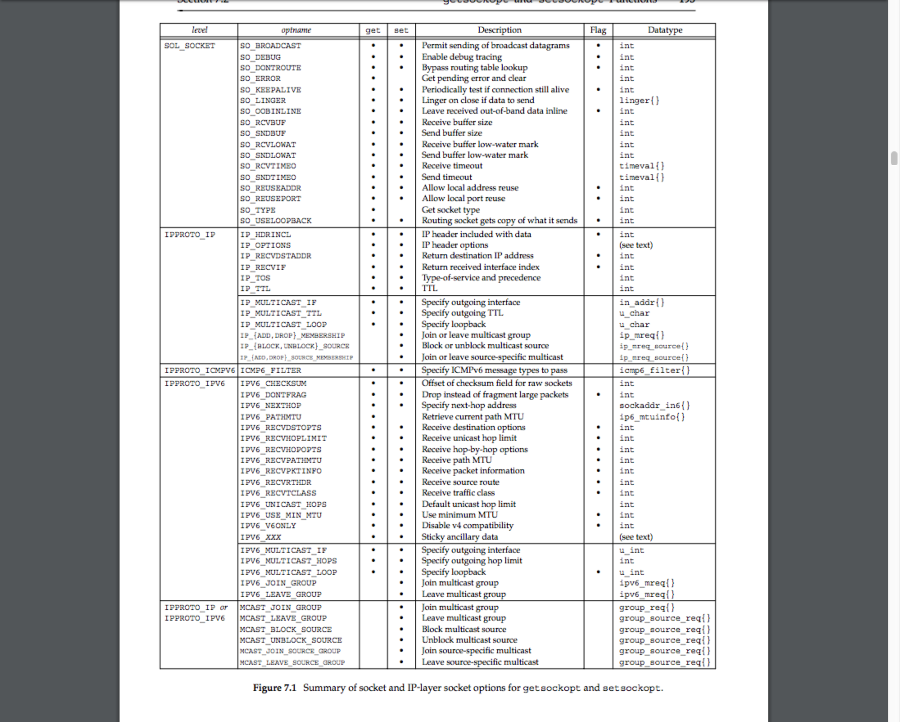
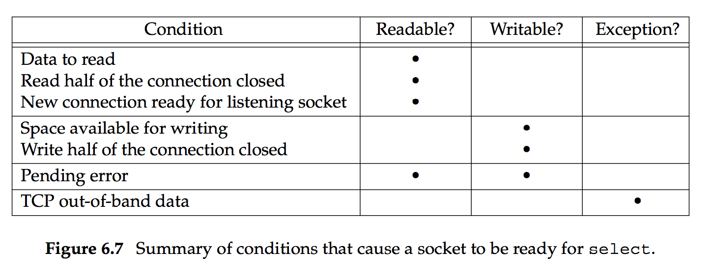
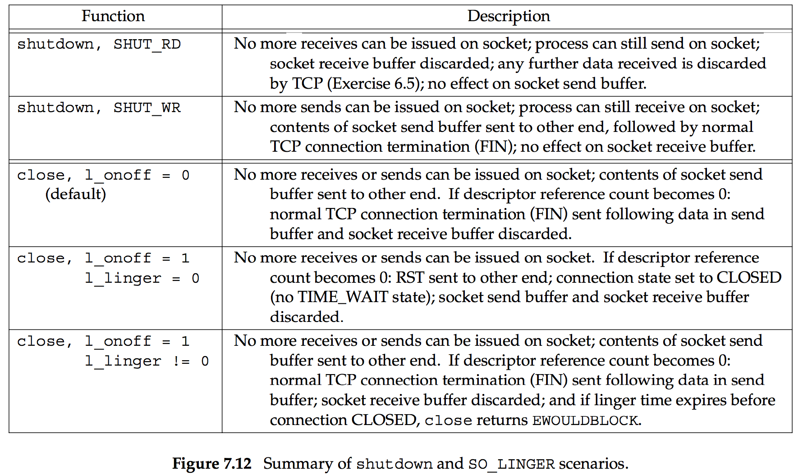

# Chapter 7: Socket Options

``` c
// From sys/socket.h
int getsockopt(int sockfd, int level, int optname, void *optval, socket_t *optlen);
int setsockopt(int sockfd, int level, int optname, const void *optval, socklen_t optlen);

/* These two retun 0 if OK, -1 on error. */
```   

`sockfd` refers to the socket descriptor, `level` speccifies the cxode in the system that interprets the option: the general socket code or some protocal-specific code (e.g., IPv4, IPv6, TCP, or SCTP).   

`optval` is a pointer to a variable from which the new value of the option is fetched by `setsockopt`, or into which the current value of the option is stored by `getsockopt`. The size of this variable is specified by the final argument, as a value for `setsockopt` and as a value-result for `getsockopt`.

   

   

Some socket options are automatically inheritted: if these options of the listening socket are on, these options are automatically on for the sockets accepted from it: `SO_DEBUG`, `SO_DONTROUT`, `SO_KEEPALIVE`, `SO_LINGER`, `SO_OOBINLINE`, `SO_RCVBUF`, `SO_RCVLOWAT`, `SO_SNDBUF`, `SO_SNDLOWAT`, `TCP_MAXSEG` and `TCP_NODELAY`.    

设置 `SO_LINGER`, 需要传递结构体 `struct linger`:

``` c
struct linger {
    int l_onoff;        /* 0=off, nonzero=on */
    int l_linger;       /* linger time, POSIX specifies units as seconds */
};
```   

以下为 函数 `shutdown` 和 设置了 `SO_LINGER` 之后的 `close` 间的行为区别:

   

设置 `SO_RCVBUF` 和 `SO_SNDBUF` 时, 在socket 被连接前设置, 或者为listening socket设置, 此option会被继承. 此项设置的buffer大小应为MSS的偶数倍, 否则可能会浪费buffer. 并且, buffer大小不能小于4倍MSS, 否则 TCP fast recovery (3次ACK要求重传) 无法正常实现, 因为小于 4 * MSS会造成peer要求重传的信息被丢失.   

`SO_REUSEADDR` 起如下作用:   
1. `SO_REUSEADDR` 允许启动一个监听服务器并捆绑其众所周知的端口，即使以前建立的将该端口用作他们的本地端口的连接仍存在。
2. 允许在同一端口上启动同一服务器的多个实例，只要每个实例捆绑一个不同的本地IP地址即可。
3. `SO_REUSEADDR` 允许单个进程捆绑同一端口到多个套接字上，只要每次捆绑指定不同的本地IP地址即可。
4. `SO_REUSEADDR` 允许完全重复的捆绑：当一个IP地址和端口号已绑定到某个套接字上时，如果传输协议支持，同样的IP地址和端口还可以捆绑到另一个套接字上。一般来说本特性仅支持UDP套接字。   

当一个端口被多个 sockets 使用时, 如果其中一个的 IP 为 wildcard, 而另一个 ip 为一具体 ip. 则所有传送至此端口, 此具体 ip 的包都不会被 wildcard ip 的 socket 捕获. 即: 如果一个端口被多个socket使用, 那么传输至此端口的包会被 ip 地址更加具体的 socket 捕获.   

With TCP, we are never able to start multiple servers that `bind` the same IP address and the same port: a _complete duplicate binding_. That is, we cannot start one server that binds 198.69.10.2 port 80 and start another that also binds 192.69.10.2 port 80, even if we set the `SO_REUSEADDR` socket option for the second server.   

`SO_REUSEPORT` 作用和 `SO_REUSEADDR` 类似:   
1. This option allows completely duplicate bindings, but only if each socket that wants to bind the same IP address and port specify this socket option.
2. `SO_REUSEADDR` is considered equivalent to `SO_REUSEPORT` if the IP address being bound is a multicast address.   

许多人将 `SO_REUSEADDR` 当成了 `SO_REUSEPORT` 。基本上来说， `SO_REUSEPORT` 允许我们将任意数目的socket绑定到完全相同的源地址端口对上，只要所有之前绑定的socket都设置了 `SO_REUSEPORT` 选项。如果第一个绑定在该地址端口对上的socket没有设置 `SO_REUSEPORT` ，无论之后的socket是否设置 `SO_REUSEPORT` ，其都无法绑定在与这个地址端口完全相同的地址上。除非第一个绑定在这个地址端口对上的socket释放了这个绑定关系。与 `SO_REUSEADDR` 不同的是 ，处理 `SO_REUSEPORT` 的代码不仅会检查当前尝试绑定的socket的 `SO_REUSEPORT` ，而且也会检查之前已绑定了当前尝试绑定的地址端口对的socket的 `SO_REUSEPORT` 选项。   

`SO_REUSEPORT` 并不等于 `SO_REUSEADDR` 。这么说的含义是如果一个已经绑定了地址的socket没有设置 `SO_REUSEPORT` ，而另一个新socket设置了 `SO_REUSEPORT` 且尝试绑定到与当前socket完全相同的端口地址对，这次绑定尝试将会失败。同时，如果当前socket已经处于 `TIME_WAIT` 阶段，而这个设置了 `SO_REUSEPORT` 选项的新socket尝试绑定到当前地址，这个绑定操作也会失败。为了能够将新的socket绑定到一个当前处于 `TIME_WAIT` 阶段的socket对应的地址端口对上，我们要么需要在绑定之前设置这个新socket的 `SO_REUSEADDR` 选项 ，要么需要在绑定之前给两个socket都设置 `SO_REUSEPORT` 选项。当然，同时给socket设置 `SO_REUSEADDR` 和 `SO_REUSEPORT` 选项是也是可以的。    

`SO_REUSEPORT` 是在 `SO_REUSEADDR` 之后被添加到BSD系统中的。这也是为什么现在有些系统的socket实现里没有 `SO_REUSEPORT` 选项。因为它们在这个选项被加入BSD系统之前参考了BSD的socket实现。而在这个选项被加入之前，BSD系统下没有任何办法能够将两个socket绑定在完全相同的地址端口对上。   

相对于用于一对一通信的unicast地址，multicast地址用于一对多通信。IPv4和IPv6都拥有multicast地址。但是IPv4中的multicast实际上在公共网路上很少被使用。   

`SO_REUSEADDR` 的意义在multicast地址的情况下会与之前有所不同。在这种情况下， `SO_REUSEADDR` 允许我们将多个socket绑定至完全相同的源广播地址端口对上。换句话说，对于multicast地址而言， `SO_REUSEADDR` 的作用相当于unicast通信中的 `SO_REUSEPORT` 。事实上，在multicast情况下， `SO_REUSEADDR` 和 `SO_REUSEPORT` 的作用完全相同。      

在Linux3.9之前，只有 `SO_REUSEADDR` 选项存在。这个选项的作用基本上同BSD系统下相同。但其仍有两个重要的区别。    

第一个区别是如果一个处于监听（服务器）状态下的TCP socket已经被绑定到了一个通配符IP地址和一个特定端口下，那么不论这两个socket有没有设置 `SO_REUSEADDR` 选项，任何其他TCP socket都无法再被绑定到相同的端口下。即使另一个socket使用了一个具体IP地址（像在BSD系统中允许的那样）也不行。而非监听（客户）TCP socket则无此限制。     

第二个区别是对于UDP socket来说， `SO_REUSEADDR` 的作用和BSD中 `SO_REUSEPORT` 完全相同。所以两个UDP socket如果都设置了 `SO_REUSEADDR` 的话，它们就可以被绑定在一组完全相同的地址端口对上。 
Linux3.9加入了 `SO_REUSEPORT` 选项。只要所有socket（包括第一个）在绑定地址前设置了这个选项，两个或多个，TCP或UDP，监听（服务器）或非监听（客户）socket就可以被绑定在完全相同的地址端口组合下。同时，为了防止端口劫持（port hijacking），还有一个特别的限制：所有试图绑定在相同的地址端口组合的socket必须属于拥有相同用户ID的进程。所以一个用户无法从另一个用户那里“偷窃”端口。 
除此之外，对于设置了 `SO_REUSEPORT` 选项的socket，Linux kernel还会执行一些别的系统所没有的特别的操作：对于绑定于同一地址端口组合上的UDP socket，kernel尝试在它们之间平均分配收到的数据包；对于绑定于同一地址端口组合上的TCP监听socket，kernel尝试在它们之间平均分配收到的连接请求（调用accept()方法所得到的请求）。这意味着相比于其他允许地址复用但随机将收到的数据包或者连接请求分配给连接在同一地址端口组合上的socket的系统而言，Linux尝试了进行流量分配上的优化。比如一个简单的服务器进程的几个不同实例可以方便地使用 `SO_REUSEPORT` 来实现一个简单的负载均衡，而且这个负载均衡有kernel负责， 对程序来说完全免费！    

