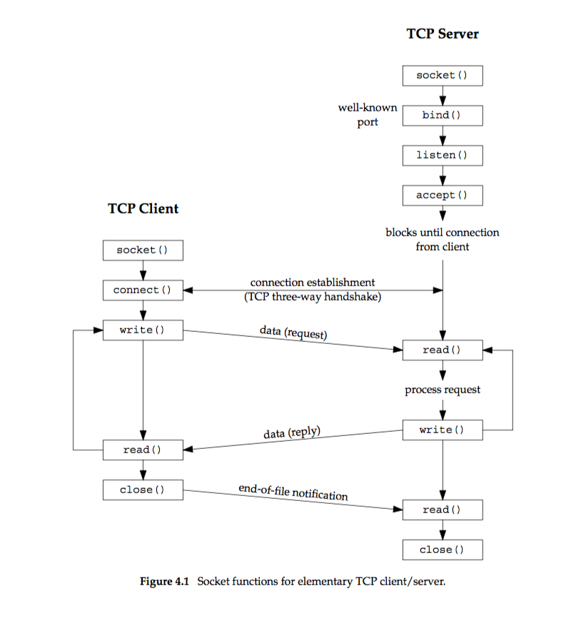

# Chapter 4: Elementary TCP Sockets

   

-------------------
## `socket` function
``` c
// From sys/socket.h
int socket(int family, int type, int protocal); // Returns non-negative descriptor if OK, -1 on error.
```   

`family` sepcifies the protocal family, this argument is also referred as `domain`; `type` is the socket type; `protocal` is a valid protocal type, or set to `0` to select the system's default for the given combination of `family` and `type`.   

This table is for argument `family`:

| family   |   Description   |
|----------|-----------------|
| AF_INET  | IPv4 protocals  |
| AF_INET6 | IPv6 protocals  |
| AF_LOCAL | Unix domain protocals |
| AF_ROUTE | Routing sockets |
| AF_KEY   | Key socket      |

This table is for argument `type`:

|        type         |             Description                 |
|---------------------|-----------------------------------------|
|     SOCK_STREAM     |         stream socket                   |
|     SOCK_DGRAM      |         data socket                     |
|     SOCK_SEQPACKET  |         sequenced packet socket         |
|     SOCK_RAW        |         raw socket                      |

This table is for argument `protocal`, only the ones for `AF_INET` and `AF_INET6` are listed:

|    protocal      |   Descripption   |
|------------------|------------------|
|  IPPROTO_TCP     | TCP transport protocal |
|  IPPROTO_UDP     | UDP transport protocal |
|  IPPROTO_SCTP    | SCTP transport protocal |


Combinations of `family` and `type` for the socket function.

|                |    AF_INET    |    AF_INET6    |    AF_LOCAL    |    AF_ROUTE    |    AF_KEY    |
|----------------|---------------|----------------|----------------|----------------|--------------|
|   SOCK_STREAM  | TCP|SCTP      |   TCP|SCTP     | Yes            | | |
|   SOCK_DGRAM   | UDP           |   UDP          | Yes | | |
| SOCK_SEQPACKET | SCTP          | SCTP           | Yes | | | |
| SOCK_RAW       | IPv4          | IPv6           |  | Yes  | Yes  |    

The first argument for `socket` may be PF_xxx, it will be explained later.   

`AF_UNIX` (The historical UNIX name) may be encountered instead of `AF_LOCAL`.   

Linux provides `SOCK_PATCKET` type, used to access the datalink.   

There are also other `family`s and `type`s for `socket` function.   

The non-negative return value of `socket` is a `socket descriptor` or `sockfd`, similar to a file descriptor.   

The family `AF_xxx` stands for `address family` and `PF_xxx` stands for `protocal family`. They are of the same value in most situations. To avoid confusion, we only use `AF_xxx` now.   

-------------
## `connect` function
``` c
// From sys/socket.h
int connect(int sockfd, const struct sockaddr *servaddr, socklen_t addrlen);
```

`sockfd` is the return value of function `socket`. the `servaddr` and `addrlen` must be setted before calling. `servaddr` is the socket structure contains server ip and corresponding port, `addrlen` is the length of the socket structure. It is not needed to call `bind` before calling `connect` on client, because the kernel will set a ephemeral port and the source IP address if necessary.   

`connect` initiates the TCP three-way handshake and only returns when the connection is successfully established or an error occurs. Its possible return values are stated below:

| Return value | Description |
|--------------|-------------|
| 0 | OK |
| ETIMEDOUT | The server does not respond. (On 4.4BSD if the client does not get a ACK from server after 75 seconds from the sending of SYN, this value is returned) |
| ECONNREFUSED | The server sends a reset (RST) back, in order to reject the connection. |
| EHOSTUNREACH/ENETUNREACH | When ICMP "destination unreachable" returned, it is considered a "soft error". The kernel keeps sending SYN. After a fixed time of trying (75 seconds on 4.4BSD), if it is still failed, it returns this value. And, the `ENETUNREACH` is obsolete now. |

Function `connect` moves the TCP state from `CLOSED` to `SYN_SENT`. If it succeeds, the state is moved to `ESTABLISHED`. If it fails, this socket is no longer usable and closed.   

We cannot call `connect` twice on one socket. If the previous `connect` fails, the socket must not be reused.   
