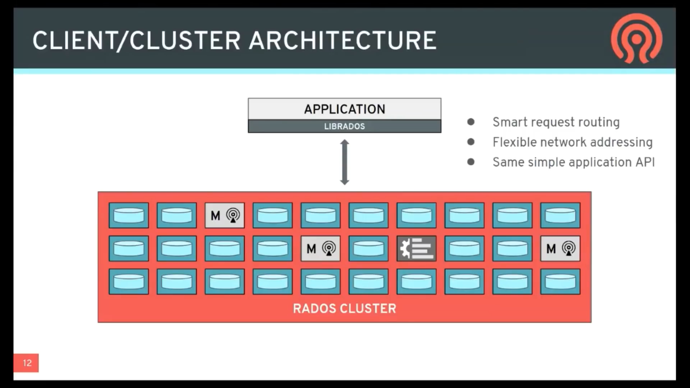

# 2024-08-02

## RADOS: Reliable Automatic Distributed Object Storage

在理论计算机科学中，CAP定理（CAP theorem），又被称作布鲁尔定理（Brewer's theorem），它指出对于一个分布式计算系统来说，不可能同时满足以下三点：

> 一致性（Consistency） （等同于所有节点返回的数据都是一致的）
>
> 可用性（Availability）（每次请求都能获取到非错的响应——但是不保证获取的数据为最新数据）
>
> 分区容错性（Partition tolerance）（大部分分布式系统都不能在时限内达成数据一致性，就意味分布式系统一定会发生了分区的情况。这就是再分布式系统中 P 是一定该发生的，那么 A 和 C 我们只能选择一个。）

### Zoopkeeper保证CP

当向注册中心查询服务列表时，我们可以容忍注册中心返回的是几分钟以前的注册信息，但是不能接受服务直接down掉不可用。也就是说，服务注册功能对可用性的要求要高于一致性。但是zk会出现这样的一种情况，当master节点因网路故障与其他节点失去联系时，剩余的节点会重新进行leader选举。问题在于，选举leader的时间太长，30~120s，且选举期间整个zk集群是都是不可用的，这就导致在选举期间注册服务瘫痪，在云部署的环境下，因网络问题使得zk集群失去master节点是较大概率会发生的事，虽然服务能够最终恢复，但是漫长的选举时间导致的注册长期不可用是不能容忍的。

### Eureka保证AP

Eureka在设计时就优先保证可用性。Eureka各个节点都是平等的，几个节点挂掉不影响正常节点的工作，剩余的节点依然可以提供注册和查询服务。而Eureka的客户端在向某个Eureka注册时如果发现连接失败，则会自动切换至其他的节点，只要有一台Eureka还在，就能保证注册服务可用（保证可用性），只不过查到的信息可能不是最新的（不保证一致性）。除此之外，Eureka还有一种自我保护机制，如果在15分钟内超过85%的节点都没有正常的心跳，那么Eureka就认为客户端与注册中心出现了网络故障，此时会出现以下几种情况:

1. Eureka不再从注册列表中移除因为长时间没有收到心跳而应该过期的服务
2. Eureka仍然能够接受新服务的注册和查询请求，但是不会被同步到其它节点上（即保证当前节点依然可用）
3. 当前网络稳定时，当前实例新的注册信息会被同步到其它节点中

因此，Eureka可以很好的应对因网络故障导致节点失去联系的情况，而不会像zookeeper那样使整个注册服务瘫痪。

## RADOS Software Components

## Client/Cluster Architecture

传统存储服务通过虚拟IP(VIP), DNS形式, 对外将存储集群的服务暴露为一个单独的服务。Application通过这个单独的服务来访问整个存储集群。一切failover, 横向扩缩容等行为均对application保持透明。这种设计会影响整个系统的性能。

Ceph则使用了所谓的"Client/Cluster Architecture", 这种架构将集群中的复杂行为暴露给application, 以期得到更好的性能。

在application中负责和集群通信的逻辑, 是以SDK的形式存在的, 被称作librados。

## 如何判断某块数据位于哪一个OSD? (Data Placement 问题)

一种简单的方式是在metadata server中放置一张表, 表中记录每块数据所应该放置的OSD, 然后每次读写时都向其查询。

但这种方法性能较差, 且metadata server的负载极高, 并且这个表可能会非常大。

Ceph采用的方式则叫做"Calculated Placement"。在librados启动时, 其会从metaserver拿到一组计算规则, 这组计算规则描述了如何从每块数据的标识符计算出其对应所处的OSD标识符。

有些存储系统中会将这种计算规则称为"路由"。

> 通常每块数据都有自己的标识符, 每个OSD也都有自己的标识符。而从数据标识符计算得到OSD标识符, 通常是通过一个算法得到的。这个算法是集群中的所有服务, 包括librados, 都知晓的, 因而在传输路由时, 算法本身是不需要传递的。
>
> 真正需要被传递的东西, 其实是这个算法的参数, 因而路由的数据量其实并不大。
>
> 下文会说到, 这个算法用来算的是 Object -> Pool -> PG -> OSD 这一系列的关系。

路由在绝大多数时间段内是不变的。这样, librados不需要访问元数据服务, 也能确认每块数据应该放置在哪个OSD上了。

如果集群出现了failover, 则librados会拿到新的路由信息。得到新的路由后, 后续的读写都会使用新的路由来进行。

## RADOS Data Object

Ceph中的"数据", 指的是RADOS Data Object。不论上层是以对象/块/文件中的哪一种形式来访问ceph, 其所读写的数据都会被放入一个或多个RADOS Data Object中。

RADOS Data Object是Ceph的基本数据单位, 也就是说它是不可分割的\, 一个RADOS Data Object不可能将其一部分放置于一组OSD上, 而将其另一部份放置于另一组OSD上。对于任意一个RADOS Data Object, 每个OSD要么存储其全部数据, 要么完全不存储其任何数据。

每个RADOS Data Object都有一个name(字符串), 数个attributes(其也可以被视作一种metadata), 字节数据(可能只有几字节, 也可能有数十兆)或者omap(omap是一种kv表, 一个object要么包含字节数据要么包含omap, 不能共存)。

每个OSD还会属于一个"pool"。Pool是一个逻辑上的概念, 每个ceph集群中可以有数个pool, 每个pool通常都有一组特定的用途, 比如用于块存储, 用于文件存储等等。

## ? -> Objects -> Pools -> PGs -> OSDs

如何对用户数据进行partition, 并将其存储到OSD中？

首先第一步, 将用户数据(文件, 块存储volume等)拆分为一个或多个RADOS Data Objects。

然后, 找到这些objects所在的pool。

然后, 这里要引入一个概念, Placement Group (PG)。每个pool中都含有多个PG。当然这个PG也是一个逻辑概念, 每个PG中都含有多个OSD(当然, 每个OSD也属于多个PG)。这里需要从object计算得到其所属的pg, 在这张图里是通过对object name做hash再对pg num取余的方式得到一个object所属的PG id。

得到pg id后, 这个Object 将被写入此PG中的数个OSD。写入多个OSD是为了能够实现高可用, 但这里也不会把整个PG中的所有OSD都写上, 而是通过特定的算法(crush map)选出数个来写。

## Placement Group (PG)

如上方所述, 每个PG都包含有数个OSD, 而每个OSD又同时属于数个PG。

这种数据组织方式, 在集群中发生failover时, 可以更快的完成集群的修复。

在普通的replica策略(上图左侧)中, 整个集群被划分为多个raid 1 group。在其中一个Raid 1 group里发生磁盘损坏(比如图中的白色B)后, 如果希望将这个group重新恢复成3副本, 则需要找一个空白的spare disk(如图中), 然后从这个raid 1 group上找一张或数张健康的盘, 将其中的数据拷贝到这个spare disk里。这个流程被称为repair(修复)。在整个修复期间, 这个raid 1 group的副本数量将始终少于设计数量(3副本的情况下, 集群中最少坏掉3张盘, 这个集群就可能不可用了; 而如果有一张盘正被修复, 则最少只需要再坏2张), 因此集群发生数据丢失的风险是更高的。而repair流程可能会很长, 因为整个repair其实一直在向一张盘(新的spare 盘)进行写入, 这张盘的IO性能很容易会称为瓶颈。所以, 这种模式会造成集群安全性下降和性能下降(性能也会下降是因为如果有某个来自application的请求也来到了这个spare disk, 或者来到了repair的数据提供盘, 则其和repair 会争抢这张盘带宽资源)。

另外还有一种策略, 即每产生一个新的Object, 就给其选择3个不同的OSD(如上图右侧)。这种方式下, 如果发生坏盘, 则可以在不加入新盘的情况下, 由元数据服务给坏盘上的每个object再选一个新OSD, 然后从含有此object的其他正常OSD中把数据复制过去。这种方式的优势是不需要单独的spare disk(只要空间足够就能修), 各个object的修复可以并行进行, 没有单点负载, 但坏处也很明显。首先如上文所述, 这样会降低IO性能并增加元数据服务的压力。此外, 集群的数据安全也会有很大问题。假设我们给每个object分配3个副本, 那么如果这个集群中同时坏了3块盘, 则这个集群有极大概率会发生数据丢失; 而如果使用raid 1 group的形式, 只要坏盘不集中在一个group里, 数据就不会坏。(如下图左侧和右侧)

而ceph的"recovery"流程则更像是2者的中间形态。如上方两图的中间, 由于坏盘属于多个PG, 因此可以多个PG同时进行数据恢复, 具体来说就是在坏盘所处的每个pg里再找一个OSD A和OSD B, 其中OSD A存有坏盘上的 object 而 OSD B 没有(上方说过, 一个object 不会被写入PG中的所有OSD), 然后把这些object从A拷贝到B上。这种模式比随机选取OSD要慢, 但比raid 1 group快。此外, 当发生多盘failover时, 出现数据丢失的概率会比raid 1 group要高, 但比随机选取的方式要低。

因此可以说, PG方案是一种折中的方案:

## Failure Domain

如上方所述, 我们通常会将一个object同时存储在多个OSD上。

如果这些OSD都在一个Host(就是server, 服务器)上, 那如果这台服务器挂了, 我们就损失了这个object的所有副本。

如果我们选择了不同的Host上的不同的OSD, 但这些hosts又属于同一个rack(机架), 那么如果机架断电了, 我们还是会丢数据。当然, 机架出故障的概率当然是低于Host的。

在rack之上, 还有row, 每个row含有多个rack。Row之上是数据中心(data center), 一个data center又含有多个row。可以发现, data center, row, rack, host, OSD, 它们之间是层层嵌套的关系, 且故障发生的概率逐层增加。

我们将这种层次关系画成一颗树(下图)。将这张图中的每个节点都称作一个failure domain, 此外我们还额外添加一个root节点充当这棵树的root, 这个root下辖一个或多个data center; 每个data center又有一个或多个row; row有一个或多个rack; rack有多一个或个host; host有一个或多个OSD。当我们为一个object选择OSD时, 应该使得这些OSD同处的failure domain(也就是它们的最近公共祖先)在这棵树上越高越好。因为这样, 这几个OSD同时挂掉导致数据丢失的概率也就越小。

## CRUSH

Crush算法就是上方的"failure domain越高越好"的具体实现。它也是上文中的"路由"的主要内容。

Crush
