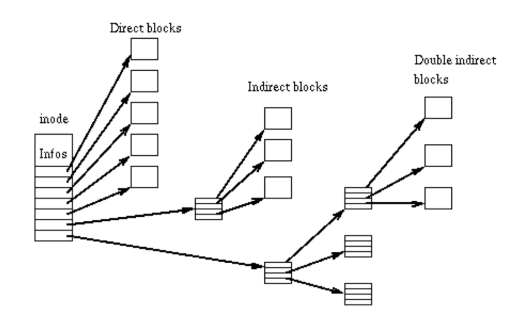

# Definations
All fields in ext2 are stored in little endian format.   

## Blocks
A partition, disk, file or block device formatted with a Second Extended Filesystem is deviced into small groups of sectors called "blocks". These blocks are then grouped into larger units called block groups.   

Block sizes commonly implemented include 1KiB, 2KiB, 4Kib and 8KiB.   

| Upper Limits | 1KiB | 2KiB | 4KiB | 8KiB | Comments |
|:------------:|:----:|:----:|:----:|:----:|---------:|
| file system blocks | 2147483647 | 2147483647 | 2147483647| 2147483647 | Max of signed 4-bytes int |
| blocks per block group | 8192 | 16384 | 32768 | 65536 | Every Block group use one block as the bitmap of its total blocks, so the number of blocks per block group is block_size * 8. |
| inodes per block group | 8192 | 16384 | 32768 | 65536 | Each block group uses one block as inode bitmap, so same as the reason above. |
| bytes per block group | 8MiB | 32MiB | 128MiB | 512 MiB |          |
| file system size (real) | 4TiB | 8TiB | 16TiB | 32TiB |     |
| file system size (Linux) | 2TiB | 8TiB | 16TiB | 32TiB | Due to the maximum size of a block device in Linux 2.4, the 1KiB-blocksize one owns at most 2TiB capacity. |
| blocks per file | 16843020 | 134217728 | 1074791436 | 8594130956 |      |
| file size (real) | 16GiB | 256GiB | 2TiB | 2TiB | The 2TiB file size is lomited by the i_blocks value in the inode which indicates the number of 512-bytes sector rather than the actual number of ext2 blocks allocated. |
| file size (Linux 2.6.28) | 16GiB | 256GiB | 2TiB | 2TiB |     |     
     
------
## Block Groups
Blocks are ckustered into block groups in order to reduce fragmentation and minimise the amount of head seeking when reading a large amount of consecutive date.    

Information about each block group is kept in a descriptor table stored in the block(s) immediately after the superblock.    

Two blocks near the start of each group are reserved for the block usage itmap and the inode usage bitmap which show which blocks and inodes are in use.    

Since each bitmap is limited to a single block, this means ehat the maximum size of a block group is 8 times the size of a block.     

The block(s) following the bitmaps in each block group are designated as the inode table for that block group and the remainder are the data blocks.    
The block allocation algorithm attemps to allocate data blocks in the same block group as the inode which contains them.     
     
The picture above shows the organization of a block group in Ext2 revision 0. In some block groups of revision 1, there is no super block or block group descriptor table.
      
-------
## Directories
A directory is a filesystem object and has an inode just like a file. It associates each name with an inode number.    

The inode allocation code should try to assign inodes which are in the same block group as the directory in which they are first created.    

The original Ext2 revision used singly-linked list to store the filenames in the directory; newer revisions are able to use hashes and binary trees.   

Also note that as direcroty grows additional blocks are assigned to store the additional file records. When filenames are removed, some implementations do not free these additional blocks.   
   
------
## Inodes
The inode (index node) is a fundamental concept in the ext2 filesystem. Each object in the filesystem is represented by an inode.    

The inode structure contains pointers to the filesystem blocks which contain the data held in the object and all of the metadata about an object except its name.    

The metadata about an object includes the premissions, owner, group, flags, size, number of blocks sed, access time, change time, modification time, deletion time, number of links, fragments, version (for NFS) and extended attributes (EAs) and/or Access Control Lists (ACLs).   

There are some reserved fields which are currently unused in the inode structure and several which are overloaded.    

There are pointers to the first **12 blocks** which contain the file's data in the inode. There is **1 pointer to an indirect block** (which contains pointers to the next set of blocks), **1 pointer to a doubly-indirect block** (which contains pointers to indirect blocks) and **1 pointer to a trebly-indirect block** (which contains pointers to doubly-indirect blocks).   
   
(The numbers of blocks in this picture is not accurate.)   

Some filesystem specific behaviour flags are also stored and allow for specific filesystem behaviour on a per-file basis. There are flags for secure deletion, undeletable, compression, synchronous updates, immutability, append-only, dumpable, no-atime, indexed directories, and data-journaling.   

Many of the filesystem specific behaviour flags, like journaling, have been implemented in newer filesystems like Ext3 and Ext4, while some other are still under development.   

All the inodes are stored in inode tables, with one inode table per block group.   

-------   
## Superblocks
The superblock contains all the information about the configuration of the filesystem.   

The primary copy of the superblock is stored at **an offset of 1024 bytes from the start of the device**, and it is essential to mounting the filesystem.   

Since the superblock is very important, backup copies of the superblock are stored in block groups throughout the filesystem.   

**The first version of ext2 (revision 0)** stores a copy at **the start of every block group**, along with backups of the group descriptor block(s).   

Since the superblock and group descriptor backup policy consumes too much space, **later versions** only putting backups in specific groups. **The groups chosen are 0, 1 and powers of 3, 5 and 7.**    

Revision 1 and higher of the filesystem also store extra fields, such as a volume name, a unique identification number, the inode size, and space for optional filesystem features to store configuration info.   

-------
## Symbolic Links   
A symbolic link (also symlink or soft link) is a special type of file that contains a reference to another file or directory in the form of an **absolute or relative path** and that affects pathname resolution.   

A symbolic link merely contains a text string that is interpreted and followed by the operating system as a path to another file or directory.   

A symbolic link is on its own and can exist independently of its target. The moving, renaming and deleting of the target file is not supposed to trigger the modification of the relative symbolic link.   

Symbolic links pointing to non-existing files are sometimes called "orphaned" pr "dangling".   

Symbolic links are also filesystem objects with inodes. For all symlink shorter than 60 bytes long, the data is stored within the inode itself; it uses the fields which would normally be used to store the pointers to data blocks. This is a worthwhile optimisation as it we avoid allocating a full block for the symlink, and most symlinks are less than 60 characters long.   

Symbolic links can also point to files or directories of other partitions and file systems.   

----------
# Disk Organization
An Ext2 file systems starts with a superblock located at byte offset 1024 from the start of the volume. This is block 1 for a 1KiB block formatted volume or within block 0 for larger block sizes. Note that the size of the super block is constant regardless of the blovk size.   

On the next block(s) following the superblock, is the Block Group Descriptor Table; which provides an overview of how the volume is split into block groups and where to find the inode bitmap, the blovk bitmap, and the inode table for each block group.    

**The first version of ext2 (revision 0)** stores a copy at **the start of every block group**, along with backups of the group descriptor block(s).   

Since the superblock and group descriptor backup policy consumes too much space, **later versions** still place one block bitmap, one inode bitmap, one inode table and datablocks in every group, but only putting backups in specific groups. **The groups chosen are 0, 1 and powers of 3, 5 and 7.**     

The block bitmap and inode bitmap are limited to 1 block each per block group, so the total blocks per block group is therefore limited. (More information in the Block Size Impact table).    

Each data block may also be further devided into "fragments". As of Linux 2.6.28, this feature is still not implemented. It is suggested to ensure the **fragment size** equal to the **block size** to maintain compatibility.    

The blocks of the last group may be less than the block_per_group specified in the super block, while the inodes of all block groups must be of same amount.   

Block Desciptor Table always take a whole block, each entry of the table takes 32 bytes.    

Here is a sample floppy disk layout for 1 KiB blocks:   

| Block Offset |    Length    | Description |
|:-------------|:------------:|------------:|
| byte 0       |   512 bytes  | boot record (if present) |
| byte 512     |   512 bytes  | additional boot record data (if present) |
|  Block group 0: blocks 1 to 1439.   
| byte 1024    |  1024 bytes  | superblock  |
| block 2      |  1 block     | block group descriptor table |
| block 3      |  1 block     | block bitmap  |
| block 4      |  1 block     | inode bitmap |
| block 5      |  23 blocks   | inode table |
| block 28     |  1412 blocks | data blocks |

For the curious, block 0 always points to the first sector of the disk or partition and will always contain the boot record if one is present.   

Super block is always located at byte offset 1024.   

Here is a sample of a 20MiB Partition Layout.   

|   Block Offset   |     Length     |   Description   |
|:-----------------|:--------------:|----------------:|
| byte 0           |   512 bytes    | boot record (if present) |
| byte 512         |   512 bytes    | addition boot record data (if present) | Block group 0: blocks 1 to 8192
| byte 1024        |   1024 bytes   | superblock      |
| block 2          |   1 block      | block group descriptor table |
| block 3          |   1 block      | block bitmap    |
| block 4          |   1 block      | inode bitmap    |
| block 5          |  214 blocks    | inode table     |
| block 219        |  7974 blocks   | data blocks     |
| block group 1: blocks 8193 to 16384.
| block 8193       |  1 block       | superblock backup |
| block 8194       |  1 block       | block group descriptor table backup |
| block 8195       |  1 block       | block bitmap    |
| block 8196       |  1 block       | inode bitmap    |
| block 8197       |  214 blocks    | inode table     |
| block 8408       |  7974 blocks   | data blocks     |
| block group 2: blocks 16385 to 24576.
| block 16385      |  1 block       | block bitmap    |
| block 16386      |  1 block       | inode bitmap    |
| block 16387      |  214 blocks    | inode table     |
| block 16601      |  3879 blocks   | data blocks     |

Unless the image was crafted with controlled parameters, the position of the various structures on disk (except the superblock) should never be assumed. Always load the superblock first.   

--------
# Structure of Superblock
``` c
// From fs/ext2/ext2.h

/*
 * Structure of the super block
 */
struct ext2_super_block {
	__le32	s_inodes_count;		/* Inodes count */
	__le32	s_blocks_count;		/* Blocks count */
	__le32	s_r_blocks_count;	/* Reserved blocks count */
	__le32	s_free_blocks_count;	/* Free blocks count */
	__le32	s_free_inodes_count;	/* Free inodes count */
	__le32	s_first_data_block;	/* First Data Block */
	__le32	s_log_block_size;	/* Block size */
	__le32	s_log_frag_size;	/* Fragment size */
	__le32	s_blocks_per_group;	/* # Blocks per group */
	__le32	s_frags_per_group;	/* # Fragments per group */
	__le32	s_inodes_per_group;	/* # Inodes per group */
	__le32	s_mtime;		/* Mount time */
	__le32	s_wtime;		/* Write time */
	__le16	s_mnt_count;		/* Mount count */
	__le16	s_max_mnt_count;	/* Maximal mount count */
	__le16	s_magic;		/* Magic signature */
	__le16	s_state;		/* File system state */
	__le16	s_errors;		/* Behaviour when detecting errors */
	__le16	s_minor_rev_level; 	/* minor revision level */
	__le32	s_lastcheck;		/* time of last check */
	__le32	s_checkinterval;	/* max. time between checks */
	__le32	s_creator_os;		/* OS */
	__le32	s_rev_level;		/* Revision level */
	__le16	s_def_resuid;		/* Default uid for reserved blocks */
	__le16	s_def_resgid;		/* Default gid for reserved blocks */
	/*
	 * These fields are for EXT2_DYNAMIC_REV superblocks only.
	 *
	 * Note: the difference between the compatible feature set and
	 * the incompatible feature set is that if there is a bit set
	 * in the incompatible feature set that the kernel doesn't
	 * know about, it should refuse to mount the filesystem.
	 * 
	 * e2fsck's requirements are more strict; if it doesn't know
	 * about a feature in either the compatible or incompatible
	 * feature set, it must abort and not try to meddle with
	 * things it doesn't understand...
	 */
	__le32	s_first_ino; 		/* First non-reserved inode */
	__le16   s_inode_size; 		/* size of inode structure */ /* Must be less than the block size */
	__le16	s_block_group_nr; 	/* block group # of this superblock */
	__le32	s_feature_compat; 	/* compatible feature set */
	__le32	s_feature_incompat; 	/* incompatible feature set */
	__le32	s_feature_ro_compat; 	/* readonly-compatible feature set */
	__u8	s_uuid[16];		/* 128-bit uuid for volume */
	char	s_volume_name[16]; 	/* volume name */
	char	s_last_mounted[64]; 	/* directory where last mounted */
	__le32	s_algorithm_usage_bitmap; /* For compression */
	/*
	 * Performance hints.  Directory preallocation should only
	 * happen if the EXT2_COMPAT_PREALLOC flag is on.
	 */
	__u8	s_prealloc_blocks;	/* Nr of blocks to try to preallocate*/
	__u8	s_prealloc_dir_blocks;	/* Nr to preallocate for dirs */
	__u16	s_padding1;
	/*
	 * Journaling support valid if EXT3_FEATURE_COMPAT_HAS_JOURNAL set.
	 */
	__u8	s_journal_uuid[16];	/* uuid of journal superblock */
	__u32	s_journal_inum;		/* inode number of journal file */
	__u32	s_journal_dev;		/* device number of journal file */
	__u32	s_last_orphan;		/* start of list of inodes to delete */
	__u32	s_hash_seed[4];		/* HTREE hash seed */
	__u8	s_def_hash_version;	/* Default hash version to use */
	__u8	s_reserved_char_pad;
	__u16	s_reserved_word_pad;
	__le32	s_default_mount_opts;
 	__le32	s_first_meta_bg; 	/* First metablock block group */
	__u32	s_reserved[190];	/* Padding to the end of the block */
};


/*
 * File system states
 */
#define	EXT2_VALID_FS			0x0001	/* Unmounted cleanly */
#define	EXT2_ERROR_FS			0x0002	/* Errors detected */
#define	EFSCORRUPTED			EUCLEAN	/* Filesystem is corrupted */

/*
 * Mount flags
 */
#define EXT2_MOUNT_CHECK		0x000001  /* Do mount-time checks */
#define EXT2_MOUNT_OLDALLOC		0x000002  /* Don't use the new Orlov allocator */
#define EXT2_MOUNT_GRPID		0x000004  /* Create files with directory's group */
#define EXT2_MOUNT_DEBUG		0x000008  /* Some debugging messages */
#define EXT2_MOUNT_ERRORS_CONT		0x000010  /* Continue on errors */
#define EXT2_MOUNT_ERRORS_RO		0x000020  /* Remount fs ro on errors */
#define EXT2_MOUNT_ERRORS_PANIC		0x000040  /* Panic on errors */
#define EXT2_MOUNT_MINIX_DF		0x000080  /* Mimics the Minix statfs */
#define EXT2_MOUNT_NOBH			0x000100  /* No buffer_heads */
#define EXT2_MOUNT_NO_UID32		0x000200  /* Disable 32-bit UIDs */
#define EXT2_MOUNT_XATTR_USER		0x004000  /* Extended user attributes */
#define EXT2_MOUNT_POSIX_ACL		0x008000  /* POSIX Access Control Lists */
#define EXT2_MOUNT_XIP			0x010000  /* Obsolete, use DAX */
#define EXT2_MOUNT_USRQUOTA		0x020000  /* user quota */
#define EXT2_MOUNT_GRPQUOTA		0x040000  /* group quota */
#define EXT2_MOUNT_RESERVATION		0x080000  /* Preallocation */
#define EXT2_MOUNT_DAX			0x100000  /* Direct Access */


/*
 * Maximal mount counts between two filesystem checks
 */
#define EXT2_DFL_MAX_MNT_COUNT		20	/* Allow 20 mounts */
#define EXT2_DFL_CHECKINTERVAL		0	/* Don't use interval check */

/*
 * Behaviour when detecting errors
 */
#define EXT2_ERRORS_CONTINUE		1	/* Continue execution */
#define EXT2_ERRORS_RO			2	/* Remount fs read-only */
#define EXT2_ERRORS_PANIC		3	/* Panic */
#define EXT2_ERRORS_DEFAULT		EXT2_ERRORS_CONTINUE


/*
 * Codes for operating systems
 */
#define EXT2_OS_LINUX		0
#define EXT2_OS_HURD		1
#define EXT2_OS_MASIX		2
#define EXT2_OS_FREEBSD		3
#define EXT2_OS_LITES		4

/*
 * Revision levels
 */
#define EXT2_GOOD_OLD_REV	0	/* The good old (original) format */
#define EXT2_DYNAMIC_REV	1 	/* V2 format w/ dynamic inode sizes */

#define EXT2_CURRENT_REV	EXT2_GOOD_OLD_REV
#define EXT2_MAX_SUPP_REV	EXT2_DYNAMIC_REV

#define EXT2_GOOD_OLD_INODE_SIZE 128

/*
 * Feature set definitions
 */

#define EXT2_HAS_COMPAT_FEATURE(sb,mask)			\
	( EXT2_SB(sb)->s_es->s_feature_compat & cpu_to_le32(mask) )
#define EXT2_HAS_RO_COMPAT_FEATURE(sb,mask)			\
	( EXT2_SB(sb)->s_es->s_feature_ro_compat & cpu_to_le32(mask) )
#define EXT2_HAS_INCOMPAT_FEATURE(sb,mask)			\
	( EXT2_SB(sb)->s_es->s_feature_incompat & cpu_to_le32(mask) )
#define EXT2_SET_COMPAT_FEATURE(sb,mask)			\
	EXT2_SB(sb)->s_es->s_feature_compat |= cpu_to_le32(mask)
#define EXT2_SET_RO_COMPAT_FEATURE(sb,mask)			\
	EXT2_SB(sb)->s_es->s_feature_ro_compat |= cpu_to_le32(mask)
#define EXT2_SET_INCOMPAT_FEATURE(sb,mask)			\
	EXT2_SB(sb)->s_es->s_feature_incompat |= cpu_to_le32(mask)
#define EXT2_CLEAR_COMPAT_FEATURE(sb,mask)			\
	EXT2_SB(sb)->s_es->s_feature_compat &= ~cpu_to_le32(mask)
#define EXT2_CLEAR_RO_COMPAT_FEATURE(sb,mask)			\
	EXT2_SB(sb)->s_es->s_feature_ro_compat &= ~cpu_to_le32(mask)
#define EXT2_CLEAR_INCOMPAT_FEATURE(sb,mask)			\
	EXT2_SB(sb)->s_es->s_feature_incompat &= ~cpu_to_le32(mask)

#define EXT2_FEATURE_COMPAT_DIR_PREALLOC	0x0001
#define EXT2_FEATURE_COMPAT_IMAGIC_INODES	0x0002
#define EXT3_FEATURE_COMPAT_HAS_JOURNAL		0x0004
#define EXT2_FEATURE_COMPAT_EXT_ATTR		0x0008
#define EXT2_FEATURE_COMPAT_RESIZE_INO		0x0010
#define EXT2_FEATURE_COMPAT_DIR_INDEX		0x0020
#define EXT2_FEATURE_COMPAT_ANY			0xffffffff

#define EXT2_FEATURE_RO_COMPAT_SPARSE_SUPER	0x0001
#define EXT2_FEATURE_RO_COMPAT_LARGE_FILE	0x0002
#define EXT2_FEATURE_RO_COMPAT_BTREE_DIR	0x0004
#define EXT2_FEATURE_RO_COMPAT_ANY		0xffffffff

#define EXT2_FEATURE_INCOMPAT_COMPRESSION	0x0001
#define EXT2_FEATURE_INCOMPAT_FILETYPE		0x0002
#define EXT3_FEATURE_INCOMPAT_RECOVER		0x0004
#define EXT3_FEATURE_INCOMPAT_JOURNAL_DEV	0x0008
#define EXT2_FEATURE_INCOMPAT_META_BG		0x0010
#define EXT2_FEATURE_INCOMPAT_ANY		0xffffffff

#define EXT2_FEATURE_COMPAT_SUPP	EXT2_FEATURE_COMPAT_EXT_ATTR
#define EXT2_FEATURE_INCOMPAT_SUPP	(EXT2_FEATURE_INCOMPAT_FILETYPE| \
					 EXT2_FEATURE_INCOMPAT_META_BG)
#define EXT2_FEATURE_RO_COMPAT_SUPP	(EXT2_FEATURE_RO_COMPAT_SPARSE_SUPER| \
					 EXT2_FEATURE_RO_COMPAT_LARGE_FILE| \
					 EXT2_FEATURE_RO_COMPAT_BTREE_DIR)
#define EXT2_FEATURE_RO_COMPAT_UNSUPPORTED	~EXT2_FEATURE_RO_COMPAT_SUPP
#define EXT2_FEATURE_INCOMPAT_UNSUPPORTED	~EXT2_FEATURE_INCOMPAT_SUPP

/*
 * Default values for user and/or group using reserved blocks
 */
#define	EXT2_DEF_RESUID		0
#define	EXT2_DEF_RESGID		0

/*
 * Default mount options
 */
#define EXT2_DEFM_DEBUG		0x0001
#define EXT2_DEFM_BSDGROUPS	0x0002
#define EXT2_DEFM_XATTR_USER	0x0004
#define EXT2_DEFM_ACL		0x0008
#define EXT2_DEFM_UID16		0x0010
    /* Not used by ext2, but reserved for use by ext3 */
#define EXT3_DEFM_JMODE		0x0060 
#define EXT3_DEFM_JMODE_DATA	0x0020
#define EXT3_DEFM_JMODE_ORDERED	0x0040
#define EXT3_DEFM_JMODE_WBACK	0x0060
```   

