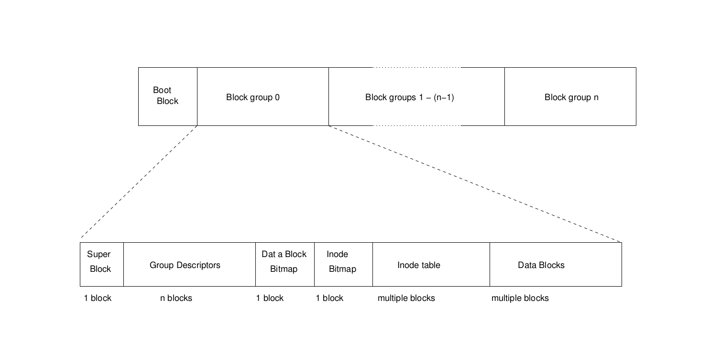

# Definations
## Blocks
A partition, disk, file or block device formatted with a Second Extended Filesystem is deviced into small groups of sectors called "blocks". These blocks are then grouped into larger units called block groups.   
Block sizes commonly implemented include 1KiB, 2KiB, 4Kib and 8KiB.   

| Upper Limits | 1KiB | 2KiB | 4KiB | 8KiB | Comments |
|:------------:|:----:|:----:|:----:|:----:|---------:|
| file system blocks | 2147483647 | 2147483647 | 2147483647| 2147483647 | Max of signed 4-bytes int |
| blocks per block group | 8192 | 16384 | 32768 | 65536 | Every Block group use one block as the bitmap of its total blocks, so the number of blocks per block group is block_size * 8. |
| inodes per block group | 8192 | 16384 | 32768 | 65536 | Each block group uses one block as inode bitmap, so same as the reason above. |
| bytes per block group | 8MiB | 32MiB | 128MiB | 512 MiB |          |
| file system size (real) | 4TiB | 8TiB | 16TiB | 32TiB |     |
| file system size (Linux) | 2TiB | 8TiB | 16TiB | 32TiB | Due to the maximum size of a block device in Linux 2.4, the 1KiB-blocksize one owns at most 2TiB capacity. |
| blocks per file | 16843020 | 134217728 | 1074791436 | 8594130956 |      |
| file size (real) | 16GiB | 256GiB | 2TiB | 2TiB | The 2TiB file size is lomited by the i_blocks value in the inode which indicates the number of 512-bytes sector rather than the actual number of ext2 blocks allocated. |
| file size (Linux 2.6.28) | 16GiB | 256GiB | 2TiB | 2TiB |     |     
     
------
## Block Groups
Blocks are ckustered into block groups in order to reduce fragmentation and minimise the amount of head seeking when reading a large amount of consecutive date.    
Information about each block group is kept in a descriptor table stored in the block(s) immediately after the superblock.    
Two blocks near the start of each group are reserved for the block usage itmap and the inode usage bitmap which show which blocks and inodes are in use.    
Since each bitmap is limited to a single block, this means ehat the maximum size of a block group is 8 times the size of a block.     
The block(s) following the bitmaps in each block group are designated as the inode table for that block group and the remainder are the data blocks.    
The block allocation algorithm attemps to allocate data blocks in the same block group as the inode which contains them.     
     
      
-------
## Directories
A directory is a filesystem object and has an inode just like a file. It associates each name with an inode number.    
The inode allocation code should try to assign inodes which are in the same block group as the directory in which they are first created.    
The original Ext2 revision used singly-linked list to store the filenames in the directory; newer revisions are able to use hashes and binary trees.   
Also note that as direcroty grows additional blocks are assigned to store the additional file records. When filenames are removed, some implementations do not free these additional blocks.   
   
------
## Inodes
The inode (index node) is a fundamental concept in the ext2 filesystem. Each object in the filesystem is represented by an inode.    The inode structure contains pointers to the filesystem blocks which contain the data held in the object and all of the metadata about an object except its name. The metadata about an object 