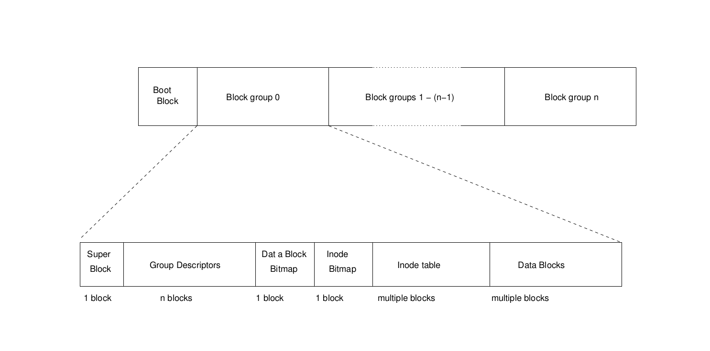

## 2018-11-20
### Ext2fs features
1. Ext2fs 会为superuser保留大约5%的block, 从而使sysadmin可以recover from situations where user processes fill up the filesystem.
2. Ext2fs 允许 用户 set file attributes, choose file semantics (BSD or SVR4), and logical block size (1k, 2k or 4k).
3. Fast symbolic links (which use no data block) are implemented: the target name is stored in the inode itself, not in a data block, up to a certain length (currently 60 characters).
4. The fs keeps track of the filesystem state, so the file system checker, ext2fsck, can devide whether to check the filesystem on boot.   
5. All fields in Ext2 are stored in little endian format.

### Ext2fs performance optimizations
1. Ext2fs uses readaheads to take advantage of buffer cache management. Readaheads are done both on regular files and on directory reads.
2. Allocation optimizations are used to reduce disk head seeks. Related inodes and data blocks are clustered into Block Groups; the kernel tries to allocate disk blocks for a file within that file's own block group.
3. The file system preallocates a group of adjacent blocks when writing data to a file. The fs's authors claim that this results in good write performance under heavy read; and the fact that it allocates contiguous blocks to files speeds up reads as well.   

### Physical Layout of an ext2 partition
The first block in any ext2 partition is reserved for the partition's boot sector. (The rest of the partition is made up of blovk groups).   
All block groups are the same size.   
Because thay are stored sequentially, the kernel can easily find a block group on a disk just from its index number.   
The system tries to keep all the data blocks belonging to a given file in its home block group. The idea here is to reduce file fragmentation.      
Every block group contains some redundant information:   
+   a copy of the file system super block
+   opies of all group descriptors     

The kernel uses only the versions of these items in block 0.   
They are replicated in the other blocks for the use of the filesystem checker. If, when it performs a consistency check on the file system, it finds that the block 0 super block has been corrupted, it can use one of the other copies to replace it (and the group descriptors) and bring the filesystem back to an acceptable state.    
   
    
### The Ext2 phisical superblock (from fs/ext2/ext2.h, with some comments not from linux kernel.)
``` c
/*
 * Structure of the super block
 */
struct ext2_super_block {
	__le32	s_inodes_count;		/* Inodes count */
	__le32	s_blocks_count;		/* Blocks count */ /* Including the boot sector */
	__le32	s_r_blocks_count;	/* Reserved blocks count */ /* only the blocks reserved for superuser, boot block not included. */
	__le32	s_free_blocks_count;	/* Free blocks count */
	__le32	s_free_inodes_count;	/* Free inodes count */
	__le32	s_first_data_block;	/* First Data Block */
	__le32	s_log_block_size;	/* Block size */
    /* s_log_block_size expresses block size as a power of 2, using 1024
     * bytes as the unit. So 0 would be a 1024-byte block, 1 a 2048-byte
     * block, etc. Note that the fragmentation stuff (below) is not yet
     * implemented --pls */
	__le32	s_log_frag_size;	/* Fragment size */
	__le32	s_blocks_per_group;	/* # Blocks per group */
	__le32	s_frags_per_group;	/* # Fragments per group */
	__le32	s_inodes_per_group;	/* # Inodes per group */
	__le32	s_mtime;		/* Mount time */
	__le32	s_wtime;		/* Write time */
    /* fields below cause the filesystem checker (ext2fsck) to
     * run after a predefined number of mounts or a certain amount of
     * time has passes since the last check. --pls */
	__le16	s_mnt_count;		/* Mount count */
	__le16	s_max_mnt_count;	/* Maximal mount count */
	__le16	s_magic;		/* Magic signature */
	__le16	s_state;		/* File system state */
	__le16	s_errors;		/* Behaviour when detecting errors */
	__le16	s_minor_rev_level; 	/* minor revision level */
	__le32	s_lastcheck;		/* time of last check */
	__le32	s_checkinterval;	/* max. time between checks */
	__le32	s_creator_os;		/* OS */
	__le32	s_rev_level;		/* Revision level */
	__le16	s_def_resuid;		/* Default uid for reserved blocks */
	__le16	s_def_resgid;		/* Default gid for reserved blocks */
	/*
	 * These fields are for EXT2_DYNAMIC_REV superblocks only.
	 *
	 * Note: the difference between the compatible feature set and
	 * the incompatible feature set is that if there is a bit set
	 * in the incompatible feature set that the kernel doesn't
	 * know about, it should refuse to mount the filesystem.
	 * 
	 * e2fsck's requirements are more strict; if it doesn't know
	 * about a feature in either the compatible or incompatible
	 * feature set, it must abort and not try to meddle with
	 * things it doesn't understand...
	 */
	__le32	s_first_ino; 		/* First non-reserved inode */
	__le16   s_inode_size; 		/* size of inode structure */
	__le16	s_block_group_nr; 	/* block group # of this superblock */
	__le32	s_feature_compat; 	/* compatible feature set */
	__le32	s_feature_incompat; 	/* incompatible feature set */
	__le32	s_feature_ro_compat; 	/* readonly-compatible feature set */
	__u8	s_uuid[16];		/* 128-bit uuid for volume */
	char	s_volume_name[16]; 	/* volume name */
	char	s_last_mounted[64]; 	/* directory where last mounted */
	__le32	s_algorithm_usage_bitmap; /* For compression */
	/*
	 * Performance hints.  Directory preallocation should only
	 * happen if the EXT2_COMPAT_PREALLOC flag is on.
	 */
	__u8	s_prealloc_blocks;	/* Nr of blocks to try to preallocate*/
	__u8	s_prealloc_dir_blocks;	/* Nr to preallocate for dirs */
	__u16	s_padding1;
	/*
	 * Journaling support valid if EXT3_FEATURE_COMPAT_HAS_JOURNAL set.
	 */
	__u8	s_journal_uuid[16];	/* uuid of journal superblock */
	__u32	s_journal_inum;		/* inode number of journal file */
	__u32	s_journal_dev;		/* device number of journal file */
	__u32	s_last_orphan;		/* start of list of inodes to delete */
	__u32	s_hash_seed[4];		/* HTREE hash seed */
	__u8	s_def_hash_version;	/* Default hash version to use */
	__u8	s_reserved_char_pad;
	__u16	s_reserved_word_pad;
	__le32	s_default_mount_opts;
 	__le32	s_first_meta_bg; 	/* First metablock block group */
	__u32	s_reserved[190];	/* Padding to the end of the block */
};
```   
   
### The ext2 group descriptor (from fs/ext2/ext2.h, with some comments not from linux kernel)
``` c
/*
 * Structure of a blocks group descriptor
 */
struct ext2_group_desc
{
	__le32	bg_block_bitmap;		/* [number of] Blocks bitmap block */
	__le32	bg_inode_bitmap;		/* [number of] Inodes bitmap block */
	__le32	bg_inode_table;		/* Inodes table block */
	__le16	bg_free_blocks_count;	/* Free blocks count */
	__le16	bg_free_inodes_count;	/* Free inodes count */
	__le16	bg_used_dirs_count;	/* Directories count */
	__le16	bg_pad;				/* Alignment to word boundary --pls*/
	__le32	bg_reserved[3];		/* nulls to pad out 24 bytes --pls*/
};
```      
Each bitmap must be stored in a signle block, so the size of the block is relevant here: a 1k block can contain a bitmap mapping the states of 8192 blocks; a 4k block, 32768 blocks.   
   
### 