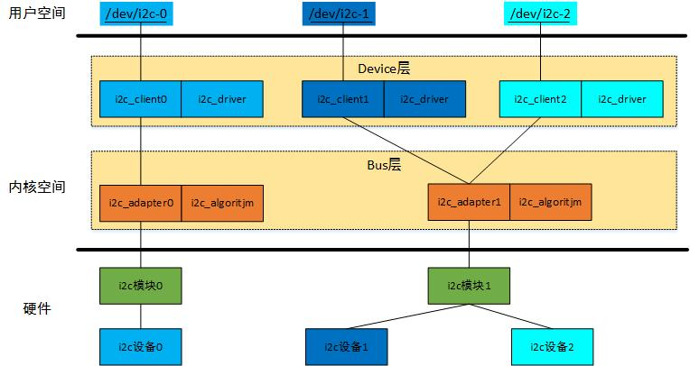
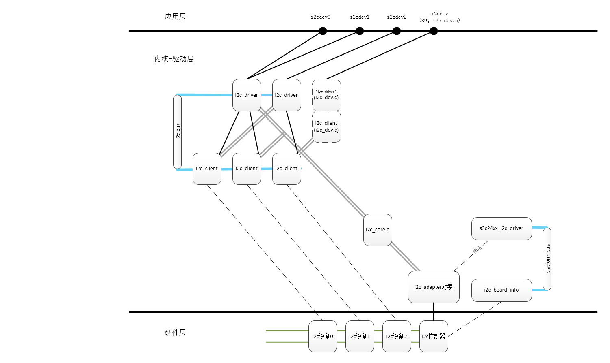
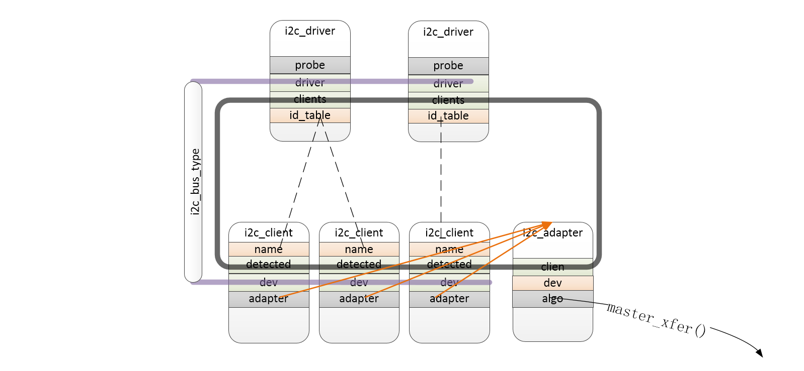

# i2c
### 参考
[Linux i2c子系统(一) _动手写一个i2c设备驱动](https://www.cnblogs.com/xiaojiang1025/p/6500540.html)   
[I2C子系统架构驱动](https://blog.csdn.net/cc289123557/article/details/51814778)   
***   
## i2c子系统架构
一个i2c控制器就对应一个i2c_board_info, 通过platform_bus_type协调工作。   
一个i2c总线上的设备就对应内核中的一个i2c_client类型的对象, 它的驱动就是的i2c_driver, 二者通过i2c_bus_type协调工作。   
同样是抽象的思路, 对于i2c总线本身, 内核也使用i2c_bus_type来描述。   
事实上, 对于任何一种总线, 内核都有一个bus_type类型的对象与之对应, 但是platform_bus_type并没有对应的实际的物理总线, 这也就是platform总线也叫虚拟总线的原因.   

除了分离，i2c子系统也体现的软件分层的设计思想, 整个i2c子系统由3层构成：设备驱动层--i2c核心--控制器驱动   
   
   

****
## i2c子系统组件
+   `i2c_adapter`对象实现了一组通过一个i2c控制器发送消息的所有信息, 包括时序, 地址等等, 即封装了i2c控制器的"控制信息"。它被i2c主机驱动创建, 通过clien域和`i2c_client`和`i2c_driver`相连, 这样设备端驱动就可以通过其中的方法以及i2c物理控制器来和一个i2c总线的物理设备进行交互.   
+   `i2c_algorithm`描述一个i2c主机的发送时序的信息，该类的对象`algo`是`i2c_adapter`的一个域，其中的`master_xfer()`注册的函数最终被设备驱动端的`i2c_transfer()`回调。   
+   `i2c_client`描述一个挂接在硬件i2c总线上的设备的设备信息，即i2c设备的设备对象，与`i2c_driver`对象匹配成功后通过`detected`和`i2c_driver`以及`i2c_adapter`相连，在控制器驱动与控制器设备匹配成功后被控制器驱动通过`i2c_new_device()`创建。   
+   `i2c_driver`描述一个挂接在硬件i2c总线上的设备的驱动方法，即i2c设备的驱动对象，通过`i2c_bus_type`和设备信息`i2c_client`匹配，匹配成功后通过`clients`和`i2c_client`对象以及`i2c_adapter`对象相连.   
+   `i2c_msg`描述一个在设备端和主机端之间进行流动的数据, 在设备驱动中打包并通过`i2c_transfer()`发送。相当于skbuf之于网络设备，urb之于USB设备。   
+   `i2c_transfer()`是i2c核心提供给设备驱动的发送方法, 通过它发送的数据需要被打包成`i2c_msg`, 这个函数最终会回调相应`i2c_adapter->i2c_algorithm->master_xfer()`接口将`i2c_msg`对象发送到i2c物理控制器.     
   
   
***       
## 组件说明   
#### `i2c_adapter`
首先说`i2c_adapter`, 并不是编写一个i2c设备驱动需要它, 通常我们在配置内核的时候已经将i2c控制器的设备信息和驱动已经编译进内核了, 就是这个adapter对象已经创建好了, 但是了解其中的成员对于理解i2c驱动框架非常重要, 所有的设备驱动都要经过这个对象的处理才能和物理设备通信.   
``` c
//include/linux/i2c.h
struct i2c_adapter {
        struct module *owner;
        unsigned int class;               /* classes to allow probing for */
        const struct i2c_algorithm *algo; /* the algorithm to access the bus */    // 这个i2c控制器需要的控制算法, 其中最重要的成员是master_xfer()接口, 这个接口是硬件相关的, 里面的操作都是基于具体的SoCi2c寄存器的, 它将完成将数据发送到物理i2c控制器的"最后一公里"
        void *algo_data;

        /* data fields that are valid for all devices   */
        struct rt_mutex bus_lock;

        int timeout;                    /* in jiffies */
        int retries;
        struct device dev;              /* the adapter device */ // 表示这个一个device, 会挂接到内核中的链表中来管理

        int nr;
        char name[48];
        struct completion dev_released;

        struct mutex userspace_clients_lock;
        struct list_head userspace_clients; // 这个节点将一个i2c_adapter对象和它所属的i2c_client对象以及相应的i2c_driver对象连接到一起

        struct i2c_bus_recovery_info *bus_recovery_info;
};
```
   
下面是2个`i2c-core.c`提供的`i2c_adapter`直接相关的操作API, 通常也不需要设备驱动开发中使用.   
##### `i2c_add_adapter()`
这个API可以将一个`i2c_adapter`类型的对象注册到内核中, 下面是他们的调用关系,我们可以从中看到一个`adapter`对象和系统中的`i2c_driver`对象以及`i2c_client`对象的匹配流程。   
首先，我们在驱动中构造一个`i2c_adapter`对象的时候，对其中的相关域进行初始化，这里我们最关心它的父设备, 例如:   
``` c
//drivers/i2c/buses/i2c-s3c2410.c
static int s3c24xx_i2c_probe(struct platform_device *pdev) 
{   
    // ...
    i2c->adap.dev.parent = &pdev->dev;  
    // ...
}
```
得到了这样一个i2c_adapter对象，我们就可以调用这个API将它注册到内核，调用关系如下:   
```
i2c_add_adapter()
1   └──i2c_register_adapter(adapter)
2       ├──adap->dev.bus = &i2c_bus_type;
3       ├──adap->dev.type = &i2c_adapter_type;
4       │   └──i2c_adapter_attr_groups
5       │        └── i2c_adapter_attr_group
6       │           └── i2c_adapter_attrs
7       │              └── &dev_attr_new_device.attr
8       │               └──DEVICE_ATTR(new_device, S_IWUSR, NULL, i2c_sysfs_new_device);
9       │                  └──i2c_sysfs_new_device()
10      │                         └──list_add_tail(&client->detected, &adap->userspace_clients);
11      └──device_register(&adap-dev);
12          ├──device_initialize(dev);
13          │   ├──/* /sys/devices/ /
14          │   ├──struct kset devices_kset;
15          │   ├──dev->kobj.kset = devices_kset;
16          │   ├──kobject_init(&dev->kobj, &device_ktype);
17          │   └──set_dev_node(dev, -1);
18          └──device_add(dev);
19             ├──parent=get_device(dev->parent);
20             ├──kobj = get_device_parent(dev, parent);
21             │   └──return &parent->kobj;
22             ├──dev->kobj.parent = kobj;
23             ├──set_dev_node(dev, dev_to_node(parent));
24             ├──kobject_add(&dev->kobj, dev->kobj.parent, NULL);
25             │   ├──kobject_add_varg(kobj, parent, fmt, args);
26             │   ├──kobj->parent = parent;
27             │   ├──kobject_add_internal(kobj);
28             │   ├──parent = kobject_get(kobj->parent);
29             │   ├──kobj_kset_join(kobj);
30             │   │   ├──kset_get(kobj->kset)
31             │   │   └──list_add_tail(&kobj->entry, &kobj->kset->list); 
32             │   ├──kobj->parent = parent;
33             │   └──create_dir(kobj);
34             ├──device_create_file(dev, &dev_attr_uevent);
35             ├──device_create_sys_dev_entry(dev);
36             ├──devtmpfs_create_node(dev);
37             ├──device_add_class_symlinks(dev);
38             ├──device_add_attrs(dev);
39             ├──bus_add_device(dev);
40             ├──bus_probe_device(dev);
41             ├──klist_add_tail(&dev->p->knode_parent,&parent->p->klist_children);
42             └──klist_add_tail(&dev->knode_class,&dev->class->p->klist_devices);
```   
--10--> 将`i2c_adapter`对象中的`userspace_clients`与匹配到的`client`对象中`detected`连接到一起.   
--15--> 将`/sys/devices`的kset赋值给`i2c_adapter->device->kobject->parent`，即建立`i2c_adapter`对象和`/sys/devices`的父子关系.   
--20--> 获取`device->parent`的kobject对象.   
--22--> 将`device->parent`的`kobject`对象作为`device->kobject->parent`, 形成`device->kobject->parent == device->parent->kobject`.   
--31--> 将这个`device->kobject`挂接到`device->kset->list`链表中, 由此可见, `kobject->kset`指向的`kset`对象和`kobject->entry`挂接到的`kset`对象可以不是一个.   
##### `i2c_del_adapter()`     
从内核中删除一个`adapter`.   
***   
#### `i2c_client`    
在i2c设备端，驱动开发的主要工作和平台总线一样:构建设备对象和驱动对象. 接下来以mpu6050为例，讨论如何编写i2c设备端的驱动。   
同样这里的设备对象也可以使用三种方式构建:平台文件，模块和设备树.   
本文采用设备树的方式构建设备对象，我们可以参考内核文档`"Documentations/devicetree/bindings/i2c/i2c-s3c2410.txt"`以及设备树中的样板来编写我们的设备树节点,__我们在设备树中可不会写mpu6050内部寄存器的地址,因为这些寄存器地址SoC看不到__。   
``` dts
/{
109           i2c@138B0000 {
110                      #address-cells = <1>;
111                      #size-cells = <0>;
112                      samsung,i2c-sda-delay = <100>;
113                      samsung,i2c-max-bus-freq = <20000>;
114                      pinctrl-0 =<&i2c5_bus>;
115                      pinctrl-names="default";
116                      status="okay";
117                      mpu6050@68{
118                                 compatible="invensense,mpu6050";
119                                 reg=<0x68>;
120                      };
121           };
```   

--109-->即我们SoC上的i2c控制器的地址   
--116-->这个一定要okay，其实是对"./arch/arm/boot/dts/exynos4.dtsi +387"处的status = "disabled"的重写，相同的节点的不同属性信息都会被合并，相同节点的相同的属性会被重写   
--117-->设备子节点，/表示板子，它的子节点node1表示SoC上的某个控制器，控制器中的子节点node2表示挂接在这个控制器上的设备(们)。68即是设备地址。   
--118-->这个属性就是我们和驱动匹配的钥匙，一个字符都不能错   
--119-->这个属性是从设备的地址，我们可以通过查阅手册"MPU-6050_DataSheet_V3_4"得到    
写了这个设备节点，内核就会为我们在内核中构造一个`i2c_client`对象并挂接到i2c总线对象的设备链表中以待匹配，这个设备类如下   
``` c
//include/linux/i2c.h
217 struct i2c_client {                           
218         unsigned short flags;           /* div., see below              */
219         unsigned short addr;            /* chip address - NOTE: 7bit    */
220                                         /* addresses are stored in the  */
221                                         /* _LOWER_ 7 bits               */
222         char name[I2C_NAME_SIZE];
223         struct i2c_adapter *adapter;    /* the adapter we sit on        */
224         struct device dev;              /* the device structure         */
225         int irq;                        /* irq issued by device         */
226         struct list_head detected;
227 };
```   
--219-->设备地址   
--223-->表示这个client从属的i2c主机对应的adapter对象，驱动方法中使用这个指针发送数据   
--224-->表示这是一个device   
--225-->中断使用的中断号   
--226-->将所有i2c_client连在一起的节点   
***   
#### `i2c_driver`
和平台总线类似，i2c驱动对象使用`i2c_driver`结构来描述，所以，编写一个i2c驱动的本质工作就是构造一个`i2c_driver`对象并将其注册到内核。我们先来认识一下这个对象    
``` c
//include/linux/i2c.h
161 struct i2c_driver {
162         unsigned int class;
167         int (*attach_adapter)(struct i2c_adapter *) __deprecated;
170         int (*probe)(struct i2c_client *, const struct i2c_device_id *);
171         int (*remove)(struct i2c_client *);
174         void (*shutdown)(struct i2c_client *);
175         int (*suspend)(struct i2c_client *, pm_message_t mesg);
176         int (*resume)(struct i2c_client *);
183         void (*alert)(struct i2c_client *, unsigned int data);
188         int (*command)(struct i2c_client *client, unsigned int cmd, void *arg);
190         struct device_driver driver;
191         const struct i2c_device_id *id_table;
194         int (*detect)(struct i2c_client *, struct i2c_board_info *);
195         const unsigned short *address_list;
196         struct list_head clients;                             
197 };
```   
__struct i2c_driver__   
--170-->探测函数，匹配成功之后执行，会将匹配到的`i2c_client`对象传入，完成申请资源，初始化，提供接口等工作。   
--171-->移除函数，设备消失时会调用，驱动模块被`rmmod`时也会先被调用，完成和`probe`相反的操作。   
--174-->这三个方法都是电源管理相关的接口   
--190-->表明这是一个设备的驱动类，和`platform`一样，用于匹配设备树的`of_match_table`域在这里    
--191-->用于使用平台文件或模块编写设备信息时进行匹配使用，相当于`platform_driver`中的`id_table`。   
--197-->用于将所有`i2c_driver`联系到一起的节点    

那么接下来就是填充对象了，我们这里使用的是设备树匹配，所以of_match_table被填充如下。   
``` c
struct of_device_id mpu6050_dt_match[] = {
    {.compatible = "invensense,mpu6050"},
    {},
};
struct i2c_device_id mpu6050_dev_match[] = {};
```   
然后将这两个成员填充到`i2c_driver`对象如下，这个阶段我们可以在mpu6050_probe中只填写`prink`来测试我们的驱动方法对象是否有问题。   
``` c
struct i2c_driver mpu6050_driver = {
    .probe = mpu6050_probe,
    .remove = mpu6050_remove,
    .driver = {
        .owner = THIS_MODULE,
        .name = "mpu6050drv",
        .of_match_table = of_match_ptr(mpu6050_dt_match), 
    },
    .id_table = mpu6050_dev_match,
};
```   
使用下述API注册/注销驱动对象，这个宏和`module_platform_driver`一样是内核提供给我们一个用于快速实现注册注销接口的快捷方式，写了这句以及模块授权，我们就可以静待各种信息被打印了   
``` c
module_i2c_driver(mpu6050_driver);
```   
***   
#### `i2c_msg`
如果测试通过，我们就要研究如何找到`adapter`以及如何通过找到的`adapter`将数据发送出去。没错，我说的`i2c_msg`    
``` c
 68 struct i2c_msg {                                                                                                   
 69         __u16 addr;     /* slave address                        */
 70         __u16 flags;
 71 #define I2C_M_TEN               0x0010  /* this is a ten bit chip address */
 72 #define I2C_M_RD                0x0001  /* read data, from slave to master */
 73 #define I2C_M_STOP              0x8000  /* if I2C_FUNC_PROTOCOL_MANGLING */
 74 #define I2C_M_NOSTART           0x4000  /* if I2C_FUNC_NOSTART */
 75 #define I2C_M_REV_DIR_ADDR      0x2000  /* if I2C_FUNC_PROTOCOL_MANGLING */
 76 #define I2C_M_IGNORE_NAK        0x1000  /* if I2C_FUNC_PROTOCOL_MANGLING */
 77 #define I2C_M_NO_RD_ACK         0x0800  /* if I2C_FUNC_PROTOCOL_MANGLING */
 78 #define I2C_M_RECV_LEN          0x0400  /* length will be first received byte */
 79         __u16 len;              /* msg length                           */
 80         __u8 *buf;              /* pointer to msg data                  */
 81 };  
 ```   
__struct i2c_msg__   
--69-->从机地址   
--70-->操作标志，`I2C_M_RD`为读(0)，写为1   
--79-->有效数据长度   
--80-->装载有效数据的头指针    
我们知道，i2c总线上传入数据是以字节为单位的，而我们的通信类别分为两种:读and写，对于写，通常按照下面的时序:   

|        Master         |   Slave  |
|:---------------------:|:--------:|
|           S           |          |
|    I2CAddr+WriteBit   |          |
|                       |   ACK    |
| InternalRegisterAddr  |          |
|                       |   ACK    |
|         DATA          |          |
|                       |   ACK    |
|         DATA          |          |
|                       |   ACK    |
|           P           |          |     

对于读，通常是按照下面的时序:   

|        Master         |   Slave  |
|:---------------------:|:--------:|
|           S           |          |
|    I2CAddr+WriteBit	|          |
|                       |   ACK    |
|  InternalRegisterAddr |          |
|                       |   ACK    |
|          S            |          |
|     I2CAddr+ReadBit   |          |
|                       |   ACK    |
|                       |   DATA   |
|          ACK          |          |
|                       |   DATA   |
|         NACK          |          |
|           P           |          |   

i2c子系统为了实现这种通信方法，为我们封装了`i2c_msg`结构，对于每一个`START`信号，都对应一个`i2c_msg`对象，实际操作中我们会将所有的请求封装成一个`struct i2c_msg[]`，一次性将所有的请求通过`i2c_transfer()`发送给匹配到的`client`的从属的`adapter`，由`adapter`根据相应的`algo`域以及`master_xfer`域通过主机驱动来将这些请求发送给硬件上的设备.    
***   
## 实例
这是一个通过i2c总线来访问mpu6050的驱动   
``` c
//mpu6050_common.h
#define MPU6050_MAGIC 'K'

union mpu6050_data
{
    struct {
        short x;
        short y;
        short z;
    }accel;
    struct {
        short x;
        short y;
        short z;
    }gyro;
    unsigned short temp;
};

#define GET_ACCEL _IOR(MPU6050_MAGIC, 0, union mpu6050_data)
#define GET_GYRO  _IOR(MPU6050_MAGIC, 1, union mpu6050_data) 
#define GET_TEMP  _IOR(MPU6050_MAGIC, 2, union mpu6050_data)
```   
``` c
//mpu6050_drv.h

#define SMPLRT_DIV      0x19    //陀螺仪采样率，典型值：0x07(125Hz)
#define CONFIG          0x1A    //低通滤波频率，典型值：0x06(5Hz)
#define GYRO_CONFIG     0x1B    //陀螺仪自检及测量范围，典型值：0x18(不自检，2000deg/s)
#define ACCEL_CONFIG        0x1C    //加速计自检、测量范围及高通滤波，典型值：0x18(不自检，2G，5Hz)
#define ACCEL_XOUT_H        0x3B
#define ACCEL_XOUT_L        0x3C
#define ACCEL_YOUT_H        0x3D
#define ACCEL_YOUT_L        0x3E
#define ACCEL_ZOUT_H        0x3F
#define ACCEL_ZOUT_L        0x40
#define TEMP_OUT_H      0x41
#define TEMP_OUT_L      0x42
#define GYRO_XOUT_H     0x43
#define GYRO_XOUT_L     0x44
#define GYRO_YOUT_H     0x45
#define GYRO_YOUT_L     0x46
#define GYRO_ZOUT_H     0x47    //陀螺仪z轴角速度数据寄存器（高位）
#define GYRO_ZOUT_L     0x48    //陀螺仪z轴角速度数据寄存器（低位）
#define PWR_MGMT_1      0x6B    //电源管理，典型值：0x00(正常启用)
#define WHO_AM_I        0x75    //IIC地址寄存器(默认数值0x68，只读)
#define SlaveAddress        0x68    //MPU6050-I2C地址寄存器
#define W_FLG           0
#define R_FLG           1
```   
``` c
//mpu6050.c
struct mpu6050_pri {
    struct cdev dev;
    struct i2c_client *client;
};
struct mpu6050_pri dev;
static void mpu6050_write_byte(struct i2c_client *client,const unsigned char reg,const unsigned char val)
{ 
    char txbuf[2] = {reg,val};
    struct i2c_msg msg[2] = {
        [0] = {
            .addr = client->addr,
            .flags= W_FLG,
            .len = sizeof(txbuf),
            .buf = txbuf,
        },
    };
    i2c_transfer(client->adapter, msg, ARRAY_SIZE(msg));
}
static char mpu6050_read_byte(struct i2c_client *client,const unsigned char reg)
{
    char txbuf[1] = {reg};
    char rxbuf[1] = {0};
    struct i2c_msg msg[2] = {
        [0] = {
            .addr = client->addr,
            .flags = W_FLG,
            .len = sizeof(txbuf),
            .buf = txbuf,
        },
        [1] = {
            .addr = client->addr,
            .flags = I2C_M_RD,
            .len = sizeof(rxbuf),
            .buf = rxbuf,
        },
    };

    i2c_transfer(client->adapter, msg, ARRAY_SIZE(msg));
    return rxbuf[0];
}
static int dev_open(struct inode *ip, struct file *fp)
{
    return 0;
}
static int dev_release(struct inode *ip, struct file *fp)
{
    return 0;
}
static long dev_ioctl(struct file *fp, unsigned int cmd, unsigned long arg)
{
    int res = 0;
    union mpu6050_data data = {{0}};
    switch(cmd){
    case GET_ACCEL:
        data.accel.x = mpu6050_read_byte(dev.client,ACCEL_XOUT_L);
        data.accel.x|= mpu6050_read_byte(dev.client,ACCEL_XOUT_H)<<8;
        data.accel.y = mpu6050_read_byte(dev.client,ACCEL_YOUT_L);
        data.accel.y|= mpu6050_read_byte(dev.client,ACCEL_YOUT_H)<<8;
        data.accel.z = mpu6050_read_byte(dev.client,ACCEL_ZOUT_L);
        data.accel.z|= mpu6050_read_byte(dev.client,ACCEL_ZOUT_H)<<8;
        break;
    case GET_GYRO:
        data.gyro.x = mpu6050_read_byte(dev.client,GYRO_XOUT_L);
        data.gyro.x|= mpu6050_read_byte(dev.client,GYRO_XOUT_H)<<8;
        data.gyro.y = mpu6050_read_byte(dev.client,GYRO_YOUT_L);
        data.gyro.y|= mpu6050_read_byte(dev.client,GYRO_YOUT_H)<<8;
        data.gyro.z = mpu6050_read_byte(dev.client,GYRO_ZOUT_L);
        data.gyro.z|= mpu6050_read_byte(dev.client,GYRO_ZOUT_H)<<8;
        printk("gyro:x %d, y:%d, z:%d\n",data.gyro.x,data.gyro.y,data.gyro.z);
        break;
    case GET_TEMP:
        data.temp = mpu6050_read_byte(dev.client,TEMP_OUT_L);
        data.temp|= mpu6050_read_byte(dev.client,TEMP_OUT_H)<<8;
        printk("temp: %d\n",data.temp);
        break;
    default:
        printk(KERN_INFO "invalid cmd");
        break;
    }
    printk("acc:x %d, y:%d, z:%d\n",data.accel.x,data.accel.y,data.accel.z);
    res = copy_to_user((void *)arg,&data,sizeof(data));
    return sizeof(data);
}

struct file_operations fops = {
    .open = dev_open,
    .release = dev_release,
    .unlocked_ioctl = dev_ioctl, 
};

#define DEV_CNT 1
#define DEV_MI 0
#define DEV_MAME "mpu6050"

struct class *cls;
dev_t dev_no ;

static void mpu6050_init(struct i2c_client *client)
{
    mpu6050_write_byte(client, PWR_MGMT_1, 0x00);
    mpu6050_write_byte(client, SMPLRT_DIV, 0x07);
    mpu6050_write_byte(client, CONFIG, 0x06);
    mpu6050_write_byte(client, GYRO_CONFIG, 0x18);
    mpu6050_write_byte(client, ACCEL_CONFIG, 0x0);
}
static int mpu6050_probe(struct i2c_client * client, const struct i2c_device_id * id)
{
    dev.client = client;
    printk(KERN_INFO "xj_match ok\n");
    cdev_init(&dev.dev,&fops);
    
    alloc_chrdev_region(&dev_no,DEV_MI,DEV_CNT,DEV_MAME);
    
    cdev_add(&dev.dev,dev_no,DEV_CNT);
    
    mpu6050_init(client);

    /*自动创建设备文件*/
    cls = class_create(THIS_MODULE,DEV_MAME);
    device_create(cls,NULL,dev_no,NULL,"%s%d",DEV_MAME,DEV_MI);
    
    printk(KERN_INFO "probe\n");
    
    return 0;
}

static int mpu6050_remove(struct i2c_client * client)
{
    device_destroy(cls,dev_no);
    class_destroy(cls);
    unregister_chrdev_region(dev_no,DEV_CNT);
    return 0;
}

struct of_device_id mpu6050_dt_match[] = {
    {.compatible = "invensense,mpu6050"},
    {},
};

struct i2c_device_id mpu6050_dev_match[] = {};
struct i2c_driver mpu6050_driver = {
    .probe = mpu6050_probe,
    .remove = mpu6050_remove,
    .driver = {
        .owner = THIS_MODULE,
        .name = "mpu6050drv",
        .of_match_table = of_match_ptr(mpu6050_dt_match), 
    },
    .id_table = mpu6050_dev_match,
};
module_i2c_driver(mpu6050_driver);
MODULE_LICENSE("GPL");
```   
通过上面的驱动, 我们可以在应用层操作设备文件从mpu6050寄存器中读取原始数据, 应用层如下   
``` c
int main(int argc, char * const argv[])
{
    int fd = open(argv[1],O_RDWR);
    if(-1== fd){
        perror("open");
        return -1;
    }
    union mpu6050_data data = {{0}};
    while(1){
        ioctl(fd,GET_ACCEL,&data);
        printf("acc:x %d, y:%d, z:%d\n",data.accel.x,data.accel.y,data.accel.z);
        ioctl(fd,GET_GYRO,&data);
        printf("gyro:x %d, y:%d, z:%d\n",data.gyro.x,data.gyro.y,data.gyro.z);
        ioctl(fd,GET_TEMP,&data);
        printf("temp: %d\n",data.temp);
        sleep(1);
    }
    return 0;
}
```   
