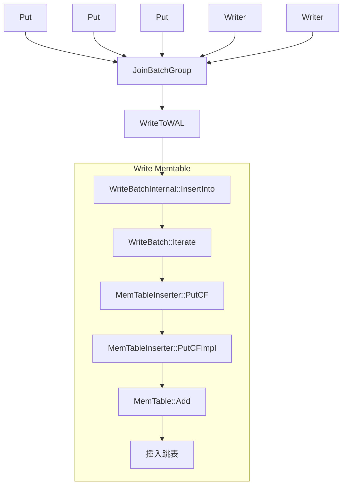

# 2024-10-29
1. Rocksdb 使用单链表来组成链表, 主要目的是为了支持并发插入。因为单链表在插入节点时, 可以使用CAS来进行, 但双链表不行。

2. 列族的概念类似于MySQL/MongoDB中的表/collection。它是一种逻辑上的分区。一个rocksdb实例中可以有多个列族, 每个列族都有自己的LSM结构。多个列族共享WAL, 但不共享memtable, immemtable, SST; rocksdb默认情况下只有一个列族, 名为default(列族id为0)。

3. RocksDB里的配置分诶ColumnFamilyOptions和DBOptions。前者为单个列族的配置, 后者是整个DB的配置。

4. RocksDB通过`Version`管理某一个时刻的DB的状态怒。任何读写都是对一个version的操作。

Version用于管理LSM中的SST的集合在每次compaction结束或者memtable被flush到磁盘时, 都将会创建一个新的version, 用来记录新的LSM结构。随着数据不断的写入以及compaction额执行, RocksDB中将会存在多个version。但在任一时刻都只会有一个 __当前__ 的version版本, 即current version。新的Get操作或者迭代器在其整个查询过程和迭代器的生命周期内都会使用current version。"过时" (没有被任何Get或者iterator迭代器使用)的version都需要被清除。任何version都未使用的SST则会被删除。

# 2024-10-30
1. RocksDB在写入数据时, 会先写WAL, 再写Memtable

2. Rocksdb的写是批次写, 当有多组写入并行进行时, 其会将这多个写入放入一个或多个`write batch`内, 然后在每个batch中选出一笔写操作称作`leader`, 此batch中的其它写入操作则为`follower`, 由这个`leader`去负责这批kv写入。写完后再唤醒此batch中的follower, 并将处于等待状态的其它write请求组成一个或多个新的`write batch`, 继续进行此操作。

大致调用模式(这是较早版本的rocksdb):



现行版本(不同DB配置的调用链会有所差别, 这里只选取其中一个典型):

```text
Status DB::Put(const WriteOptions &options, const Slice &key, const Slice &value);
    Status DBImpl::Put(const WriteOptions& o, ColumnFamilyHandle* column_family, const Slice& key, const Slice& val);
        Status DB::Put(const WriteOptions& opt, ColumnFamilyHandle* column_family, const Slice& key, const Slice& value);
            Status WriteBatch::Put(ColumnFamilyHandle* column_family, const Slice& key, const Slice& value);
                Status WriteBatchInternal::Put(WriteBatch* b, uint32_t column_family_id, const Slice& key, const Slice& value);
            Status DBImpl::Write(const WriteOptions& write_options, WriteBatch* my_batch);
                Status DBImpl::WriteImpl(const WriteOptions& write_options, WriteBatch* my_batch, WriteCallback* callback, UserWriteCallback* user_write_cb, uint64_t* log_used, uint64_t log_ref, bool disable_memtable, uint64_t* seq_used, size_t batch_cnt, PreReleaseCallback* pre_release_callback, PostMemTableCallback* post_memtable_callback);
                    void WriteThread::JoinBatchGroup(Writer* w); # 主要流程, 这里会将多个Writer组成单链表(后续在WriteImpl里还会把它们再组成双链表), 然后一并刷入。如果压力过大, 部分write请求也会在这个函数中卡死(通过条件变量直接挂起当前线程)
                    Status DBImpl::PreprocessWrite(const WriteOptions& write_options, LogContext* log_context, WriteContext* write_context); # 能走到这里, 说明本次write一定是本次WriteBatchGroup中的leader(非leader在代码上方的`if (w.state == WriteThread::STATE_COMPLETED)`处就直接推出了)。 这里会进行memtable->immemtable的转换, WAL的切换, memtable的flush
                    size_t WriteThread::EnterAsBatchGroupLeader(Writer* leader, WriteGroup* write_group); #  计算本write group的大小、write个数、连接、last_writer_的位置等
                    IOStatus DBImpl::WriteToWAL(const WriteThread::WriteGroup& write_group, log::Writer* log_writer, uint64_t* log_used, bool need_log_sync, bool need_log_dir_sync, SequenceNumber sequence, LogFileNumberSize& log_file_number_size); # 写WAL, 不过需要注意的是, RocksDB不强制要求每次写WAL都得写盘, WAL的更改可能会留存在page cache里, 一段时间后才会刷入
                    Status WriteBatchInternal::InsertInto(WriteThread::WriteGroup& write_group, SequenceNumber sequence, ColumnFamilyMemTables* memtables, FlushScheduler* flush_scheduler, TrimHistoryScheduler* trim_history_scheduler, bool ignore_missing_column_families, uint64_t recovery_log_number, DB* db, bool concurrent_memtable_writes, bool seq_per_batch, bool batch_per_txn); # 写 memtable
                    void WriteThread::ExitAsBatchGroupFollower(Writer* w); # 因为本次写入流程在本次writebatch中的角色为leader, 所以在写入完成后还需要唤醒所有的follower
```

# 2024-11-01

1. Rocksdb的读流程相对简单。它会先尝试读Memtable, 再读ImMemtable, 再读SST。注意在读第0层SST时, 可能需要遍历第0层的所有SST文件, 因为第0层的各SST间还是有重叠的。从第1层开始就不再需要了。

```text
Status DB::Get(const ReadOptions& options, const Slice& key, std::string* value);
    Status DB::Get(const ReadOptions& options, ColumnFamilyHandle* column_family, const Slice& key, std::string* value);
        Status DB::Get(const ReadOptions& options, ColumnFamilyHandle* column_family, const Slice& key, PinnableSlice* value);
            Status DBImpl::Get(const ReadOptions& _read_options, ColumnFamilyHandle* column_family, const Slice& key, PinnableSlice* value, std::string* timestamp);
                Status DBImpl::GetImpl(const ReadOptions& read_options, ColumnFamilyHandle* column_family, const Slice& key, PinnableSlice* value, std::string* timestamp);
                    Status DBImpl::GetImpl(const ReadOptions& read_options, const Slice& key, GetImplOptions& get_impl_options);
                          bool MemTable::Get(const LookupKey& key, std::string* value, PinnableWideColumns* columns, std::string* timestamp, Status* s, MergeContext* merge_context, SequenceNumber* max_covering_tombstone_seq, const ReadOptions& read_opts, bool immutable_memtable, ReadCallback* callback = nullptr, bool* is_blob_index = nullptr, bool do_merge = true); # 读取Memtable
                              // - 先检查 FragmentedRangeTombstone。这里存放的是通过`DeleteRange`在当前memtable中删除掉的key
                              void MemTable::GetFromTable(const LookupKey& key, SequenceNumber max_covering_tombstone_seq, bool do_merge, ReadCallback* callback, bool* is_blob_index, std::string* value, PinnableWideColumns* columns, std::string* timestamp, Status* s, MergeContext* merge_context, SequenceNumber* seq, bool* found_final_value, bool* merge_in_progress);
                                  void SkipListRep::Get(const LookupKey& k, void* callback_args, bool (*callback_func)(void* arg, const char* entry))
                          bool MemTableListVersion::Get(const LookupKey& key, std::string* value, PinnableWideColumns* columns, std::string* timestamp, Status* s, MergeContext* merge_context, SequenceNumber* max_covering_tombstone_seq, const ReadOptions& read_opts, ReadCallback* callback = nullptr, bool* is_blob_index = nullptr);
                              bool MemTableListVersion::Get(const LookupKey& key, std::string* value, PinnableWideColumns* columns, std::string* timestamp, Status* s, MergeContext* merge_context, SequenceNumber* max_covering_tombstone_seq, SequenceNumber* seq, const ReadOptions& read_opts, ReadCallback* callback, bool* is_blob_index);
                                  bool MemTableListVersion::GetFromList(std::list<MemTable*>* list, const LookupKey& key, std::string* value, PinnableWideColumns* columns, std::string* timestamp, Status* s, MergeContext* merge_context, SequenceNumber* max_covering_tombstone_seq, SequenceNumber* seq, const ReadOptions& read_opts, ReadCallback* callback, bool* is_blob_index);
                                      // 对所有immemtable调用 bool MemTable::Get(const LookupKey& key, std::string* value, PinnableWideColumns* columns, std::string* timestamp, Status* s, MergeContext* merge_context, SequenceNumber* max_covering_tombstone_seq, SequenceNumber* seq, const ReadOptions& read_opts, bool immutable_memtable, ReadCallback* callback, bool* is_blob_index, bool do_merge)
                          void Version::Get(const ReadOptions& read_options, const LookupKey& k, PinnableSlice* value, PinnableWideColumns* columns, std::string* timestamp, Status* status, MergeContext* merge_context, SequenceNumber* max_covering_tombstone_seq, PinnedIteratorsManager* pinned_iters_mgr, bool* value_found, bool* key_exists, SequenceNumber* seq, ReadCallback* callback, bool* is_blob, bool do_merge); # 从当前version的SST中查找
                              // 构建 FilePicker, 多次调用FilePicker：：GetNextFile()会依序返回可能包含目标key的SST文件, 然后再依序为这些SST调用下述 TableCache::Get(), 直到找到目标key或者遍历完成。
                                  # 多次调用 # Status TableCache::Get(const ReadOptions& options, const InternalKeyComparator& internal_comparator, const FileMetaData& file_meta, const Slice& k, GetContext* get_context, const MutableCFOptions& mutable_cf_options, HistogramImpl* file_read_hist, bool skip_filters, int level, size_t max_file_size_for_l0_meta_pin);
                                      Status BlockBasedTable::Get(const ReadOptions& read_options, const Slice& key, GetContext* get_context, const SliceTransform* prefix_extractor, bool skip_filters); // Rocksdb的默认SST实现即为BlockBasedTable, 所以这里我们认为调用的是BlockBasedTable::Get()
```

# 2024-11-04
在搜索memtable时(`SkipListRep::Get()`), 为什么需要用一个循环来实现:

```c++
void Get(const LookupKey& k, void* callback_args,
         bool (*callback_func)(void* arg, const char* entry)) override {
  SkipListRep::Iterator iter(&skip_list_);
  Slice dummy_slice;
  for (iter.Seek(dummy_slice, k.memtable_key().data());
       iter.Valid() && callback_func(callback_args, iter.key());
       iter.Next()) {

  }
}
```

而不能直接使用以下形式?

```c++
void Get(const LookupKey& k, void* callback_args,
         bool (*callback_func)(void* arg, const char* entry)) override {
  SkipListRep::Iterator iter(&skip_list_);
  Slice dummy_slice;
  iter.Seek(dummy_slic, k.memtable_key().data());
  if (iter.Valid()) {
    callback_func(callback_args, iter.key());
  }
}
```

这是因为一个memtable中可能含有多个version的数据。因此这里找到一个key之后, 还需要检查version、timestamp等信息。

