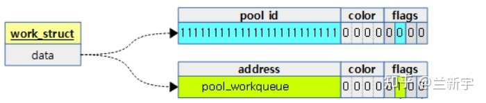
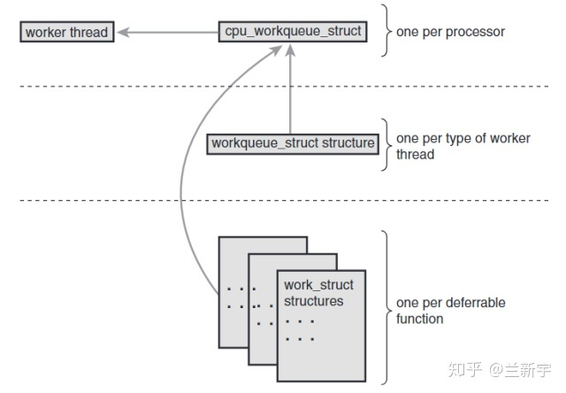
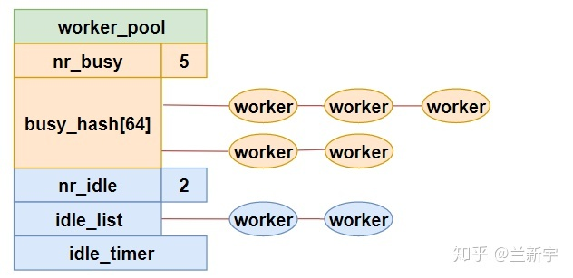

# [任务工厂 - Linux中的workqueue机制 [一] - 知乎 (zhihu.com)](https://zhuanlan.zhihu.com/p/91106844) :

work的定义:

```c
struct work_struct {
	struct list_head entry;
	work_func_t func;
	atomic_long_t data;
};
```

其中， **"entry"** 表示其所挂载的workqueue队列的节点， **"func"** 就是要执行的任务的入口函数。而 **"data"** 表示的意义就比较丰富了：最后的4个bits是作为"flags"标志位使用的，中间的4个bits是用于flush功能的"color"（flush的功能是在销毁workqueue队列之前，等待workqueue队列上的任务都处理完成）。



剩下的bits在不同的场景下有不同的含义(相当于C语言里的"union")，它可以指向work item所在的workqueue队列的地址，由于低8位被挪作他用，因此要求workqueue队列的地址是按照256字节对齐的。它还可以表示处理work item的worker线程所在的pool的ID(关于pool将在本文的后半部分介绍)。

为了充分利用locality，通常选择将处理hardirq的CPU作为该hardirq对应的workqueue底半部的执行CPU，
在早期Linux的实现中，每个CPU对应一个workqueue队列，并且每个CPU上只有一个worker线程来处理这个workqueue队列，
也就是说workqueue队列和worker线程都是per-CPU的，且一一对应。



当然, 这样会造成, 如果多个work被queue进一个workqueue中, 后进入的work必须等到先进入的work先结束执行, 才能被处理。因此, 后续的linux版本中, 在一个cpu core上放置多个了worker线程。

> cmwq

这种在一个CPU上运行多个worker线程的做法，就是 v2.6.36 版本引入的，也是现在Linux内核所采用的concurrency managed workqueue，简称cmwq。一个CPU上是不可能“同时”运行多个线程的，所以这里的名称是concurrency(并发)，而不是parallelism(并行)。

显然，设置合适的worker线程数目是很关键的，多了浪费资源，少了又不能充分利用CPU。大体的原则就是：如果现在一个CPU上的所有worker线程都进入了睡眠状态，但workqueue队列上还有未处理的work item，那么就再启动一个worker线程。

一个CPU上同一优先级的所有worker线程（优先级的概念见下文）共同构成了一个**worker pool**(此概念由内核v3.8引入)，我们可能比较熟悉memory pool，当需要内存时，就从空余的memory pool中去获取，同样地，当workqueue上有work item待处理时，我们就从worker pool里挑选一个空闲的worker线程来服务这个work item。

worker pool在代码中由 `worker_pool` 结构体表示(定义在kernel/workqueue.c)：

```c
struct worker_pool {
	spinlock_t		lock;		/* the pool lock */
	int			cpu;		/* the associated cpu */
	int			id;		/* pool ID */

	struct list_head	idle_list;	/* list of idle workers */
	DECLARE_HASHTABLE(busy_hash, 6);        /* hash of busy workers */
    ...
}
```

如果一个worker正在处理work item，那么它就是busy的状态，将挂载在busy workers组成的6阶的hash表上。既然是hash表，那么就需要key，充当这个key的是正在被处理的work item的内存地址。

如果一个worker没有处理work item，那么它就是idle的状态，将挂载在idle workers组成的链表上。

前面说过，有未处理的work item，内核就会启动一个新的worker线程，以提高效率。有创建就有消亡，当现在空闲的worker线程过多的时候，就需要销毁一部分worker线程，以节省CPU资源。就像一家公司，在项目紧张，人员不足的时候需要招人，在项目不足，人员过剩的时候可能就会裁员。

这种 **动态的资源伸缩** ，就有点“云”的味道了，即根据负载的变化，动态地扩容和缩容，目标是用尽可能少的资源，来完成尽可能多的事。至于保留多少空闲线程可以取得较理想的平衡，则涉及到一个颇为复杂的算法，在此就不展开了。



worker线程在代码中由"`worker`"结构体表示(定义在kernel/workqueue_internal.h)：

```c
struct worker {
	struct worker_pool	 *pool;		/* the associated pool */
	union {
		struct list_head  entry;	/* while idle */
		struct hlist_node hentry;	/* while busy */
	};

	struct work_struct	*current_work;	  /* work being processed */
	work_func_t		 current_func;	  /* current_work's fn */
	struct task_struct	*task;		  /* worker task */

	struct pool_workqueue	*current_pwq;     /* current_work's pwq */
        ...
}
```

其中，"`pool`"是这个worker线程所在的worker pool，根据worker线程所处的状态，它要么在idle worker组成的空闲链表中，要么在busy worker组成的hash表中。

"current_work"和"current_func"分别是worker线程正在处理的work item和其对应的入口函数。既然worker线程是一个内核线程，那么不管它是idle，还是busy的，都会对应一个task_struct(由"task"表示)。
