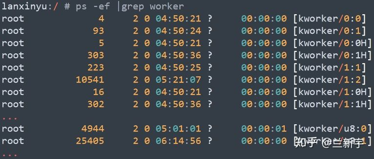
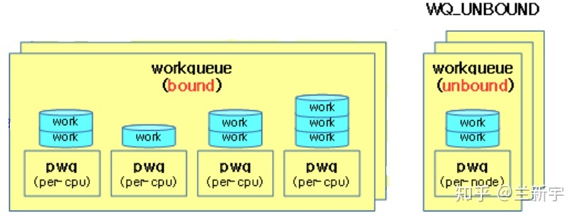
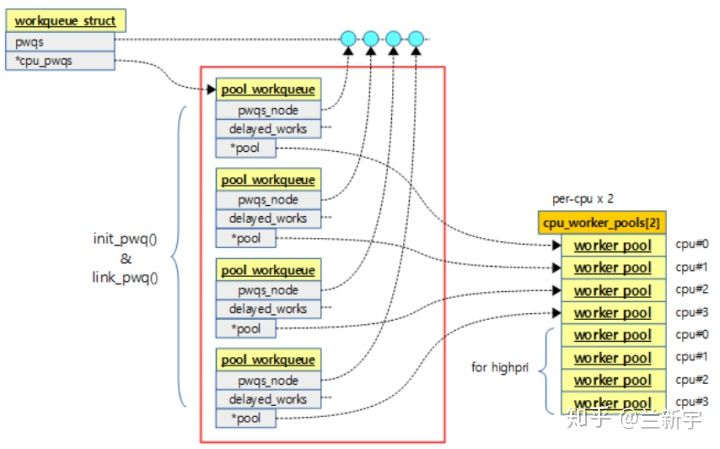

# [任务工厂 - Linux中的workqueue机制 [二] - 知乎 (zhihu.com)](https://zhuanlan.zhihu.com/p/94561631) :

在多个worker线程的cmwq模式下，按理一个CPU依然只对应一个workqueue队列，该队列由该CPU的worker pool里的线程共同服务(共享)，但别忘了任务是有优先级的，虽不说像完整的系统那样将优先级划分地很细，至少要分成低优先级和高优先级两类吧。为此，目前的设计是一个CPU对应两个workqueue队列，相应地也有两个worker pool，分别服务于这个2个队列。

用"ps"命令来看下系统中都有哪些worker线程，worker线程被命名成了"kworker/n:x"的格式，其中n是worker线程所在的CPU的编号，x是其在worker pool中的编号，如果带了"H"后缀，说明这是高优先级的worker pool。



还有一些带"u"前缀的，它表示"unbound"，意思是这个worker线程不和任何的CPU绑定，而是被所有CPU共享，这种设计主要是为了增加灵活性。"u"后面的这个数字也不再表示CPU的编号，而是表示由这些unbound的worker线程组成的worker pool的ID号。

假设一个系统有4个CPU，那么它就对应至多8个"bound"的worker pool(4个普通优先级+4个高优先级)和8个workqueue队列，每个worker pool里有若干个worker线程，每个workqueue队列上有若干个work items。至于"unbound"的worker pool数目，则是由具体的需求决定的。



上图的"pwq"就是表示workqueue队列的" *pool_workqueue * "结构体(定义在kernel/workqueue.c)。这里有个对齐的要求，原因就是上文介绍的"work_struct->data"的低8位被占用的问题。

```c
struct pool_workqueue {
	int	nr_active;	/* nr of active works */
	int	max_active;	/* max active works */

	struct  worker_pool	   *pool;   /* the associated pool */
	struct  workqueue_struct   *wq;	    /* the owning workqueue */
        ..
}__aligned(1 << WORK_STRUCT_FLAG_BITS);
```

* "max_active"和"nr_active"分别是该workqueue队列最大允许和实际挂载的work item的数目。最大允许的work item数目也就决定了该workqueue队列所对应的work pool上最多可能的活跃(busy)的worker线程的数目。
* "pool"指向服务这个workqueue队列的worker pool，至于这个"wq"，它的数据类型是"workqueue_struct"，从名字上看这个"workqueue_struct"好像也是表示workqueue队列的，那它和pwd(pool_workqueue)有什么区别呢？

来看下" *workqueue_struct * "结构体的定义(代码位于kernel/workqueue.c)：

```c
struct workqueue_struct {
	struct list_head	list;		                   /* list of all workqueues */
	struct list_head	pwqs;		           /* all pwqs of this wq */
	struct pool_workqueue  *cpu_pwqs;         /* per-cpu pwqs */
        ...
}
```

"list"是workqueue_struct自身串接而成的链表，以方便内核管理。


"pwqs"是同种类型的pwq组成的链表。



> **初始化**

至此，有关workqueue机制的5个结构体以及它们之间的相互关系就介绍完了，如果做个类比的话，那么work item就是工件，pwq队列就是这些工件组成的流水线，worker线程就是工人，worker pool就是一个班组的工人构成的集合。

假设一个集团有4个工厂(4个CPU)，每个工厂都分了两条流水线，一条是由高级工构成的班组负责的高效流水线，一条是由初级工构成的班组负责的普通流水线，那么这4个工厂的高效流水线都属于同一个技术级别(workqueue_struct)，普通流水线则同属于另一个技术级别。

至于unbound的生产班组，就理解为外包吧，它们从组织关系上不属于任何一个工厂，但是可以综合这4个工厂的生产任务的波动，提供对人力资源更机动灵活的配置。

来看一下workqueue机制所需的这一套东西都是怎么创建出来的。负责创建的函数主要是workqueue_init_early()，它的调用关系大致如下：

```go
workqueue_init_early() 
    --> alloc_workqueue() 
        --> alloc_and_link_pwqs()
             --> init_pwq()
```

在workqueue_init_early()中，初始化了per-CPU的worker pool，并为这些worker pool指定了ID和关联了CPU，工厂是工人劳动的场所，这一步相当于是把工厂的基础设施建好了。

```go
int __init workqueue_init_early(void)
{
	// 创建worker pool 
	for_each_possible_cpu(cpu) {
		struct worker_pool *pool;
		for_each_cpu_worker_pool(pool, cpu) {
                        init_worker_pool(pool);
			pool->cpu = cpu;
                        worker_pool_assign_id(pool);
	...
        }

        // 创建workqueue队列
	system_wq = alloc_workqueue("events", 0, 0);
	system_highpri_wq = alloc_workqueue("events_highpri", WQ_HIGHPRI, 0);
	system_unbound_wq = alloc_workqueue("events_unbound", WQ_UNBOUND, WQ_UNBOUND_MAX_ACTIVE);
        ...				  
}
```

接下来就是调用alloc_workqueue()创建各种类型的workqueue_struct，基础的是三种：普通优先级的，高优先级的，以及不和CPU绑定的，这一步相当于是把流水线的分类，以及采用自产还是外包的形式确定了。

在alloc_workqueue()中，第3个参数指定了可以并发的worker线程的数目(工厂流水线的容量)，最大为512(WQ_MAX_ACTIVE)，设为0则表示使用默认值(WQ_MAX_ACTIVE/2=256)。至于为什么是512，仅仅是一种经验的估算而已：


在alloc_and_link_pwqs()中，才是创建per-CPU的pwq队列，并把pwq队列和对应的workqueue_struct关联起来。这一步相当于是按之前确定的分类，依次建好了4个工厂对应的流水线。

```go
int alloc_and_link_pwqs(struct workqueue_struct *wq)
{
	bool highpri = wq->flags & WQ_HIGHPRI;

	if (!(wq->flags & WQ_UNBOUND)) {
		wq->cpu_pwqs = alloc_percpu(struct pool_workqueue);
		for_each_possible_cpu(cpu) {
			init_pwq(pwq, wq, &cpu_pools[highpri]);
	...
}
```

然后就是各个工厂根据市场上来的订单(产生的work items)确立生产任务的要求，并根据订单生产所需的技能级别，招募高级工或者初级工，安排到对应的流水线上。在这个过程中，还需要根据订单量的变化，动态地调整工人的数目，以实现效益的最大化(CPU资源最充分的利用)。
