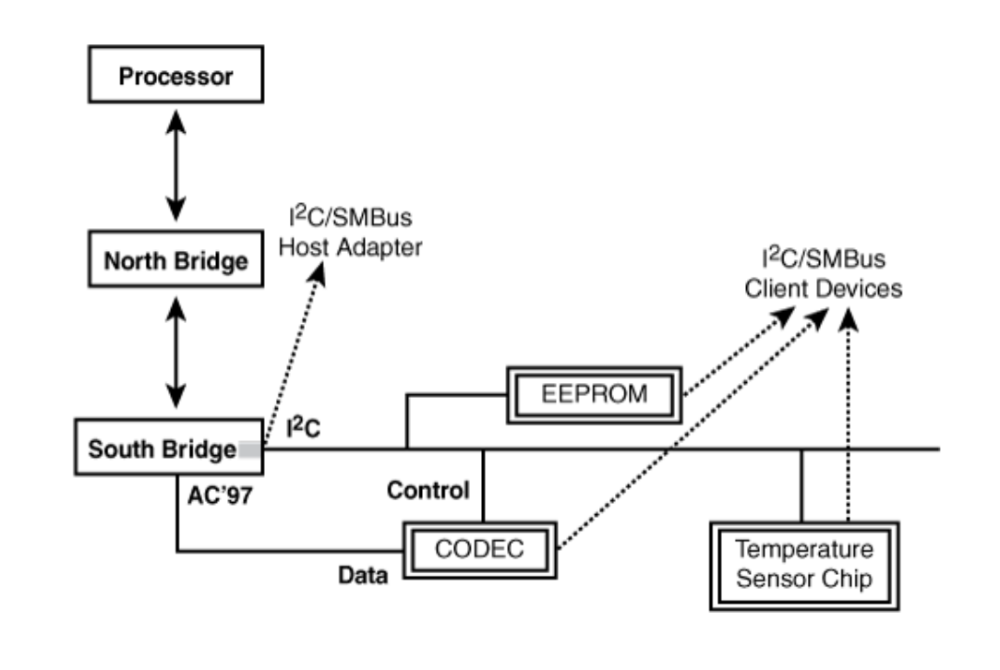
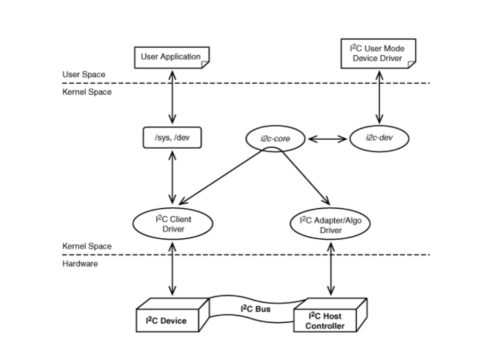

# Chapter 08. The Inter-Integrated Circuit Protocal
I2C, SMBus, SPI 和 1-wire 设备的特点:   
+   数据传输量小   
+   数据传输速率低   
***   
I2C/SMBus 常被用来连接EEPROMs, audio codecs, and specialized chips that monitor parameters such as temerature and power-supply voltage. I2C还被用来在嵌入式系统中与RTCs, smart battery circuits, multiplexers, port expanders, optical transceiver, and other devices通讯.   
I2C/SMBus协议为主/从结构协议(master-slave protocol). 通讯发生在host adapter(or host controller)与client devices(or slaves)之间, peers之间无通讯.    
     
I2C和SMBus均为2-wire interface, 一条负责时钟信息, 一条负责双向数据, 这两条线分别叫做`Serial CLock (SCL)`和`Serial DAta (SDA)`. 由于I2C只需要2条线路, 因此其不会在电路板上占用过多空间, 但其带宽也收到了严格限制. I2C在standard mode下带宽为100Kbps, 在 fast mode下为400Kbps (SMBus只有100Kbps). I2C的双向通讯还会使各方的通讯速度减半(50 Kbps 或 200Kbps), 因为只有一条数据传输线.   
每个I2C设备和SMBus设备都拥有一个7-bit 地址. 协议允许使用10-bit地址, 但许多设备只支持7位. 因此在1条总线上通常至多只有127个设备. Device addresses通常也被称作slave addresses.   
***
### I2C 核心 (I2C Core)与Linux I2C Subsystem:   
I2C core layer使得I2C设备的驱动与I2C控制器的驱动相互独立, 在不同host上工作的slave驱动可以不变.   
Kernel I2C infrastructure包括下列部分:   
+   Device drivers for I2C host adapters. 他们属于bus drivers, 通常包括adapter drivers 和 algorithm drivers两个部分.   
+   Device drivers for I2C client devices.
+   i2c-dev, which allows the implementation of user mode i2c client drivers.   
    
由于SMBus是I2C的子集, 因此对SMBus的支持也由I2C subsystem完成. 以下是I2C Core提供的兼容SMBus和I2C的API:    

| Function               |        Purpose                                  |
|:-----------------------|------------------------------------------------:|
| `i2c_smbus_read_byte()`  | Reads a single byte from the device without specifying a location offset. Uses the same offsetas the previously issued command.|
| `i2c_smbus_write_byte()` | Sends a single byte to the device at the same memory offset as the previously issued command.  |
| `i2c_smbus_write_quick()` | Sends a single bit to the device (in place of the Rd/Wr bit shown in `Listing 8.1`). |
| `i2c_smbus_read_byte_data()` | Reads a single byte from the device at a specified offset. |
| `i2c_smbus_write_byte_data()` | Sends a single byte to the device at a specified offset. |
| `i2c_smbus_read_word_data()` | Reads 2 bytes from the specified offset. |
| `i2c_smbus_write_word_data()` | Sends 2 bytes to the specified offset. |
| `i2c_smbus_read_block_data()` | Reads a block of data from the specified offset. |
| `i2c_smbus_write_block_data()` | Sends a block of data (<= 32 bytes) to the specified offset. |     
  
***
下列示例代码展示了与I2C EEPROM通讯的逻辑:   
*`Listing 8.1`: Transactions on the I2C Bus*   
``` c
/* ... */
/*
* Connect to the EEPROM. 0x50 is the device address.
* smbus_fp is a file pointer into the SMBus device.
*/
ioctl(smbus_fp, 0x50, slave);
/* Write a byte (0xAB) at memory offset 0 on the EEPROM */
i2c_smbus_write_byte_data(smbus_fp, 0, 0xAB);
/*
* This is the corresponding transaction observed
* on the bus after the write:
* S 0x50 Wr [A] 0 [A] 0xAB [A] P
*
* S is the start bit, 0x50 is the 7-bit slave address (0101000b),
* Wr is the write command (0b), A is the Accept bit (or
* acknowledgment) received by the host from the slave, 0 is the
* address offset on the slave device where the byte is to be
* written, 0xAB is the data to be written, and P is the stop bit.
* The data enclosed within [] is sent from the slave to the
* host, while the rest of the bits are sent by the host to the
* slave.
*/


/* Read a byte from offset 0 on the EEPROM */
res = i2c_smbus_read_byte_data(smbus_fp, 0);
/*
* This is the corresponding transaction observed
* on the bus after the read:
* S 0x50 Wr [A] 0 [A] S 0x50 Rd [A] [0xAB] NA P
*
* The explanation of the bits is the same as before, except that
* Rd stands for the Read command (1b), 0xAB is the data received
* from the slave, and NA is the Reverse Accept bit (or the
* acknowledgment sent by the host to the slave).
*/
```
***
### Device Example: EEPROM   
下列代码展示了一个作为I2C client device的EEPROM驱动. 绝大多数电脑中都有类似的EEPROM设备, 用于BIOS设置信息. 示例EEPROM有两个memory banks. 示例驱动将这两个memory banks暴露为两个`/dev` interfaces: `/dev/eep/0` 和 `/dev/eep/1`.    
这两个memory banks作为2个独立的I2C slaves存在, 分别被赋予I2C slave addresses: `SLAVE_ADDR1` 和 `SLAVE_ADDR2`.   
此驱动只使用SMBus-compatible APIs, 因此其可以驱动SMBus EEPROM设备.   
#### Initializing   
*`Listing 8.2`: Initializing the EEPROM Driver*   
``` c
/* Driver entry points */
static struct file_operations eep_fops = {
    .owner = THIS_MODULE,
    .llseek = eep_llseek,
    .read = eep_read,
    .ioctl = eep_ioctl,
    .open = eep_open,
    .release = eep_release,
    .write = eep_write,
};
static dev_t dev_number;            /* Allotted Device Number */
static struct class *eep_class;     /* Device class */
/* Per-device client data structure for each
 * memory bank supported by the driver
 */
struct eep_bank {
    struct i2c_client *client;          /* I2C client for this bank */
    unsigned int addr;                  /* Slave address of this bank */
    unsigned short current_pointer;     /* File pointer */
    int bank_number;                    /* Actual memory bank number */
    /* ... */                           /* Spinlocks, data cache for
                                            slow devices,.. */
};
#define NUM_BANKS 2                 /* Two supported banks */
#define BANK_SIZE 2048              /* Size of each bank */
struct ee_bank *ee_bank_list;       /* List of private data
                                        structures, one per bank */

/*
* Device Initialization
*/
int __init
eep_init(void)
{
    int err, i;
    /* Allocate the per-device data structure, ee_bank */
    ee_bank_list = kmalloc(sizeof(struct ee_bank)*NUM_BANKS,
                            GFP_KERNEL);
    memset(ee_bank_list, 0, sizeof(struct ee_bank)*NUM_BANKS);
    /* Register and create the /dev interfaces to access the EEPROM
        banks. Refer back to Chapter 5, "Character Drivers" for
        more details */
    if (alloc_chrdev_region(&dev_number, 0,
                            NUM_BANKS, "eep") < 0) {
        printk(KERN_DEBUG "Can't register device\n");
        return -1;
    }

    eep_class = class_create(THIS_MODULE, DEVICE_NAME);
    for (i=0; i < NUM_BANKS;i++) {

        /* Connect the file operations with cdev */
        cdev_init(&ee_bank[i].cdev, &ee_fops);
        /* Connect the major/minor number to the cdev */
        if (cdev_add(&ee_bank[i].cdev, (dev_number + i), 1)) {
            printk("Bad kmalloc\n");
            return 1;
        }
        class_device_create(eep_class, NULL, (dev_number + i),
                                NULL, "eeprom%d", i);
    }

    /* Inform the I2C core about our existence. See the section
        "Probing the Device" for the definition of eep_driver */
    err = i2c_add_driver(&eep_driver);

    if (err) {
        printk("Registering I2C driver failed, errno is %d\n", err);
        return err;
    }
    
    printk("EEPROM Driver Initialized.\n");
    return 0;
}
```
`Listing 8.2` initiates creation of the device nodes, but to complete their production, add the following to an appropriate rule file under `/etc/udev/rules.d/`:   
```
KERNEL:"eeprom[0-1]*", NAME="eep/%n"
```
这条规则将会使`udev`根据内核发出的`uevent`来自动设置`/dev` interface.用户进程可以通过访问`/dev/eep/n`来调用相应的file_operation.   

下列为`eep_fops` 中的`open`回调函数: `eep_open`:
*`Listing 8.3`: Opening the EEPROM Driver
``` c
int eep_open(struct inode *inode, struct file *file)
{
    /* The EEPROM bank to be opened */
    n = MINOR(file->f_dentry->d_inode->i_rdev);
    file->private_data = (struct ee_bank *)ee_bank_list[n];
    /* Initialize the fields in ee_bank_list[n] such as
        size, slave address, and the current file pointer */
    /* ... */
}
```
***
