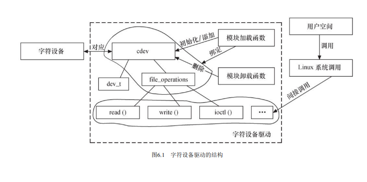

# 第6章
## 6.1.1
`include/linux/cdev.h`:
``` c
/* SPDX-License-Identifier: GPL-2.0 */
#ifndef _LINUX_CDEV_H
#define _LINUX_CDEV_H

#include <linux/kobject.h>
#include <linux/kdev_t.h>
#include <linux/list.h>
#include <linux/device.h>

struct file_operations;
struct inode;
struct module;

struct cdev {
	struct kobject kobj; /* 内嵌的kobject对象 */
	struct module *owner; /* 所属模块 */
	const struct file_operations *ops; /* 文件操作结构体 */
	struct list_head list;
	dev_t dev; /* 设备号 */
	unsigned int count;
} __randomize_layout;

void cdev_init(struct cdev *, const struct file_operations *);

struct cdev *cdev_alloc(void);

void cdev_put(struct cdev *p);

int cdev_add(struct cdev *, dev_t, unsigned);

void cdev_set_parent(struct cdev *p, struct kobject *kobj);
int cdev_device_add(struct cdev *cdev, struct device *dev);
void cdev_device_del(struct cdev *cdev, struct device *dev);

void cdev_del(struct cdev *);

void cd_forget(struct inode *);

#endif
```
设备号dev_t是一个32位整形数，前12位为主设备号，后20位为次设备号。使用下列宏可以从一个`dev_t`中extract出主次设备号:
``` c
MAJOR(dev_t dev)
MINOR(dev_t dev)
```
使用下列宏可以用一组主、次设备号生成一个`dev_t`:
``` c
MKDEV(int major, int minor)
```
`cdev_init()`用于初始化`cdev`的成员，建立`cdev`和`file_operations`之间的连接：
``` c
// From /fs/char_dev.c

/**
 * cdev_init() - initialize a cdev structure
 * @cdev: the structure to initialize
 * @fops: the file_operations for this device
 *
 * Initializes @cdev, remembering @fops, making it ready to add to the
 * system with cdev_add().
 */
void cdev_init(struct cdev *cdev, const struct file_operations *fops)
{
	memset(cdev, 0, sizeof *cdev);
	INIT_LIST_HEAD(&cdev->list);
	kobject_init(&cdev->kobj, &ktype_cdev_default);
	cdev->ops = fops;
}
```
`cdev_alloc()`用于动态申请一个`cdev`内存，其源代码如下:
``` c
// From /fs/char_dev.c

/**
 * cdev_alloc() - allocate a cdev structure
 *
 * Allocates and returns a cdev structure, or NULL on failure.
 */
struct cdev *cdev_alloc(void)
{
	struct cdev *p = kzalloc(sizeof(struct cdev), GFP_KERNEL);
	if (p) {
		INIT_LIST_HEAD(&p->list);
		kobject_init(&p->kobj, &ktype_cdev_dynamic);
	}
	return p;
}
```
`cdev_add()`和`cdev_del()`分别向系统添加和删除一个`cdev`，完成自负设备的注册和注销。   
***
## 6.1.2
在调用`cdev_add()`前，应先调用`register_chrdev_region()`或`alloc_chrdev_region()`函数向系统申请设备号，这两个函数的原型为:
``` c
int register_chrdev_region(dev_t from, unsigned int count, const char *name);
int alloc_chrdev_region(dev_t *dev, unsigned baseminor, unsigned count, const char *name);
```
`register_chrdev_region()`函数用于已知起始设备的设备号的情况，而`alloc_chrdev_region()`用于设备号未知，向系统动态申请未被占用的设备号的情况，函数调用成功之后，会把得到的设备号放入第一个参数dev中。
``` c
// From /fs/char_dev.c

/**
 * register_chrdev_region() - register a range of device numbers
 * @from: the first in the desired range of device numbers; must include
 *        the major number.
 * @count: the number of consecutive device numbers required
 * @name: the name of the device or driver.
 *
 * Return value is zero on success, a negative error code on failure.
 */
int register_chrdev_region(dev_t from, unsigned count, const char *name)
{
	struct char_device_struct *cd;
	dev_t to = from + count;
	dev_t n, next;

	for (n = from; n < to; n = next) {
		next = MKDEV(MAJOR(n)+1, 0);
		if (next > to)
			next = to;
		cd = __register_chrdev_region(MAJOR(n), MINOR(n),
			       next - n, name);
		if (IS_ERR(cd))
			goto fail;
	}
	return 0;
fail:
	to = n;
	for (n = from; n < to; n = next) {
		next = MKDEV(MAJOR(n)+1, 0);
		kfree(__unregister_chrdev_region(MAJOR(n), MINOR(n), next - n));
	}
	return PTR_ERR(cd);
}

/**
 * alloc_chrdev_region() - register a range of char device numbers
 * @dev: output parameter for first assigned number
 * @baseminor: first of the requested range of minor numbers
 * @count: the number of minor numbers required
 * @name: the name of the associated device or driver
 *
 * Allocates a range of char device numbers.  The major number will be
 * chosen dynamically, and returned (along with the first minor number)
 * in @dev.  Returns zero or a negative error code.
 */
int alloc_chrdev_region(dev_t *dev, unsigned baseminor, unsigned count,
			const char *name)
{
	struct char_device_struct *cd;
	cd = __register_chrdev_region(0, baseminor, count, name);
	if (IS_ERR(cd))
		return PTR_ERR(cd);
	*dev = MKDEV(cd->major, cd->baseminor);
	return 0;
}

///////////////////////////////////////////////////////

/*
 * Register a single major with a specified minor range.
 *
 * If major == 0 this functions will dynamically allocate a major and return
 * its number.
 *
 * If major > 0 this function will attempt to reserve the passed range of
 * minors and will return zero on success.
 *
 * Returns a -ve errno on failure.
 */
static struct char_device_struct *
__register_chrdev_region(unsigned int major, unsigned int baseminor,
			   int minorct, const char *name)
{
	struct char_device_struct *cd, **cp;
	int ret = 0;
	int i;

	cd = kzalloc(sizeof(struct char_device_struct), GFP_KERNEL);
	if (cd == NULL)
		return ERR_PTR(-ENOMEM);

	mutex_lock(&chrdevs_lock);

	if (major == 0) {
		ret = find_dynamic_major();
		if (ret < 0) {
			pr_err("CHRDEV \"%s\" dynamic allocation region is full\n",
			       name);
			goto out;
		}
		major = ret;
	}

	if (major >= CHRDEV_MAJOR_MAX) {
		pr_err("CHRDEV \"%s\" major requested (%u) is greater than the maximum (%u)\n",
		       name, major, CHRDEV_MAJOR_MAX-1);
		ret = -EINVAL;
		goto out;
	}

	cd->major = major;
	cd->baseminor = baseminor;
	cd->minorct = minorct;
	strlcpy(cd->name, name, sizeof(cd->name));

	i = major_to_index(major);

	for (cp = &chrdevs[i]; *cp; cp = &(*cp)->next)
		if ((*cp)->major > major ||
		    ((*cp)->major == major &&
		     (((*cp)->baseminor >= baseminor) ||
		      ((*cp)->baseminor + (*cp)->minorct > baseminor))))
			break;

	/* Check for overlapping minor ranges.  */
	if (*cp && (*cp)->major == major) {
		int old_min = (*cp)->baseminor;
		int old_max = (*cp)->baseminor + (*cp)->minorct - 1;
		int new_min = baseminor;
		int new_max = baseminor + minorct - 1;

		/* New driver overlaps from the left.  */
		if (new_max >= old_min && new_max <= old_max) {
			ret = -EBUSY;
			goto out;
		}

		/* New driver overlaps from the right.  */
		if (new_min <= old_max && new_min >= old_min) {
			ret = -EBUSY;
			goto out;
		}
	}

	cd->next = *cp;
	*cp = cd;
	mutex_unlock(&chrdevs_lock);
	return cd;
out:
	mutex_unlock(&chrdevs_lock);
	kfree(cd);
	return ERR_PTR(ret);
}
```
   
相应的，在调用了`cdev_del()`函数注销了字符设备后，应使用`unregister_chrdev_region()`来释放原先分配的设备号。
   
``` c
// From /fs/char_dev.c

/**
 * unregister_chrdev_region() - unregister a range of device numbers
 * @from: the first in the range of numbers to unregister
 * @count: the number of device numbers to unregister
 *
 * This function will unregister a range of @count device numbers,
 * starting with @from.  The caller should normally be the one who
 * allocated those numbers in the first place...
 */
void unregister_chrdev_region(dev_t from, unsigned count)
{
	dev_t to = from + count;
	dev_t n, next;

	for (n = from; n < to; n = next) {
		next = MKDEV(MAJOR(n)+1, 0);
		if (next > to)
			next = to;
		kfree(__unregister_chrdev_region(MAJOR(n), MINOR(n), next - n));
	}
}

/**
 * __unregister_chrdev - unregister and destroy a cdev
 * @major: major device number
 * @baseminor: first of the range of minor numbers
 * @count: the number of minor numbers this cdev is occupying
 * @name: name of this range of devices
 *
 * Unregister and destroy the cdev occupying the region described by
 * @major, @baseminor and @count.  This function undoes what
 * __register_chrdev() did.
 */
void __unregister_chrdev(unsigned int major, unsigned int baseminor,
			 unsigned int count, const char *name)
{
	struct char_device_struct *cd;

	cd = __unregister_chrdev_region(major, baseminor, count);
	if (cd && cd->cdev)
		cdev_del(cd->cdev);
	kfree(cd);
}

//////////////////////////////////////////////

static struct char_device_struct *
__unregister_chrdev_region(unsigned major, unsigned baseminor, int minorct)
{
	struct char_device_struct *cd = NULL, **cp;
	int i = major_to_index(major);

	mutex_lock(&chrdevs_lock);
	for (cp = &chrdevs[i]; *cp; cp = &(*cp)->next)
		if ((*cp)->major == major &&
		    (*cp)->baseminor == baseminor &&
		    (*cp)->minorct == minorct)
			break;
	if (*cp) {
		cd = *cp;
		*cp = cd->next;
	}
	mutex_unlock(&chrdevs_lock);
	return cd;
}
```
***
## 6.1.3 `file_operations`结构体
``` c
// From linux/fs.h

struct file_operations {
	struct module *owner;
	loff_t (*llseek) (struct file *, loff_t, int);
	ssize_t (*read) (struct file *, char __user *, size_t, loff_t *);
	ssize_t (*write) (struct file *, const char __user *, size_t, loff_t *);
	ssize_t (*read_iter) (struct kiocb *, struct iov_iter *);
	ssize_t (*write_iter) (struct kiocb *, struct iov_iter *);
	int (*iterate) (struct file *, struct dir_context *);
	int (*iterate_shared) (struct file *, struct dir_context *);
	__poll_t (*poll) (struct file *, struct poll_table_struct *);
	long (*unlocked_ioctl) (struct file *, unsigned int, unsigned long);
	long (*compat_ioctl) (struct file *, unsigned int, unsigned long);
	int (*mmap) (struct file *, struct vm_area_struct *);
	unsigned long mmap_supported_flags;
	int (*open) (struct inode *, struct file *);
	int (*flush) (struct file *, fl_owner_t id);
	int (*release) (struct inode *, struct file *);
	int (*fsync) (struct file *, loff_t, loff_t, int datasync);
	int (*fasync) (int, struct file *, int);
	int (*lock) (struct file *, int, struct file_lock *);
	ssize_t (*sendpage) (struct file *, struct page *, int, size_t, loff_t *, int);
	unsigned long (*get_unmapped_area)(struct file *, unsigned long, unsigned long, unsigned long, unsigned long);
	int (*check_flags)(int);
	int (*flock) (struct file *, int, struct file_lock *);
	ssize_t (*splice_write)(struct pipe_inode_info *, struct file *, loff_t *, size_t, unsigned int);
	ssize_t (*splice_read)(struct file *, loff_t *, struct pipe_inode_info *, size_t, unsigned int);
	int (*setlease)(struct file *, long, struct file_lock **, void **);
	long (*fallocate)(struct file *file, int mode, loff_t offset,
			  loff_t len);
	void (*show_fdinfo)(struct seq_file *m, struct file *f);
```
`lseek ()`函数用来修改一个文件的当前读写位置,并将新位置返回,在出错时,这个函数返回一个负值。   
`read ()`函数用来从设备中读取数据,成功时函数返回读取的字节数,出错时返回一个负值。它与用户空间应用程序中的 `ssize_t read ( int fd , void*buf , size_t count )和 size_t fread ( void*ptr , size_t size , size_t nmemb , FILE*stream )`对应。   
`write ()`函数向设备发送数据,成功时该函数返回写入的字节数。如果此函数未被实现,当用户进行 `write ()`系统调用时,将得到 `-EINVAL` 返回值。它与用户空间应用程序中的 `ssize_t write ( int fd , const void*buf , size_t count )和 size_t fwrite ( const void*ptr , size_t size , size_t nmemb , FILE*stream )`对应。   
`read ()`和 `write ()`如果返回 0 ,则暗示 end-of-file ( `EOF` )。   
`unlocked_ioctl ()`提供设备相关控制命令的实现(既不是读操作,也不是写操作),当调用成功时,返回给调用程序一个非负值。它与用户空间应用程序调用的 `int fcntl ( int fd , int cmd , .../*arg*/ )`和 `int ioctl ( int d , int request , ... )`对应。   
`mmap ()`函数将设备内存映射到进程的虚拟地址空间中,如果设备驱动未实现此函数,用户进行 `mmap ()`系统调用时将获得 `-ENODEV` 返回值。这个函数对于帧缓冲等设备特别有意义,帧缓冲被映射到用户空间后,应用程序可以直接访问它而无须在内核和应用间进行内存复制。它与用户空间应用程序中的`void* mmap ( void*addr , size_t length , int prot , int flags , int fd , off_t offset )`函数对应。   
当用户空间调用 Linux API 函数 `open ()`打开设备文件时,设备驱动的 `open ()`函数最终被调用。驱动程序可以不实现这个函数,在这种情况下,设备的打开操作永远成功。与 `open ()`函数对应的是 `release ()`函数。   
`poll ()`函数一般用于询问设备是否可被非阻塞地立即读写。当询问的条件未触发时,用户空间进行 `select ()`和`poll ()`系统调用将引起进程的阻塞。   
`aio_read ()`和 `aio_write ()`函数分别对与文件描述符对应的设备进行异步读、写操作。设备实现这两个函数后,用户空间可以对该设备文件描述符执行 `SYS_io_setup` 、 `SYS_io_submit` 、 `SYS_io_getevents` 、 `SYS_io_destroy` 等系统调用进行读写。   

## 6.1.4
`copy_from_user()`与`copy_to_user()`原型:
``` c
unsigned long copy_from_user(void *to, void __user *from, unsigned long count);
unsigned long copy_to_user(void __user *to, const void *from, unsigned long count);
```
两者都返回未被拷贝的字节数。   
   
如果只需要拷贝简单的数据类型，例如`char`, `long`, `int`等，则可以使用简单的`put_user()`和`get_user()`，例如：
``` c
int val;    // 内核空间整形变量
// ...
get_user(val, (int *) arg); /* 用户->内核 */
put_user(val, (int *) arg); /* 内核->用户 */
```
   
`__user`宏:
``` c
#ifdef __CHECKER__
#define __user __attribute__((noderef, address_space(1)))
#else
#define __user
#endif
```
内核空间虽然可以访问用户空间的缓冲区，但是在访问之前，一般需要先检查其合法性，通过`access_ok(type, addr, size)`进行判断，以确定传入的缓冲区的确属于用户空间。   
   
尽量使用`put_user()`和`get_user()`, 而非`__put_user()`和`__get_user()`，因为它们不会进行`access_ok()`检查。`copy_to_user()`和`copy_from_user()`也会进行此检查。   
   
   
***
## 6.3.5 ioctl函数
Linux建议以如下方式定义`ioctl()`的命令:
| 设备类型 | 序列号 | 方向 | 数据尺寸 |
|---------|-------|-----|--------|
| 8位     |   8位  | 2位 | 13/14位 |   

`设备类型`字段可以是0~0xff内的一个值，内核中的`ioctl-numbers.txt`给出了一些推荐的和已经被使用的值，选择此值时要避免与已有的值冲突。   
命名码的`序列值`也是8位宽。   
命名码的`方向`段也是2位，此字段表示数据传送的方向，其可能是`_IOC_NONE`(无数据传送), `_IOC_READ`(读), `_IOC_WRITE`(写)和`_IOC_READ|_IOC_WRITE`(双向)。数据的传送方向以应用程序的角度来看待。   
内核还定义了`_IO()`, `_IOR()`, `_IOW()`和`_IOWR()`四个宏来辅助生成命令。   
``` c
// From include/uapi/asm-generic/ioctl.h

/*
 * Used to create numbers.
 *
 * NOTE: _IOW means userland is writing and kernel is reading. _IOR
 * means userland is reading and kernel is writing.
 */
#define _IO(type,nr)		_IOC(_IOC_NONE,(type),(nr),0)
#define _IOR(type,nr,size)	_IOC(_IOC_READ,(type),(nr),(_IOC_TYPECHECK(size)))
#define _IOW(type,nr,size)	_IOC(_IOC_WRITE,(type),(nr),(_IOC_TYPECHECK(size)))
#define _IOWR(type,nr,size)	_IOC(_IOC_READ|_IOC_WRITE,(type),(nr),(_IOC_TYPECHECK(size)))
#define _IOR_BAD(type,nr,size)	_IOC(_IOC_READ,(type),(nr),sizeof(size))
#define _IOW_BAD(type,nr,size)	_IOC(_IOC_WRITE,(type),(nr),sizeof(size))
#define _IOWR_BAD(type,nr,size)	_IOC(_IOC_READ|_IOC_WRITE,(type),(nr),sizeof(size))
```
内核中预定义了一些I/O控制命令，如果某设备驱动包含了与预定义命令一样的命令码，这些命令会作为预定义命令被内核处理而非设备驱动处理。下面是一些常用的预定义命令:   

| 宏名称     |   说明                            |
|:----------|----------------------------------:|
| `FIOCLEX` | 即 File IOctl Close on Exec ,对文件设置专用标志,通知内核当 exec ()系统调用发生时自动关闭打开的文件。|
| `FIONCLEX` | 即 File IOctl Not Close on Exec ,与 FIOCLEX 标志相反,清除由 FIOCLEX 命令设置的标志。 |
| `FIOQSIZE` | 获得一个文件或者目录的大小,当用于设备文件时,返回一个 ENOTTY 错误。 |
| `FIONBIO` | 即 File IOctl Non-Blocking I/O ,这个调用修改在 filp->f_flags 中的 O_NONBLOCK 标志。 |   

FIOCLEX 、 FIONCLEX 、 FIOQSIZE 和 FIONBIO 这些宏定义在内核的 include/uapi/asm-generic/ioctls.h 文件中。   
*******
## 6.3.6
Linux的`struct file`中，有一个`private_data`字段，用于存储文件的私有数据。一般把此字段指向设备结构体，此操作一般在`file_operations`的`open()`下完成。   
Linux内核开发中常使用`container_of`宏来通过成员的地址寻找其所在结构体的地址，其定义如下:
``` c
container_of(ptr, type, member) 
```
`ptr`: 成员地址   
`type`: 结构体类型   
`member`: 结构体成员   
实现如下:
``` c
// From include/linux/kernel.h

/**
 * container_of - cast a member of a structure out to the containing structure
 * @ptr:	the pointer to the member.
 * @type:	the type of the container struct this is embedded in.
 * @member:	the name of the member within the struct.
 *
 */
#define container_of(ptr, type, member) ({				\
	void *__mptr = (void *)(ptr);					\
	BUILD_BUG_ON_MSG(!__same_type(*(ptr), ((type *)0)->member) &&	\
			 !__same_type(*(ptr), void),			\
			 "pointer type mismatch in container_of()");	\
	((type *)(__mptr - offsetof(type, member))); })
```
