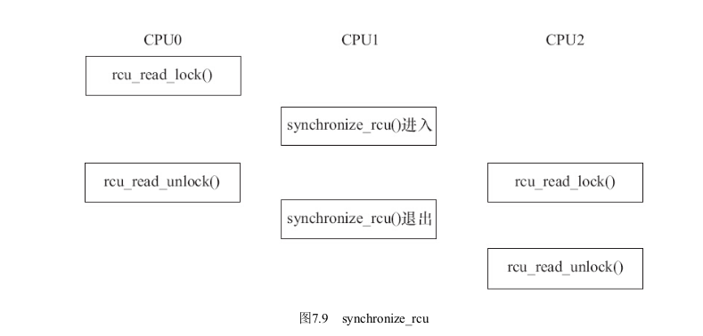

# 第7章
## 7.1
2.6版本后的内核默认不允许中断嵌套。   
访问共享资源的代码区域成为`临界区`(Critical Sections), 临界区需要被以某种互斥机制加以保护。中断屏蔽，原子操作，自旋锁，信号量，互斥体等是Linux设备驱动中可采用的互斥途径。  
***
## 7.2  
gcc中使用`barrier()`宏来部分阻止编译器对语句做乱序优化：一个最小代码快中`barier()`前的语句一定在`barrier()`后的语句前执行。   
``` c
#define barrier() __asm__ __volatile__ ("": : :"memory")
```
ARM提供了如下三种屏障指令，用于同步多核间的行为:    

| 指令              | 作用                                                 |
|:-----------------|-----------------------------------------------------:|
| DMB (数据内存屏障) | 在 DMB 之后的显式内存访问执行前,保证所有在 DMB 指令之前的内存访问完成 |
| DSB (数据同步屏障) | 等待所有在 DSB 指令之前的指令完成(位于此指令前的所有显式内存访问均完成,位于此指令前的所有缓存、跳转预测和 TLB 维护操作全部完成) |
| ISB (指令同步屏障) |  Flush 流水线,使得所有 ISB 之后执行的指令都是从缓存或内存中获得的 |   

ARM Linux的自旋锁、互斥锁等互斥逻辑需要使用上述逻辑。下列代码描述了一个互斥逻辑: 
``` asm
LOCKED EQU 1
UNLOCKED EQU 0

lock_mutex
    ;互斥量是否锁定?
    LDREX r1, [r0] ; 检查是否锁定
    CMP r1, #LOCKED ; 和"locked" 比较
    WFEEQ ; 互斥量已经锁定,进入休眠
    BEQ lock_mutex ; 被唤醒,重新检查互斥量是否锁定
    ; 尝试锁定互斥量
    MOV r1, #LOCKED
    STREX r2, r1, [r0] ; 尝试锁定
    CMP r2, #0x0 ; 检查 STR 指令是否完成
    BNE lock_mutex ; 如果失败,重试
    DMB ; 进入被保护的资源前需要隔离,保证互斥量已经被更新
    BX lr


unlock_mutex
    DMB ; 保证资源的访问已经结束
    MOV r1, #UNLOCKED ; 向锁定域写"unlocked"
    STR r1, [r0]

    DSB ; 保证在 CPU 唤醒前完成互斥量状态更新
    SEV ; 像其他 CPU 发送事件,唤醒任何等待事件的 CPU

    BX lr
```
在 Linux 内核中,定义了读写屏障 `mb ()`、读屏障 `rmb ()`、写屏障 `wmb ()`、以及作用于寄存器读写的 `__iormb ()`、 `__iowmb ()`这样的屏障 API 。读写寄存器的 `readl_relaxed ()`和 `readl ()`、 `writel_relaxed ()`和`writel ()` API 的区别就体现在有无屏障方面。
``` c
#define readb(c) ({ u8 __v = readb_relaxed(c); __iormb(); __v; })
#define readw(c) ({ u16 __v = readw_relaxed(c); __iormb(); __v; })
#define readl(c) ({ u32 __v = readl_relaxed(c); __iormb(); __v; })
#define writeb(v,c) ({ __iowmb(); writeb_relaxed(v,c); })
#define writew(v,c) ({ __iowmb(); writew_relaxed(v,c); })
#define writel(v,c) ({ __iowmb(); writel_relaxed(v,c); })
```
比如我们通过 `writel_relaxed ()`写完 DMA 的开始地址、结束地址、大小之后,我们一定要调用 `writel ()`来启动DMA 。
``` c
writel_relaxed(DMA_SRC_REG, src_addr);
writel_relaxed(DMA_DST_REG, dst_addr);
writel_relaxed(DMA_SIZE_REG, size);
writel (DMA_ENABLE, 1);
```
***
## 7.3 中断屏蔽
为避免当前CPU核上的其他线程抢断当前任务，可以使用中断屏蔽来使CPU临时停止响应中断。由于中断在操作系统中的重要性，要使中断屏蔽的时间尽可能的短。   
在多核架构中，这种方式只能禁止当前CPU核响应中断，不能禁止其它CPU核响应。   
屏蔽中断的方法为:   
``` c
local_irq_disable(); // 关中断
/* ... */
/* critical_section */ // 临界区
/* ... */
local_irq_enable(); // 开中断
```
在ARM上，这两个函数会设置CPSR的I位。   
除了`local_irq_disable()`外，还可以使用`local_irq_save(flags)`来禁止中断响应。与前者不同的是，其在屏蔽中断的时候还会保存目前CPU的中断位信息，其使用`local_irq_save(flags)`来进行相反的操作。   
如果只想禁止中断的底半部，可以使用`local_bh_disable()`，由此屏蔽的中断应使用`local_bh_enable()`来恢复。   
***
## 7.4 原子操作
原子操作可以保证对一个整形数据的修改是排他性的。Linux提供了一系列函数来实现内核中的原子操作，其又分为两类，分别对位和整形变量进行原子操作。对于ARM，其主要使用`LDREX`和`STREX`指令实现。   
例如`atomic_inc()`底层会调用的`atomic_add()`:
``` c
// 此为ARM代码:

static inline void atomic_add(int i, atomic_t *v)
{
    unsigned long tmp;
    int result;
    prefetchw(&v->counter);

    __asm__ __volatile__("@ atomic_add\n"
        "1: ldrex %0, [%3]\n"  
        " add %0, %0, %4\n"
        " strex %1, %0, [%3]\n" 
        " teq %1, #0\n"
        " bne 1b"
        : "=&r" (result), "=&r" (tmp), "+Qo" (v->counter)
        : "r" (&v->counter), "Ir" (i)
        : "cc");
}
```
   
关于`LDREX`和`STREX`:
``` asm
LDREX{cond} Rt, [Rn {, #offset}]
STREX{cond} Rd, Rt, [Rn {, #offset}]
```
其中：   

| 参数       | 意义               |
|:----------|------------------:|
|  cond    |  条件代码            |
|  Rd   | 是存放返回状态的目标寄存器  |
|  Rt   |    是要加载或存储的寄存器  |
|  Rt2   |  为进行双字加载或存储时要用到的第二个寄存器  |
|  Rn   |  是内存地址所基于的寄存器  |
|  offset   |  为应用于 Rn 中的值的可选偏移量。offset 只可用于 Thumb-2 指令中。 如果省略 offset，则认为偏移量为 0  |   

LDREX 可从内存加载数据。
+   如果物理地址有共享 TLB 属性，则 LDREX 会将该物理地址标记为由当前处理器独占访问，并且会清除该处理器对其他任何物理地址的任何独占访问标记。
+   否则，会标记：执行处理器已经标记了一个物理地址，但访问尚未完毕。   

STREX 可在一定条件下向内存存储数据。 条件具体如下：
+   如果物理地址没有共享 TLB 属性，且执行处理器有一个已标记但尚未访问完毕的物理地址，那么将会进行存储，清除该标记，并在 Rd 中返回值 0。
+   如果物理地址没有共享 TLB 属性，且执行处理器也没有已标记但尚未访问完毕的物理地址，那么将不会进行存储，而会在 Rd 中返回值 1。
+   如果物理地址有共享 TLB 属性，且已被标记为由执行处理器独占访问，那么将进行存储，清除该标记，并在 Rd 中返回值 0。
+   如果物理地址有共享 TLB 属性，但没有标记为由执行处理器独占访问，那么不会进行存储，且会在 Rd 中返回值 1。   

限制
+   r15 不可用于 Rd、Rt、Rt2 或 Rn 中的任何一个。
+   对于 STREX，Rd 一定不能与 Rt、Rt2 或 Rn 为同一寄存器。   
+   对于 ARM 指令：
    +   Rt 必须是一个编号为偶数的寄存器，且不能为 r14
    +   Rt2 必须为 R(t+1)
    +   不允许使用 offset。
+   对于 Thumb 指令：
    +   r13 不可用于 Rd、Rt 或 Rt2 中的任何一个
    +   对于 LDREXD，Rt 和 Rt2 不可为同一个寄存器
    +   offset 的值可为 0-1020 范围内 4 的任何倍数。   

用法
+   利用 LDREX 和 STREX 可在多个处理器和共享内存系统之前实现进程间通信。
+   出于性能方面的考虑，请将相应 LDREX 指令和 STREX 指令间的指令数控制到最少。   

Note
+   STREX 指令中所用的地址必须要与近期执行次数最多的 LDREX 指令所用的地址相同。 如果使用不同的地址，则 STREX 指令的执行结果将不可预知。   

体系结构
+   ARM LDREX 和 STREX 可用于 ARMv6 及更高版本中。
+   ARM LDREXB、LDREXH、LDREXD、STREXB、STREXD 和 STREXH 可用于 ARMv6K 及更高版本中。
+   所有这些 32 位 Thumb 指令均可用于 ARMv6T2 及更高版本，但 LDREXD 和 STREXD 在 ARMv7-M 架构中不可用。
+   这些指令均无 16 位版本。
***
## 7.4.1 整型原子操作
1. 设置原子变量的值
    ``` c
    void atomic_set(atomic_t *v, int i); /* 设置原子变量的值为 i */
    atomic_t v = ATOMIC_INIT(0); /* 定义原子变量 v 并初始化为 0 */
    ```
2. 获取原子变量的值
    ``` c
    atomic_read(atomic_t *v); /* 返回原子变量的值 */
    ```
3. 原子变量加 / 减
    ``` c
    void atomic_add(int i, atomic_t *v); /* 原子变量增加 i */
    void atomic_sub(int i, atomic_t *v); /* 原子变量减少 i */
    ```
4. 原子变量自增 / 自减
    ``` c
    void atomic_inc(atomic_t *v); /* 原子变量增加 1 */
    void atomic_dec(atomic_t *v); /* 原子变量减少 1 */
    ```
5. 操作并测试
    ``` c
    int atomic_inc_and_test(atomic_t *v);
    int atomic_dec_and_test(atomic_t *v);
    int atomic_sub_and_test(int i, atomic_t *v);
    ```   
    上述操作对原子变量执行自增、自减和减操作后(注意没有加),测试其是否为 0 ,为 0 返回 true ,否则返回false 。   
6. 操作并返回
    ``` c
    int atomic_add_return(int i, atomic_t *v);
    int atomic_sub_return(int i, atomic_t *v);
    int atomic_inc_return(atomic_t *v);
    int atomic_dec_return(atomic_t *v);
    ```   
    上述操作对原子变量进行加 / 减和自增 / 自减操作,并返回新的值。
***
## 7.4.2 位原子操作
1. 设置位
    ``` c
    void set_bit(nr, void *addr);
    ```
    上述操作设置 addr 地址的第 nr 位,所谓设置位即是将位写为 1 。   
2. 清除位
    ``` c
    void clear_bit(nr, void *addr);
    ```
    上述操作清除 addr 地址的第 nr 位,所谓清除位即是将位写为 0 。   
3. 改变位
    ``` c
    void change_bit(nr, void *addr);
    ```
    上述操作对 addr 地址的第 nr 位进行反置。   
4. 测试位
    ``` c
    test_bit(nr, void *addr);
    ```   
    上述操作返回 addr 地址的第 nr 位。
5. 测试并操作位
    ``` c
    int test_and_set_bit(nr, void *addr);
    int test_and_clear_bit(nr, void *addr);
    int test_and_change_bit(nr, void *addr);
    ```
    上述 `test_and_xxx_bit ( nr , void*addr )`操作等同于执行 `test_bit ( nr , void*addr )` 后再执行 `xxx_bit ( nr , void*addr )`。   

代码清单 7.2 给出了原子变量的使用例子,它使得设备最多只能被一个进程打开。
``` c
// 代码清单 7.2: 使用原子变量使设备只能被一个进程打开
static atomic_t xxx_available = ATOMIC_INIT(1); /* 定义原子变量 */

static int xxx_open(struct inode *inode, struct file *filp)
{
    ...
    if (!atomic_dec_and_test(&xxx_available)) {
        atomic_inc(&xxx_available);
        return - EBUSY;     /* 已经打开 */
    }
    ...
    return 0;   /* 成功 */
}

static int xxx_release(struct inode *inode, struct file *filp)
{
    atomic_inc(&xxx_available);      /* 释放设备 */
    return 0;
}
```
***
## 7.5.1 自旋锁的使用
1. 定义自旋锁
    ``` c
    spinlock_t lock;
    ```
2. 初始化自旋锁
    ``` c
    spin_lock_init(lock)
    ```
    该宏用于动态初始化自旋锁 lock 。
3. 获得自旋锁
    ``` c
    spin_lock(lock)
    ```
    该宏用于获得自旋锁 lock ,如果能够立即获得锁,它就马上返回,否则,它将在那里自旋,直到该自旋锁的保持者释放。
    ``` c
    spin_trylock(lock)
    ```
    该宏尝试获得自旋锁 lock ,如果能立即获得锁,它获得锁并返回 true ,否则立即返回 false ,实际上不再 “ 在原地打转 ” 。
4. 释放自旋锁
    ``` c
    spin_unlock(lock)
    ```   
    该宏释放自旋锁 lock ,它与 spin_trylock 或 spin_lock 配对使用。   

自旋锁一般这样使用:
``` c
/* 定义一个自旋锁 */
spinlock_t lock;
spin_lock_init(&lock);
spin_lock (&lock) ;     /* 获取自旋锁,保护临界区 */
.../* 临界区 */
spin_unlock (&lock) ; /* 解锁 */
```
自旋锁一般用于SMP或单核CPU但内核可被抢占的情况，对于单CPU且内核不支持抢占的系统，自旋锁自动退化为空操作。   
在单CPU且内核可被抢占的情况下，自旋锁持有期间内核不能被抢占。   
其实，在SMP平台上，持有自旋锁的CPUcore，其上的内核也不能被抢占，但其他core可以。   
尽管用了自旋锁可以保证临界区不受别的 CPU 和本 CPU 内的抢占进程打扰,但是得到锁的代码路径在执行临界区的时候,还可能受到中断和底半部( BH ,稍后的章节会介绍)的影响。为了防止这种影响,就需要用到自旋锁的衍生。   
`pin_lock ()` / `spin_unlock ()`是自旋锁机制的基础,它们和关中断 `local_irq_disable ()` / 开中断 `local_irq_enable ()`、关底半部 `local_bh_disable ()` / 开底半部`local_bh_enable ()`、关中断并保存状态字 `local_irq_save ()` / 开中断并恢复状态字 `local_irq_restore ()`结合就形成了整套自旋锁机制,关系如下:
```
spin_lock_irq() = spin_lock() + local_irq_disable()
spin_unlock_irq() = spin_unlock() + local_irq_enable()
spin_lock_irqsave() = spin_lock() + local_irq_save()
spin_unlock_irqrestore() = spin_unlock() + local_irq_restore()
spin_lock_bh() = spin_lock() + local_bh_disable()
spin_unlock_bh() = spin_unlock() + local_bh_enable()
```
`spin_lock_irq ()`、 `spin_lock_irqsave ()`、 `spin_lock_bh ()`类似函数会为自旋锁的使用系好 “ 安全带 ” 以避免突如其来的中断驶入对系统造成的伤害。   
驱动工程师应谨慎使用自旋锁,而且在使用中还要特别注意如下几个问题:   
1.  自旋锁实际上是忙等锁,当锁不可用时, CPU 一直循环执行 “ 测试并设置 ” 该锁直到可用而取得该锁, CPU 在等待自旋锁时不做任何有用的工作,仅仅是等待。因此,只有在占用锁的时间极短的情况下,使用自旋锁才是合理的。当临界区很大,或有共享设备的时候,需要较长时间占用锁,使用自旋锁会降低系统的性能。   
2.  自旋锁可能导致系统死锁。引发这个问题最常见的情况是递归使用一个自旋锁,即如果一个已经拥有某个自旋锁的 CPU 想第二次获得这个自旋锁,则该 CPU 将死锁。   
3.  在自旋锁锁定期间不能调用可能引起进程调度的函数。如果进程获得自旋锁之后再阻塞,如调用 `copy_from_user ()`、`copy_to_user ()`、 `kmalloc ()`和 `msleep ()`等函数,则可能导致内核的崩溃。   
4.  在单核情况下编程的时候,也应该认为自己的 CPU 是多核的,驱动特别强调跨平台的概念。比如,在单 CPU 的情况下,若中断和进程可能访问同一临界区,进程里调用 `spin_lock_irqsave ()`是安全的,在中断里其实不调用 `spin_lock ()`也没有问题,因为`spin_lock_irqsave ()`可以保证这个 CPU 的中断服务程序不可能执行。但是,若 CPU 变成多核, `spin_lock_irqsave ()`不能屏蔽另外一个核的中断,所以另外一个核就可能造成并发问题。因此,无论如何,我们在中断服务程序里也应该调用 `spin_lock ()`。
***
## 7.5.2 读写自旋锁
自旋锁不关心锁定的临界区究竟在进行什么操作,不管是读还是写,它都一视同仁。即便多个执行单元同时读取临界资源也会被锁住。实际上,对共享资源并发访问时,多个执行单元同时读取它是不会有问题的,自旋锁的衍生锁读写自旋锁( rwlock )可允许读的并发。读写自旋锁是一种比自旋锁粒度更小的锁机制,它保留了 “ 自旋 ” 的概念,但是在写操作方面,只能最多有 1 个写进程,在读操作方面,同时可以有多个读执行单元。当然,读和写也不能同时进行。   
读写自旋锁涉及的操作如下:   
1.  定义和初始化读写自旋锁
    ``` c
    rwlock_t my_rwlock;
    rwlock_init(&my_rwlock);  /* 动态初始化 */
    ```
2.  读锁定
    ``` c
    void read_lock(rwlock_t *lock);
    void read_lock_irqsave(rwlock_t *lock, unsigned long flags);
    void read_lock_irq(rwlock_t *lock);
    void read_lock_bh(rwlock_t *lock);
    ```
3. 读解锁
    ``` c
    void read_unlock(rwlock_t *lock);
    void read_unlock_irqrestore(rwlock_t *lock, unsigned long flags);
    void read_unlock_irq(rwlock_t *lock);
    void read_unlock_bh(rwlock_t *lock);
    ```   

在对共享资源进行读取之前,应该先调用读锁定函数,完成之后应调用读解锁函数。   
`read_lock_irqsave ()`、 `read_lock_irq ()`和 `read_lock_bh ()`也分别是 `read_lock ()`分别与 `local_irq_save ()`、`和 local_bh_disable ()`的组合,读解锁函数 `read_unlock_irqrestore ()`、 `read_unlock_irq ()`、`read_unlock_bh ()`的情况与此类似。   

4.  写锁定   
    ``` c
    void write_lock(rwlock_t *lock);
    void write_lock_irqsave(rwlock_t *lock, unsigned long flags);
    void write_lock_irq(rwlock_t *lock);
    void write_lock_bh(rwlock_t *lock);
    int write_trylock(rwlock_t *lock);
    ```   
5. 写解锁   
    ``` c
    void write_unlock(rwlock_t *lock);
    void write_unlock_irqrestore(rwlock_t *lock, unsigned long flags);
    void write_unlock_irq(rwlock_t *lock);
    void write_unlock_bh(rwlock_t *lock);
    ```   

`write_lock_irqsave ()`、 `write_lock_irq ()`、 `write_lock_bh ()`分别是 `write_lock ()`与 `local_irq_save ()`、`local_irq_disable ()`和 `local_bh_disable ()`的组合,写解锁函数 `write_unlock_irqrestore ()`、`write_unlock_irq ()`、 `write_unlock_bh ()`的情况与此类似。   
在对共享资源进行写之前,应该先调用写锁定函数,完成之后应调用写解锁函数。和 `spin_trylock ()`一样, `write_trylock ()`也只是尝试获取读写自旋锁,不管成功失败,都会立即返回。    
读写自旋锁一般这样被使用:   
``` c
rwlock_t lock;                              /* 定义 rwlock */
rwlock_init(&lock);                         /* 初始化 rwlock */ 

/* 读时获取锁 */
read_lock(&lock);
...                                         /* 临界资源 */
read_unlock(&lock);

/* 写时获取锁 */
write_lock_irqsave(&lock, flags);
...                                         /* 临界资源 */
write_unlock_irqrestore(&lock, flags);
```
***
## 7.5.3 顺序锁
顺序锁( seqlock )是对读写锁的一种优化,若使用顺序锁,读执行单元不会被写执行单元阻塞,也就是说,读执行单元在写执行单元对被顺序锁保护的共享资源进行写操作时仍然可以继续读,而不必等待写执行单元完成写操作,写执行单元也不需要等待所有读执行单元完成读操作才去进行写操作。但是,写执行单元与写执行单元之间仍然是互斥的,即如果有写执行单元在进行写操作,其他写执行单元必须自旋在那里,直到写执行单元释放了顺序锁。    
对于顺序锁而言,尽管读写之间不互相排斥,但是如果读执行单元在读操作期间,写执行单元已经发生了写操作,那么,读执行单元必须重新读取数据,以便确保得到的数据是完整的。所以,在这种情况下,读端可能反复读多次同样的区域才能读到有效的数据。   
顺序锁的设计思想是：对某一个共享数据读取的时候不加锁，写的时候加锁。同时为了保证读取的过程中因为写进程修改了共享区的数据，导致读进程读取数据错误。在读取者和写入者之间引入了一个整形变量sequence，读取者在读取之前读取sequence, 读取之后再次读取此值，如果不相同，则说明本次读取操作过程中数据发生了更新，需要重新读取。而对于写进程在写入数据的时候就需要更新sequence的值。   
也就是说临界区只允许一个write进程进入到临界区，在没有write进程的话，read进程来多少都可以进入到临界区。但是当临界区没有write进程的时候，write进程就可以立刻执行，不需要等待。     
在 Linux 内核中,写执行单元涉及的顺序锁操作如下:   
1.  获得顺序锁
    ``` c
    void write_seqlock(seqlock_t *sl);
    int write_tryseqlock(seqlock_t *sl);
    write_seqlock_irqsave(lock, flags)
    write_seqlock_irq(lock)
    write_seqlock_bh(lock)
    ```   
    其中, 
    ``` 
    write_seqlock_irqsave() = loal_irq_save() + write_seqlock()
    write_seqlock_irq() = local_irq_disable() + write_seqlock()
    write_seqlock_bh() = local_bh_disable() + write_seqlock()
    ```   
2.  释放顺序锁
    ``` c
    void write_sequnlock(seqlock_t *sl);
    write_sequnlock_irqrestore(lock, flags)
    write_sequnlock_irq(lock)
    write_sequnlock_bh(lock)
    ```   
    其中,   
    ```
    write_sequnlock_irqrestore() = write_sequnlock() + local_irq_restore()
    write_sequnlock_irq() = write_sequnlock() + local_irq_enable()
    write_sequnlock_bh() = write_sequnlock() + local_bh_enable()
    ```   
    写执行单元使用顺序锁的模式如下:   
    ``` c
    write_seqlock(&seqlock_a);
    ... /* 写操作代码块 */
    write_sequnlock(&seqlock_a);
    ```   
    因此,对写执行单元而言,它的使用与自旋锁相同。   

读执行单元涉及的顺序锁操作如下:   
1.  读开始
    ``` c
    unsigned read_seqbegin(const seqlock_t *sl);
    read_seqbegin_irqsave(lock, flags)
    ```   
    读执行单元在对被顺序锁 s1 保护的共享资源进行访问前需要调用该函数,该函数返回顺序锁 s1 的当前顺序号。其中,   
    ```
    read_seqbegin_irqsave() = local_irq_save() + read_seqbegin()
    ```   
2.  重读
    ``` c    
    int read_seqretry(const seqlock_t *sl, unsigned iv);
    read_seqretry_irqrestore(lock, iv, flags)
    ```   
    读执行单元在访问完被顺序锁 s1 保护的共享资源后需要调用该函数来检查,在读访问期间是否有写操作。如果有写操作,读执行单元就需要重新进行读操作。其中,   
    ```
    read_seqretry_irqrestore() = read_seqretry() + local_irq_restore()
    ```   
    读执行单元使用顺序锁的模式如下:   
    ``` c
    do {
        seqnum = read_seqbegin(&seqlock_a);
        /* 读操作代码块 */
        ...
    } while (read_seqretry(&seqlock_a, seqnum));
    ```
***
## 7.5.4 读-复制-更新
RCU ( Read-Copy-Update ,读 - 复制 - 更新),它是基于其原理命名的。 RCU 并不是新的锁机制,早在 20 世纪 80 年代就有了这种机制,而在 Linux 中是在开发内核 2.5.43 时引入该技术的,并正式包含在 2.6 内核中。Linux 社区关于 RCU 的经典文档位于 https://www.kernel.org/doc/ols/2001/read-copy.pdf , Linux 内核源代码Documentation/RCU/ 也包含了 RCU 的一些讲解。
不同于自旋锁,使用 RCU 的读端没有锁、内存屏障、原子指令类的开销,几乎可以认为是直接读(只是简单地标明读开始和读结束),而 RCU 的写执行单元在访问它的共享资源前首先复制一个副本,然后对副本进行修改,最后使用一个回调机制在适当的时机把指向原来数据的指针重新指向新的被修改的数据,这个时机就是所有引用该数据的 CPU 都退出对共享数据读操作的时候。等待适当时机的这一时期称为宽限期( Grace Period )。   
RCU 可以看作读写锁的高性能版本,相比读写锁, RCU 的优点在于既允许多个读执行单元同时访问被保护的数据,又允许多个读执行单元和多个写执行单元同时访问被保护的数据。但是, RCU 不能替代读写锁,因为如果写比较多时,对读执行单元的性能提高不能弥补写执行单元同步导致的损失。因为使用 RCU 时,写执行单元之间的同步开销会比较大,它需要延迟数据结构的释放,复制被修改的数据结构,它也必须使用某种锁机制来同步并发的其他写执行单元的修改操作。   
Linux 中提供的 RCU 操作包括如下 4 种:   
1.  读锁定
    ``` c
    rcu_read_lock()
    rcu_read_lock_bh()
    ```   
2.  读解锁
    ``` c
    rcu_read_unlock()
    rcu_read_unlock_bh()
    ```
    使用 RCU 进行读的模式如下:
    ``` c
    rcu_read_lock()
    ...     /* 读临界区 */
    rcu_read_unlock()
    ```
3.  同步 RCU
    ``` c
    synchronize_rcu()
    ```
    该函数由 RCU 写执行单元调用,它将阻塞写执行单元,直到当前 CPU 上所有的已经存在( Ongoing )的读执行单元完成读临界区,写执行单元才可以继续下一步操作。 synchronize_rcu ()并不需要等待后续( Subsequent )读临界区的完成,如图 7.9 所示：
       
    探测所有的 `rcu_read_lock ()`被 `r`cu_read_unlock ()`结束的过程很类似 Java 语言垃圾回收的工作。   
4.  挂接回调
    ``` c
    void call_rcu(struct rcu_head *head,
                    void (*func)(struct rcu_head *rcu));
    ```
    函数 `call_rcu ()`也由 RCU 写执行单元调用,与 `synchronize_rcu ()`不同的是,它不会使写执行单元阻塞,因而可以在中断上下文或软中断中使用。该函数把函数 func 挂接到 RCU 回调函数链上,然后立即返回。挂接的回调函数会在一个宽限期结束(即所有已经存在的 RCU 读临界区完成)后被执行。   
``` c
rcu_assign_pointer(p, v); /* 给 RCU 保护的指针赋一个新的值 */
```
``` c
rcu_dereference(p); /* 读端获取受rcu保护的指针所指向的数据 */
```
读端使用 `rcu_dereference ()`获取一个 RCU 保护的指针,之后既可以安全地引用它(访问它指向的区域)。一般需要在 `rcu_read_lock ()` /`rcu_read_unlock ()`保护的区间引用这个指针,例如:
``` c
rcu_read_lock();
irq_rt = rcu_dereference(kvm->irq_routing);
if (irq < irq_rt->nr_rt_entries)
    hlist_for_each_entry(e, &irq_rt->map[irq], link) {
        if (likely(e->type == KVM_IRQ_ROUTING_MSI))
            ret = kvm_set_msi_inatomic(e, kvm);
        else
            ret = -EWOULDBLOCK;break;
    }
rcu_read_unlock();
```
上述代码取自 virt/kvm/irq_comm.c 的 `kvm_set_irq_inatomic ()`函数。   
``` c
rcu_access_pointer(p)
```
读端使用 `rcu_access_pointer ()`获取一个 RCU 保护的指针,之后并不引用它。这种情况下,我们只关心指针本身的值,而不关心指针指向的内容。比如我们可以使用该 API 来判断指针是否为 NULL 。   
把 rcu_assign_pointer ()和 rcu_dereference ()结合起来使用,写端分配一个新的 struct foo 内存,并初始化其中的成员,之后把该结构体的地址赋值给全局的 gp 指针:   
``` c
struct foo {
int a;
int b;
int c;
};
struct foo *gp = NULL;
/* . . . */
p = kmalloc(sizeof(*p), GFP_KERNEL);
p->a = 1;
p->b = 2;
p->c = 3;
rcu_assign_pointer(gp, p);
```
读端访问该片区域:
``` c
rcu_read_lock();
p = rcu_dereference(gp);
if (p != NULL) {
    do_something_with(p->a, p->b, p->c);
}
rcu_read_unlock();
```
在上述代码中,我们可以把写端 `rcu_assign_pointer ()`看成发布( Publish )了 gp ,而读端 `rcu_dereference ()`看成订阅( Subscribe )了 gp 。它保证读端可以看到 `rcu_assign_pointer ()`之前所有内存被设置的情况(即 gp->a , gp->b , gp->c 等于 1 、 2 、 3 对于读端可见)。由此可见,与 RCU 相关的原语已经内嵌了相关的编译屏障或内存屏障。   
对于链表数据结构而言, Linux 内核增加了专门的 RCU 保护的链表操作 API :   
``` c
static inline void list_add_rcu(struct list_head *new, struct list_head *head);
```
该函数把链表元素 new 插入 RCU 保护的链表 head 的开头。
``` c
static inline void list_add_tail_rcu(struct list_head *new,
            struct list_head *head);
```
该函数类似于 `list_add_rcu ()`,它将把新的链表元素 new 添加到被 RCU 保护的链表的末尾。
``` c
static inline void list_del_rcu(struct list_head *entry);
```
该函数从 RCU 保护的链表中删除指定的链表元素 entry 。
``` c
static inline void list_replace_rcu(struct list_head *old, struct list_head *new);
```
它使用新的链表元素 new 取代旧的链表元素 old 。
``` c
list_for_each_entry_rcu(pos, head)
```
该宏用于遍历由 RCU 保护的链表 head ,只要在读执行单元临界区使用该函数,它就可以安全地和其他 RCU 保护的链表操作函数(如 `list_add_rcu ()`)并发运行。   
链表的写端代码模型如下:   
``` c
struct foo {
    struct list_head list;
    int a;
    int b;
    int c;
};
LIST_HEAD(head);
/* . . . */
p = kmalloc(sizeof(*p), GFP_KERNEL);
p->a = 1;
p->b = 2;p->c = 3;
list_add_rcu(&p->list, &head);
```
链表的读端代码则形如:
``` c
rcu_read_lock();
list_for_each_entry_rcu(p, head, list) {
    do_something_with(p->a, p->b, p->c);
}
rcu_read_unlock();
```
前面已经看到了对 RCU 保护链表中节点进行修改以及添加新节点的动作,下面我们看一下 RCU 保护的链表删除节点 N 的工作。写端分为两个步骤,第 1 步是从链表中删除 N ,之后等一个宽限期结束,再释放 N 的内存。
对于RCU机制，可见[linux内核RCU机制详解](https://blog.csdn.net/xabc3000/article/details/15335131)。   
***
## 7.6 信号量
信号量( Semaphore )是操作系统中最典型的用于同步和互斥的手段,信号量的值可以是 0 、 1 或者 n 。信号量与操作系统中的经典概念 PV 操作对应。   
P ( S ):   
1.  将信号量 S 的值减 1 ,即 S=S-1 ;   
2.  如果 S≥0 ,则该进程继续执行;否则该进程置为等待状态,排入等待队列。   

V ( S ):
1.  将信号量 S 的值加 1 ,即 S=S+1 ;
2.  如果 S>0 ,唤醒队列中等待信号量的进程。   

1.  定义信号量   
    下列代码定义名称为 sem 的信号量:
    ``` c
    struct semaphore sem;
    ```   

2.  初始化信号量
    ``` c
    void sema_init(struct semaphore *sem, int val);
    ```

3.  获得信号量
    ``` c
    void down(struct semaphore * sem);
    ```
    该函数用于获得信号量 sem ,它会导致睡眠,因此不能在中断上下文中使用。
    ``` c
    int down_interruptible(struct semaphore * sem);
    ```
    该函数功能与 down 类似,不同之处为,因为 down ()进入睡眠状态的进程不能被信号打断,但因为 down_interruptible ()进入睡眠状态的进程能被信号打断,信号也会导致该函数返回,这时候函数的返回值非 0 。   
    ``` c
    int down_trylock(struct semaphore * sem);
    ```
    该函数尝试获得信号量 sem ,如果能够立刻获得,它就获得该信号量并返回 0 ,否则,返回非 0 值。它不会导致调用者睡眠,可以在中断上下文中使用。   
    在使用 down_interruptible ()获取信号量时,对返回值一般会进行检查,如果非 0 ,通常立即返回 -ERESTARTSYS ,如:   
    ``` c
    if (down_interruptible(&sem))
        return -ERESTARTSYS;
    ```   

4.  释放信号量
    ``` c
    void up(struct semaphore * sem);
    ```
    该函数释放信号量 sem ,唤醒等待者。   
    作为一种可能的互斥手段,信号量可以保护临界区,它的使用方式和自旋锁类似。与自旋锁相同,只有得到信号量的进程才能执行临界区代码。但是,与自旋锁不同的是,当获取不到信号量时,进程不会原地打转而是进入休眠等待状态。用作互斥时,信号量一般这样被使用:   

    | 进程P1 | 进程P2 | 进程P3 | .....  | 进程Pn |
    |:-----:|:-----:|:------:|:------:|:-----:|
    | P(S); | P(S)  |  P(S)  | .....  | P(S)  |
    | 临界区 | 临界区 | 临界区  | 临界区  | 临界区 |   

由于新的 Linux 内核倾向于直接使用 mutex 作为互斥手段,信号量用作互斥不再被推荐使用。   
信号量也可以用于同步,一个进程 A 执行 down ()等待信号量,另外一个进程 B 执行 up ()释放信号量,这样进程 A 就同步地等待了进程 B 。其过程类似:     

|    进程1    |    进程2    |
|:----------:|:----------:|
|   代码区C1  |    P(S)    |
|    V(S)    |            |
|            |  代码区C2   |   

此外,对于关心具体数值的生产者 / 消费者问题,使用信号量则较为合适。因为生产者 / 消费者问题也是一种同步问题。   
***
## 7.7 互斥体
尽管信号量已经可以实现互斥的功能,但是“正宗“的 mutex 在 Linux 内核中还是真实地存在着。   
下面代码定义了名为 my_mutex 的互斥体并初始化它:   
``` c
struct mutex my_mutex;
mutex_init(&my_mutex);
```
下面的两个函数用于获取互斥体:   
``` c
void mutex_lock(struct mutex *lock);
int mutex_lock_interruptible(struct mutex *lock);
int mutex_trylock(struct mutex *lock);
```   
`mutex_lock ()`与 `mutex_lock_interruptible ()`的区别和 `down ()`与 `down_trylock ()`的区别完全一致,前者引起的睡眠不能被信号打断,而后者可以。 `mutex_trylock ()`用于尝试获得 mutex ,获取不到 mutex 时不会引起进程睡眠。   
下列函数用于释放互斥体:   
``` c
void mutex_unlock(struct mutex *lock);
```   
mutex 的使用方法和信号量用于互斥的场合完全一样:
``` c
struct mutex my_mutex; /* 定义 mutex */
mutex_init(&my_mutex); /* 初始化 mutex */
mutex_lock(&my_mutex); /* 获取 mutex */
... /* 临界资源 */
mutex_unlock(&my_mutex); /* 释放 mutex */
```
自旋锁和互斥体都是解决互斥问题的基本手段,面对特定的情况,应该如何取舍这两种手段呢?选择的依据是临界区的性质和系统的特点。   
从严格意义上说,互斥体和自旋锁属于不同层次的互斥手段,前者的实现依赖于后者。在互斥体本身的实现上,为了保证互斥体结构存取的原子性,需要自旋锁来互斥。所以自旋锁属于更底层的手段。     
互斥体是进程级的,用于多个进程之间对资源的互斥,虽然也是在内核中,但是该内核执行路径是以进程的身份,代表进程来争夺资源的。如果竞争失败,会发生进程上下文切换,当前进程进入睡眠状态, CPU 将运行其他进程。鉴于进程上下文切换的开销也很大,因此,只有当进程占用资源时间较长时,用互斥体才是较好的选择。   
当所要保护的临界区访问时间比较短时,用自旋锁是非常方便的,因为它可节省上下文切换的时间。但是 CPU得不到自旋锁会在那里空转直到其他执行单元解锁为止,所以要求锁不能在临界区里长时间停留,否则会降低系统的效率。   
由此,可以总结出自旋锁和互斥体选用的 3 项原则:   
1.  当锁不能被获取到时,使用互斥体的开销是进程上下文切换时间,使用自旋锁的开销是等待获取自旋锁(由临界区执行时间决定)。若临界区比较小,宜使用自旋锁,若临界区很大,应使用互斥体。
2.  互斥体所保护的临界区可包含可能引起阻塞的代码,而自旋锁则绝对要避免用来保护包含这样代码的临界区。因为阻塞意味着要进行进程的切换,如果进程被切换出去后,另一个进程企图获取本自旋锁,死锁就会发生。
3.  互斥体存在于进程上下文,因此,如果被保护的共享资源需要在中断或软中断情况下使用,则在互斥体和自旋锁之间只能选择自旋锁。当然,如果一定要使用互斥体,则只能通过 mutex_trylock ()方式进行,不能获取就立即返回以避免阻塞。   
## 7.8 完成量
Linux 提供了完成量( Completion ,关于这个名词,至今没有好的翻译,笔者将其译为 “ 完成量 ” ),它用于一个执行单元等待另一个执行单元执行完某事。   
Linux 中与完成量相关的操作主要有以下 4 种。
1.  定义完成量
    下列代码定义名为 my_completion 的完成量:
    ``` c
    struct completion my_completion;
    ```

2.  初始化完成量
    下列代码初始化或者重新初始化 my_completion 这个完成量的值为 0 (即没有完成的状态):   
    ``` c
    init_completion(&my_completion);
    reinit_completion(&my_completion)
    ```   

3.  等待完成量
    下列函数用于等待一个完成量被唤醒:
    ``` c
    void wait_for_completion(struct completion *c);
    ``` 

4.  唤醒完成量
    下面两个函数用于唤醒完成量:
    ``` c
    void complete(struct completion *c);
    void complete_all(struct completion *c);
    ```
    前者只唤醒一个等待的执行单元,后者释放所有等待同一完成量的执行单元。   

完成量用于同步的流程一般如下:   

|  进程P1           |            进程P2          |
|:----------------:|:--------------------------:|
|     代码区C1      | wait_for_completion(&done) |
| complete(&done)  |                            |
|                  |            代码区C2         |   

***